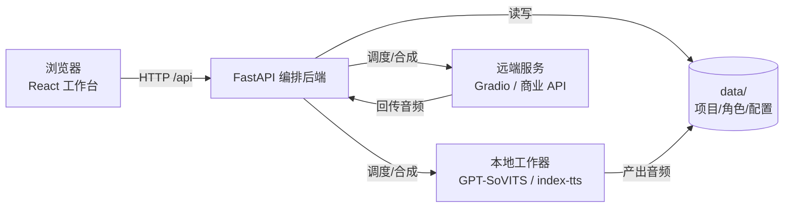
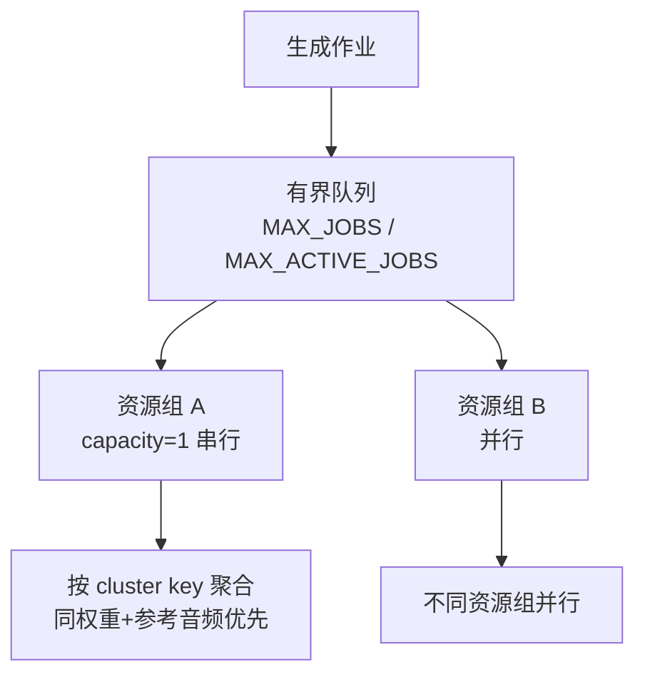

# TTS More

TTS More 是一个**剧本配音工作台**：在 GPT-SoVITS、IndexTTS、CosyVoice 等开源 TTS 与商业 HTTP 服务之上，提供统一的剧本解析、角色音色配置、任务队列和生成历史管理。它不重写模型，只做编排。

本地优先：默认绑 `127.0.0.1`，单用户零配置即可跑起来。

## 架构



主路径固定为：`剧本 → 提取台词 → 角色音色 → TTS 接入 → 生成台词 → 试听历史`。工作台左侧处理剧本，中间处理台词生成，右侧只处理当前台词的音色、参考资源和生成动作。中英双语 i18n，中文兜底。

更多见 [架构文档](docs/architecture.md) 与 [安全模型](docs/security.md)。

## 快速开始

### 1. 获取代码

```bash
git clone https://github.com/XucroYuri/TTS_more.git
cd TTS_more
```

### 2. 安装依赖

**macOS / Linux：**

```bash
# 后端（需 Python 3.10–3.11）
python3.11 -m venv .venv
.venv/bin/python -m pip install -e 'backend[dev]'
# 或用 uv：uv venv --python 3.11 .venv && uv pip install --python .venv/bin/python -e 'backend[dev]'

# 前端（需 Node ≥ 20、pnpm ≥ 9）
cd frontend && pnpm install && cd ..
```

**Windows (PowerShell)：**

```powershell
py -3.11 -m venv .venv
& .\.venv\Scripts\python.exe -m pip install -e 'backend[dev]'
cd frontend; pnpm install; cd ..
```

> 也可以直接 `make install`（跨平台，自动用 uv 或 venv）。

### 3. 启动开发环境

**macOS / Linux：**

```bash
make dev        # 或 scripts/start-dev.sh
```

**Windows：**

```powershell
.\scripts\start-dev.ps1
```

默认地址：

- 后端：`http://127.0.0.1:8000`
- 前端：`http://127.0.0.1:5173`

### 4. 一键更新

应用本体和服务 repo 都以 GitHub 为更新来源。普通更新：

```bash
scripts/update.sh
```

Windows：

```powershell
.\scripts\update.ps1
```

这会快进应用本体当前分支，安全更新 `repo.lock.json` 中的 TTS 服务 repo，并在已存在的服务 repo 内写入可复制的 `tts-more-update.sh` / `tts-more-update.ps1`。如果某个服务 repo 有本地未提交改动，普通更新会拒绝继续，避免丢改动。若 `data/local/services.json` 不存在，它会生成一份本机服务配置；已有本机配置默认保留。

只预览不写入：

```bash
scripts/update.sh --dry-run
```

确实要重写本机服务配置时，再显式加：

```bash
scripts/update.sh --force-render-services
```

确实要把服务 repo 硬重置到远端分支时，再显式加：

```bash
scripts/update.sh --force-reset-repos
```

### 5. 接入 TTS 服务

在工作台打开 `接入 → TTS 服务`，选择 GPT-SoVITS / IndexTTS / CosyVoice，粘贴服务地址并执行“检测并保存”。`127.0.0.1`、`localhost`、局域网或远端 worker 地址都可以接入；向导写入 `data/local/services.json`，不污染可提交模板。

TTS More 推荐 worker-first 架构：优先接入 `tts-more-v1` worker；已有 Gradio 服务也可以作为兼容端点接入。

本地部署推荐使用 manifest 驱动脚本。它会按 `repo.lock.json` 拉取 GPT-SoVITS 三个分支，以及 IndexTTS、CosyVoice：

```powershell
.\scripts\tts-more.ps1 sync-repos --clean
.\scripts\prepare-tts-repos.ps1 -SyncRepos -CleanRepos -Device CU128
```

macOS/Linux：

```bash
./scripts/tts-more.sh sync-repos --clean
bash scripts/prepare-tts-repos.sh --sync-repos --clean-repos --device CU128
```

准备脚本默认走 `Auto`：先跑 `probe-network`，优先选择中国大陆可达且健康的源，例如 ModelScope 或 HF Mirror，必要时再回退到全球 Hugging Face / PyPI 路线。默认安装只准备 full-quality baseline models，quantized、distilled、simplified、small、low-memory 这些都只是手动 manual 的高级选项。

详细拓扑、远端 worker、离线缓存和模型下载策略见 [部署方案](docs/deployment.md)。
当前阶段边界、设计不足和任务拆分见 [当前阶段说明与简化计划](docs/current-state-and-simplification-plan.md)。

## 验证

```bash
make test          # 后端 pytest + 前端 vitest
make build         # 前端生产构建
```

或分开跑：

```bash
.venv/bin/python -m pytest backend -q      # macOS/Linux
# Windows: & .\.venv\Scripts\python.exe -m pytest backend -q
cd frontend && pnpm test && pnpm build
```

真实 TTS 验收（需要本机/网络 endpoint、模型、GPU）：

```bash
export TTS_MORE_SERVICE_MODE=real
export TTS_MORE_RUN_REAL_TTS=1
.venv/bin/python -m pytest backend/tests/test_real_tts_validation.py -q
```

## 服务模式

默认真实网络 endpoint 模式：本地和远端服务都通过 `data/services.json` 里的 `base_url` 调用；未启动的服务显示为未就绪，不会被调度。商业 TSS（OpenAI/Gemini/xAI/火山）作为一等服务，key 只存在 `.env.local`，`services.json` 只引用 env 变量名。

provider 优先级：`GPT-SoVITS → IndexTTS → CosyVoice → 商业/通用 HTTP`。

## 队列与调度



- 同资源组按 `capacity` 限制并发；不同资源组并行。
- 同一已加载 cluster 有待执行任务时优先继续；否则选待执行最多的 cluster。
- 生成前计算加载签名（service + logs_name + 权重 + 参考音频 + 文本），签名一致可复用加载状态。

## 项目与历史

文件制存储。核心概念：

- `ScriptProject` → `ScriptRevision`（文本版本）→ `ParseRevision`（解析结果）→ `ScriptLine`（稳定行，`line_uid` 关联历史）→ `GenerationVersion`（每次生成）。
- 重新编辑/解析创建新版本分支，不覆盖旧音频。
- 历史保留 provider、service、binding、参数摘要、加载签名、音频路径、状态、错误。

## 安全

默认开放（本地单用户）。设置 `TTS_MORE_API_TOKEN` 后，写/出口端点强制 Bearer 校验。详见 [安全模型](docs/security.md)：

- SSRF 防护（出口 URL 校验，link-local/云元数据永远拒绝）
- 文件读根约束（角色库配置不得越界）
- 命令白名单（`start_command[0]` 校验）
- 上传大小上限 + 图片 magic-byte 校验
- 错误脱敏（密钥不进响应）
- 有界作业队列（防 DoS）

## 发布治理

提交前确认：`repo/`、`.env.local`、`data/local/`、生成音频、模型权重、本机路径/UNC/局域网 IP、真实角色库**均不提交**。

```bash
git check-ignore -v data/local/services.json .env.local repo/GPT-SoVITS-main
.venv/bin/python -m pytest backend/tests/test_release_governance.py -q
```

## 参考文档

- [架构](docs/architecture.md)
- [安全模型](docs/security.md)
- [TTS Worker 架构](docs/workers.md)
- [部署方案](docs/deployment.md)
- [GPT-SoVITS 接入方案](docs/gpt-sovits-integration.md)
- [CI 架构与真实 TTS 验收](docs/ci-architecture.md)
- [开源 TTS 服务接入](docs/open-source-tts-services.md)
- [发布治理](docs/release-governance.md)
