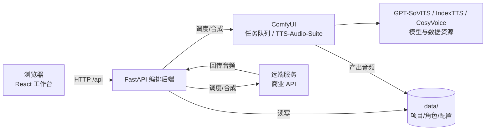
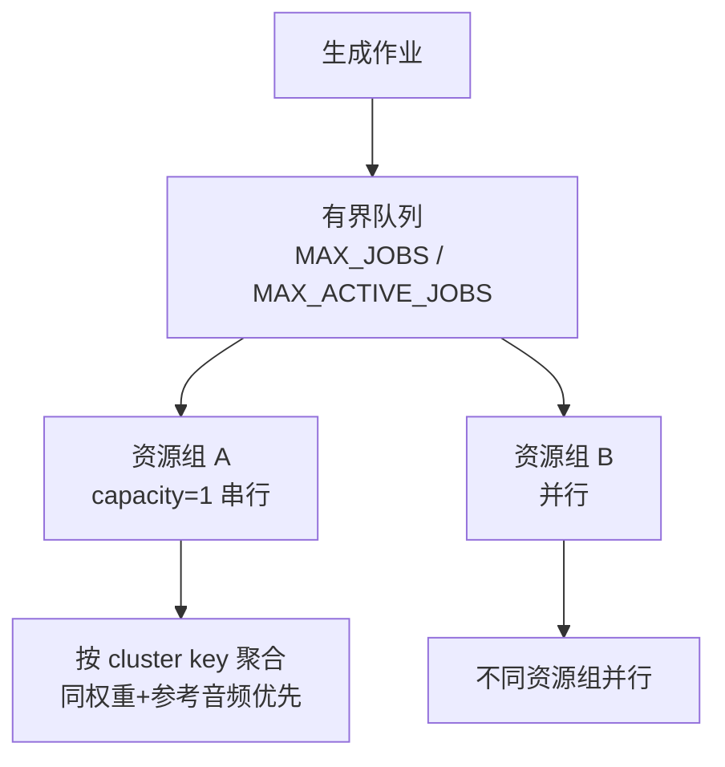

# TTS More

TTS More 是一个**剧本配音工作台**：在 GPT-SoVITS、IndexTTS、CosyVoice 等开源 TTS 与商业 HTTP 服务之上，提供统一的剧本解析、角色音色配置、任务队列和生成历史管理。它不重写模型，只做编排。

本地优先：默认绑 `127.0.0.1`，单用户零配置即可跑起来。

## 架构


```mermaid
flowchart LR
    Browser["浏览器<br/>React 工作台"] -- "HTTP /api" --> Backend["FastAPI 编排后端"]
    Backend -- "调度/合成" --> ComfyUI["ComfyUI<br/>任务队列 / TTS-Audio-Suite"]
    ComfyUI --> Models["GPT-SoVITS / IndexTTS / CosyVoice<br/>模型与数据资源"]
    Backend -- "调度/合成" --> Remote["远端服务<br/>商业 API"]
    Backend -- "读写" --> Data[("data/<br/>项目/角色/配置")]
    ComfyUI -- "产出音频" --> Data
    Remote -- "回传音频" --> Backend
```

主路径固定为：`剧本 → 提取台词 → 角色音色 → TTS 接入 → 生成台词 → 试听历史`。工作台左侧处理剧本，中间处理台词生成，右侧只处理当前台词的音色、参考资源和生成动作。中英双语 i18n，中文兜底。

当前正式本地运行路径为 TTS More 调用 ComfyUI HTTP API，由 `XucroYuri/TTS-Audio-Suite` 承载 TTS 引擎与真实任务队列；三个上游 TTS 项目仅保留为模型和数据资源来源。完整步骤见 [ComfyUI 部署指南](docs/comfyui-integration.md#从零部署指南)。

更多见 [架构文档](docs/architecture.md) 与 [安全模型](docs/security.md)。

## 快速开始

### 1. 获取代码

```bash
git clone https://github.com/XucroYuri/TTS_more.git
cd TTS_more
```

### 2. 安装依赖

**macOS / Linux：**

```bash
# 后端（需 Python 3.10–3.11）
python3.11 -m venv .venv
.venv/bin/python -m pip install -e 'backend[dev]'
# 或用 uv：uv venv --python 3.11 .venv && uv pip install --python .venv/bin/python -e 'backend[dev]'

# 前端（需 Node ≥ 20、pnpm ≥ 9）
cd frontend && pnpm install && cd ..
```

**Windows (PowerShell)：**

```powershell
py -3.11 -m venv .venv
& .\.venv\Scripts\python.exe -m pip install -e 'backend[dev]'
cd frontend; pnpm install; cd ..
```

> 也可以直接 `make install`（跨平台，自动用 uv 或 venv）。

### 3. 启动开发环境

**macOS / Linux：**

```bash
make dev        # 或 scripts/start-dev.sh
```

**Windows：**

```powershell
.\scripts\start-dev.ps1
```

默认地址：

- 后端：`http://127.0.0.1:8000`
- 前端：`http://127.0.0.1:5173`

### 4. 一键更新

应用本体和服务 repo 都以 GitHub 为更新来源。普通更新：

```bash
cp deployment/app/repo-paths.example.json deployment/app/repo-paths.local.json
scripts/update.sh --repo-paths deployment/app/repo-paths.local.json
```

Windows：

```powershell
Copy-Item deployment\app\repo-paths.example.json deployment\app\repo-paths.local.json
.\scripts\update.ps1 --repo-paths deployment\app\repo-paths.local.json
```

这会快进应用本体当前分支，安全更新 `repo.lock.json` 中的 TTS 服务 repo，并在已存在的服务 repo 内写入可复制的 `tts-more-update.sh` / `tts-more-update.ps1`。如果某个服务 repo 有本地未提交改动，普通更新会拒绝继续，避免丢改动。若 `data/local/services.json` 不存在，它会生成一份本机服务配置；已有本机配置默认保留。

只预览不写入：

```bash
scripts/update.sh --dry-run --repo-paths deployment/app/repo-paths.local.json
```

确实要重写本机服务配置时，再显式加：

```bash
scripts/update.sh --force-render-services --repo-paths deployment/app/repo-paths.local.json
```

确实要把服务 repo 硬重置到远端分支时，再显式加：

```bash
scripts/update.sh --force-reset-repos --repo-paths deployment/app/repo-paths.local.json
```

### 5. 接入 TTS 服务

先启动 ComfyUI，并安装 `XucroYuri/TTS-Audio-Suite` custom node。然后在工作台打开 `接入 → TTS 服务`，启用对应的 GPT-SoVITS / IndexTTS / CosyVoice ComfyUI 端点，填写 ComfyUI 地址和 TTS-Audio-Suite `resource_id` 后保存。`127.0.0.1`、`localhost`、局域网或远端 ComfyUI 地址都可以接入；本机修改写入 `data/local/services.json`，不污染可提交模板。

旧的 `tts-more-v1` worker、Gradio WebUI 和 portable package 路线只作为历史迁移路径保留，不是当前推荐部署方式。完整 ComfyUI 部署步骤见 [ComfyUI 部署指南](docs/comfyui-integration.md#从零部署指南)。

当前阶段边界、理论验证和剩余真实机器验收项见 [当前阶段说明与简化计划](docs/current-state-and-simplification-plan.md) 与 [理论可用性验证](docs/theoretical-usability-validation.md)。

## 验证

```bash
make test          # 后端 pytest + 前端 vitest
make build         # 前端生产构建
```

或分开跑：

```bash
.venv/bin/python -m pytest backend -q      # macOS/Linux
# Windows: & .\.venv\Scripts\python.exe -m pytest backend -q
cd frontend && pnpm test && pnpm build
```

聚焦真实 TTS 用例的 pytest 验证（需要本机/网络 endpoint、模型、GPU）：

```bash
export TTS_MORE_SERVICE_MODE=real
export TTS_MORE_RUN_REAL_TTS=1
.venv/bin/python -m pytest backend/tests/test_real_tts_validation.py -q
```

真实 TTS pytest 不能替代正式 CUDA 认证。Windows 单机只从 [单机 CUDA Runbook](docs/cuda-e2e-single-node.md) 复制命令；四机可信 LAN 见 [分布式 Runbook](docs/cuda-e2e-distributed.md)；门禁和证据语义见 [CUDA 验证契约](docs/cuda-e2e-validation.md)。macOS 和普通 hosted CI 不能签发 Windows CUDA 认证。

### ComfyUI 开发与验证变量

| 变量 | 用途 | 示例 |
| :--- | :--- | :--- |
| `TTS_AUDIO_SUITE_INSTALL_PROFILE` | 安装 TTS More 所需的精简插件依赖 | `tts_more_targets` |
| `TTS_AUDIO_SUITE_RESOURCES` | 指向本机的 TTS-Audio-Suite 资源注册文件 | `<workspace>/resources.yaml` |
| `TTS_MORE_LIVE_COMFYUI` | 显式启用需要真实 ComfyUI 与模型的 live pytest | `1` |
| `TTS_MORE_COMFYUI_URL` | 覆盖 live pytest 的 ComfyUI 地址 | `http://127.0.0.1:8188` |
| `TTS_MORE_TEST_OUTPUT` | 覆盖 live pytest 的输出根目录 | `<temp>/tts-more-tests` |

从 [`deployment/tts-repos/resources.yaml.example`](deployment/tts-repos/resources.yaml.example) 复制本机 `resources.yaml`，填写官方 TTS checkout 与模型路径后再启动 ComfyUI。该文件包含机器私有路径并已被 Git 忽略。

## 服务模式

默认真实网络 endpoint 模式：本地和远端服务都通过 `data/services.json` 里的 `base_url` 调用；未启动的服务显示为未就绪，不会被调度。商业 TSS（OpenAI/Gemini/xAI/火山）作为一等服务，key 只存在 `.env.local`，`services.json` 只引用 env 变量名。

provider 优先级：`GPT-SoVITS → IndexTTS → CosyVoice → 商业/通用 HTTP`。

## 队列与调度


```mermaid
flowchart TD
    Job["生成作业"] --> Q["有界队列<br/>MAX_JOBS / MAX_ACTIVE_JOBS"]
    Q --> RG1["资源组 A<br/>capacity=1 串行"]
    Q --> RG2["资源组 B<br/>并行"]
    RG1 --> ClsA["按 cluster key 聚合<br/>同权重+参考音频优先"]
    RG2 --> ClsB["不同资源组并行"]
```

- 同资源组按 `capacity` 限制并发；不同资源组并行。
- 同一已加载 cluster 有待执行任务时优先继续；否则选待执行最多的 cluster。
- 生成前计算加载签名（service + logs_name + 权重 + 参考音频 + 文本），签名一致可复用加载状态。

## 项目与历史

文件制存储。核心概念：

- `ScriptProject` → `ScriptRevision`（文本版本）→ `ParseRevision`（解析结果）→ `ScriptLine`（稳定行，`line_uid` 关联历史）→ `GenerationVersion`（每次生成）。
- 重新编辑/解析创建新版本分支，不覆盖旧音频。
- 历史保留 provider、service、binding、参数摘要、加载签名、音频路径、状态、错误。

## 安全

默认开放（本地单用户）。设置 `TTS_MORE_API_TOKEN` 后，写/出口端点强制 Bearer 校验。详见 [安全模型](docs/security.md)：

- SSRF 防护（出口 URL 校验，link-local/云元数据永远拒绝）
- 文件读根约束（角色库配置不得越界）
- 命令白名单（`start_command[0]` 校验）
- 上传大小上限 + 图片 magic-byte 校验
- 错误脱敏（密钥不进响应）
- 有界作业队列（防 DoS）

## 发布治理

提交前确认：`repo/`、`.env.local`、`data/local/`、生成音频、模型权重、本机路径/UNC/局域网 IP、真实角色库**均不提交**。

```bash
git check-ignore -v data/local/services.json .env.local repo/GPT-SoVITS-main
.venv/bin/python -m pytest backend/tests/test_release_governance.py -q
```

## 参考文档

- [架构](docs/architecture.md)
- [安全模型](docs/security.md)
- [TTS Worker 架构](docs/workers.md)
- [部署方案](docs/deployment.md)
- [GPT-SoVITS 接入方案](docs/gpt-sovits-integration.md)
- [CI 架构与真实 TTS 验收](docs/ci-architecture.md)
- [CUDA 全流程闭环验证](docs/cuda-e2e-validation.md)
- [开源 TTS 服务接入](docs/open-source-tts-services.md)
- [发布治理](docs/release-governance.md)
