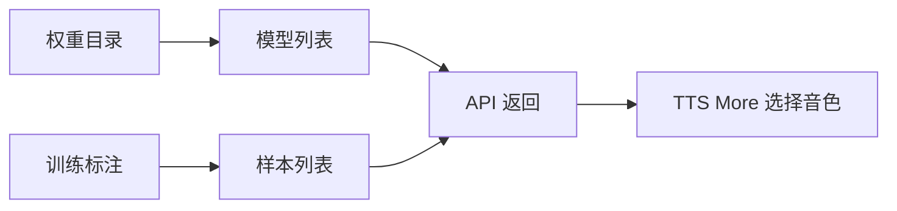

# GPT-SoVITS 子仓维护 Prompt

> 只在用户明确要求维护 GPT-SoVITS 子仓时使用。TTS More 本仓默认通过 `tts-more-v1` worker 或兼容 HTTP 端点调用服务，不需要为了普通接入去改上游仓库。

## 目标

让 GPT-SoVITS 子仓更容易被 TTS More 或其他编排层调用：

- 提供模型列表。
- 提供训练样本列表。
- 提供当前服务状态。
- 支持上传参考音频。
- 将参考音频 3 到 10 秒限制从硬阻断改为软提示。

## 输入

你需要先确认：

- 当前仓库确实是 GPT-SoVITS 子仓，而不是 TTS More 本仓。
- 用户希望修改的是 API、WebUI，还是两者都要。
- 是否需要保持原有端点、参数和返回格式兼容。

## 输出

优先新增能力，不重写主流程：

建议端点：

- `GET /models`：返回可选模型和权重摘要。
- `GET /models/{name}/samples`：返回样本音频路径和参考文本。
- `GET /status`：返回当前权重、设备和版本。
- `POST /upload_ref`：上传参考音频并返回服务端可访问路径。

WebUI 可选增强：

- 模型下拉。
- 样本下拉。
- 样本预览。
- 应用样本到参考音频和参考文本。

## 失败处理

- 目录不存在时返回空列表，不抛出不可恢复错误。
- 文件名或模型名必须做路径穿越防护。
- 参考音频过短或过长时只提示风险，不中断推理。
- 新增能力失败时，不影响已有合成端点。

## 验收

- 现有合成端点仍通过。
- 新增端点返回结构化 JSON。
- WebUI 新组件不会破坏原有组件 ID 或事件。
- 超出推荐时长的参考音频不再被 `raise` 阻断。
- 文档和测试示例不得包含真实角色名、真实参考音频名、本机路径、局域网地址或具体剧本文本。
