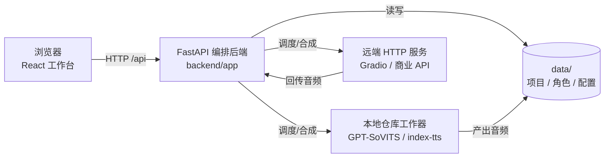
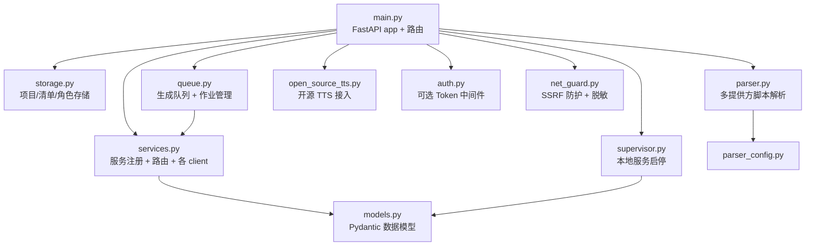
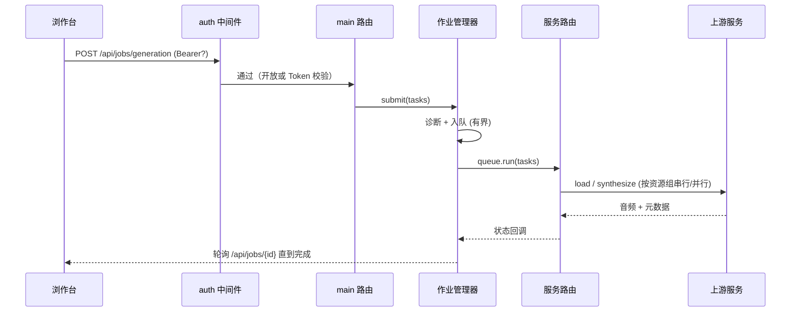

# 架构

TTS More 是一个 TTS 编排层：它不自带模型推理，而是把本地仓库（GPT-SoVITS、index-tts）和外部/商业 HTTP 服务统一成一套调度模型，再通过一个 React 工作台暴露脚本配音流程。

## 整体结构



三个核心边界：

- **前端** (`frontend/`)：单页 React 应用，三栏工作台（服务资源、台词表、台词检视器）。中英双语 i18n，中文兜底。
- **后端** (`backend/app`)：FastAPI，负责项目/角色库存储、解析器、服务路由、生成队列、服务监管。默认绑 `127.0.0.1:8000`。
- **工作器/外部服务**：本地仓库工作器（Gradio WebUI 或标准 worker 契约）和商业 API，都通过 `data/services.json` 里登记的 `base_url` 调用。

## 后端模块依赖



## 请求生命周期（一次生成）



## 数据布局

```
data/
  services.json              # 服务端点注册（受信任，操作员配置）
  templates/                 # 可提交的示例模板
  projects/                  # 标题命名项目目录（.project-id 标记）
  local/                     # 本地运行时数据（不提交）
  .runtime/                  # PID 记录、日志
Project/                     # ProjectStore 默认可写根（data 的兄弟目录）
```

`.gitignore` 覆盖了所有运行时产物（音频、模型、env、缓存）。只有 `data/services.json` 和 `data/templates/*` 会被提交。

## 跨平台

后端 `requires-python = ">=3.10,<3.14"`，无 OS 标记。`supervisor.py` 用 `_is_windows()` 区分进程组/信号分支。启动脚本同时提供 `scripts/start-dev.ps1`（Windows）和 `scripts/start-dev.sh`（POSIX），`Makefile` 跨平台。CI 在 ubuntu + windows 矩阵上跑。

## 安全模型

详见 [security.md](./security.md)。要点：默认开放（本地单用户零摩擦），设置 `TTS_MORE_API_TOKEN` 后写/出口端点强制 Bearer 校验；出口 URL 经 SSRF 防护；文件读根受限；`start_command` 有白名单；上传有大小上限。
