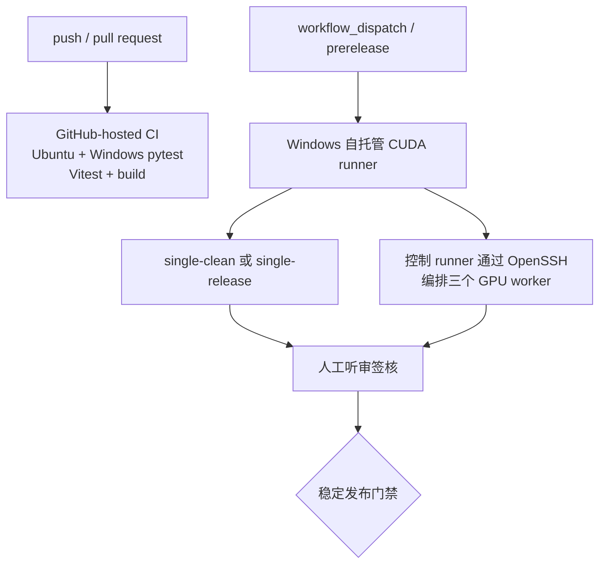

# CI 架构与 CUDA 发布门禁

CI 分为无 GPU 快反馈和 Windows CUDA 发布认证两层。完整测试矩阵、runbook 与签核以 [CUDA 全流程闭环验证](cuda-e2e-validation.md) 为准。

## 两层门禁



`.github/workflows/ci.yml` 在普通 hosted runner 上执行：

- 后端 `pytest backend -q`，Ubuntu 与 Windows；
- 前端 Vitest 与生产 build，Ubuntu；
- topology、worker 契约、工件传输、资源切换、指标判定和报告生成的无 GPU 测试。

这些测试不 import 真实 TTS 模型，也不证明 CUDA 显存、音质或 LAN 恢复行为。macOS 本地执行同样只能验证硬件无关部分。

`.github/workflows/windows-gpu-validation.yml` 使用：

```yaml
runs-on: [self-hosted, Windows, X64, cuda, tts-more-gpu]
```

它支持 `workflow_dispatch`，并监听 release 的 `prereleased`、`published`。稳定版 `published` 的 workflow 要求单机与分布式 job 都成功。人工听审仍由发布记录门禁，不能只看 workflow 绿灯。GPU 门禁不在每次 push/PR 下载模型。

## Runner 角色

### 单机 runner

同一台机器运行应用、三个 worker、CUDA 验证器和 Playwright。三 worker 同时在线，三模型按共享 `cuda-0`、`capacity:1` 顺序加载和卸载。

### 分布式控制 runner

控制 runner 运行应用、验证器和 Playwright，并通过 Windows OpenSSH 登录三个独立 GPU worker。每台 worker 保留轻量 TTS More checkout，只准备一个 TTS repo。控制 runner 使用 `app-only` 配置，远端服务为 `managed:false`，不能由本地 supervisor 管理。

OpenSSH 用户、私钥、远端 checkout 路径和真实 topology 不提交到仓库。host key 必须固定，不能通过关闭校验规避首次连接。

fixture 的 ASR 门禁固定使用 `faster-whisper large-v3`。`backend[dev]` 当前不安装该包，GPU workflow 会在控制环境显式安装 `faster-whisper`；runner 仍需提供可复用的 `large-v3` 模型缓存，否则首次下载时间计入认证准备。

## 执行与工件

PowerShell 总入口：

```powershell
.\scripts\run-cuda-validation.ps1 `
  -Mode single-clean|single-release|distributed `
  -Services data\local\services.json `
  -Fixture data\validation\cuda-fixture.local.json `
  -Output data\validation\runs\<run-id>
```

分布式模式还传入 `-Topology`、`-SshUser`、`-RemoteRoot`；后两项也可由 `TTS_MORE_VALIDATION_SSH_USER`、`TTS_MORE_VALIDATION_REMOTE_ROOT` 提供。完整认证拒绝 `-Node`、`-SkipDeploy`、`-SkipStart` 和 `-SkipFaultRecovery`；控制器使用 topology 的 service 归属分别调用远端 `scripts/deploy-local-tts.ps1 -Profile worker-node`，再在本机渲染 `app-only` 服务配置，并生成绑定 topology hash、commit 与一次性令牌哈希的 `orchestration-preflight.json`。

每次运行上传或保存：

- `summary.json`；
- `junit.xml`；
- `controller.log`；
- `orchestration-preflight.json`（不含原始令牌）；
- WAV 样本；
- `worker-log-references.json`、`distributed-evidence.json` 和自动收集的远端 worker 日志；
- 各 GPU 的 `nvidia-smi.csv`；
- Playwright report/trace；
- `human-listening-review.md` 和完成的验收记录。

公开 GitHub 工件不得包含真实 hostname/IP、SSH 用户、绝对路径、参考音频或权重。需要保留的私有证据使用访问受控的存储，只在发布记录中放受控 URL。

## 触发规则

| 事件 | Hosted CI | 单机 CUDA | 分布式 CUDA | 人工听审 |
|---|---:|---:|---:|---:|
| 普通 push/PR | 必须 | 不触发 | 不触发 | 不需要 |
| 手动调试 | 可选 | `workflow_dispatch` | `workflow_dispatch` | 视目标而定 |
| prerelease | 必须 | workflow 自动运行单机 | 需要显式运行或稳定版运行 | 至少一名；首次认证两名 |
| stable release | 必须 | 必须引用通过运行 | 必须引用通过运行 | 至少一名 |

第一次设备认证必须执行 `single-clean`，清除 repo/venv 后完整部署并建立 16 GB 性能基线。后续 `single-release` 可以复用模型缓存，但仍重新同步锁定 repo、安装依赖并渲染服务配置。第一次分布式认证通过后，才能把分布式结果设为稳定发布门禁。

## Secrets 与本地配置

以下内容只能来自 runner 本地或受保护 secrets：

- `deployment/app/topology*.local.json`；
- `deployment/app/repo-paths.local.json`；
- `data/validation/*.local.json`；
- SSH 用户、私钥和远端 checkout 路径；
- 参考音频、GPT 权重路径、模型缓存和审核者身份。

仓库只提交脱敏 topology 示例和代码/测试。运行前使用 `git check-ignore -v` 确认真实文件被忽略，运行后检查日志脱敏。

## 发布判定

自动门禁包括服务契约、真实模型能力、每服务 3 条短文本、30 条混合队列、工件传输、音频/ASR 指标、资源与性能、故障恢复和 Playwright。人工门禁按清晰度、音色相似度、情绪/韵律、伪影控制评分。

每个稳定版本必须提供单机运行 URL、分布式运行 URL 和人工记录。任一门禁失败、结果缺失或阈值超限都阻止发布；prerelease 触发本身不代表认证通过。
