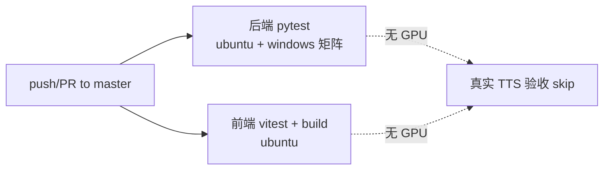
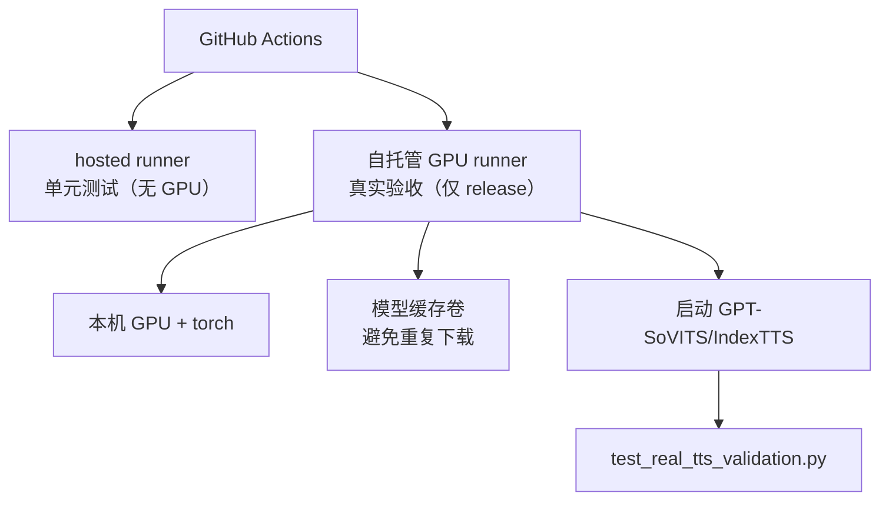
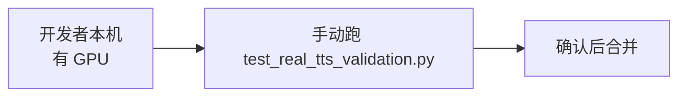
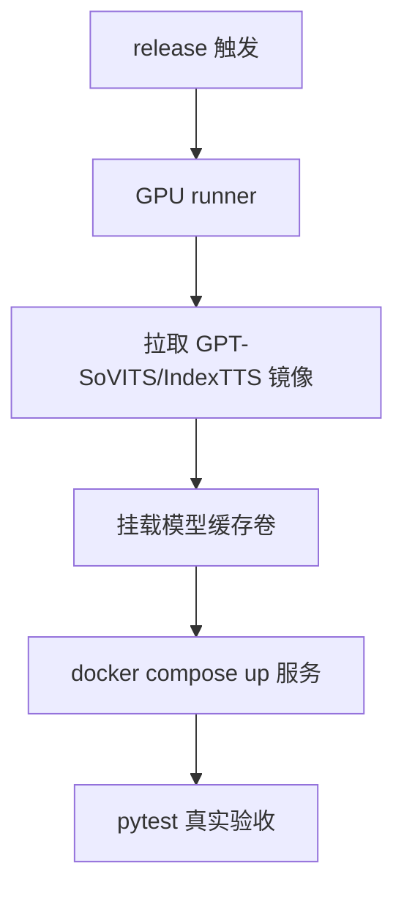
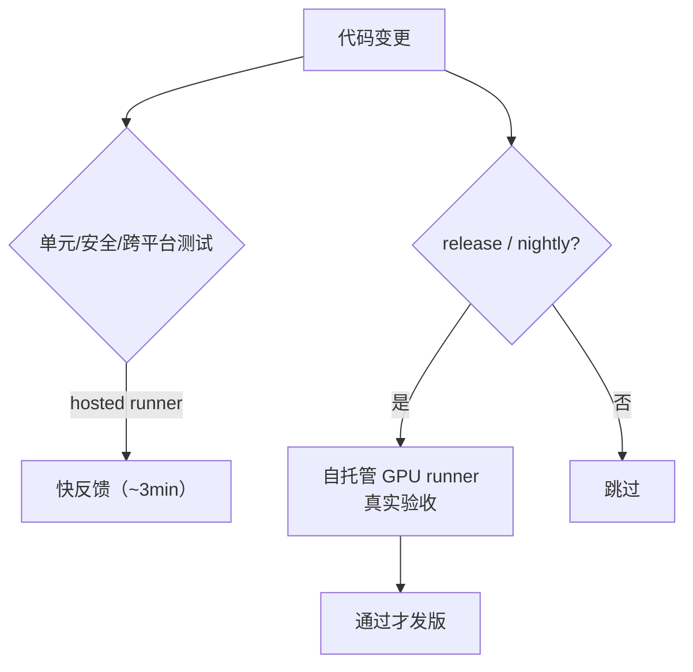

# CI 架构与真实 TTS 验收探讨

本文档探讨 TTS More 的 CI 部署架构，特别是"真实 TTS 端到端验收"在不同方案下的得失。

## 现状

当前 CI（`.github/workflows/ci.yml`）：

- 后端：`pytest backend -q`，矩阵 `ubuntu-latest` + `windows-latest`。单元测试 + 安全测试 + 跨平台测试，**无 GPU**。
- 前端：`vitest` + `vite build`，`ubuntu-latest`。
- `test_real_tts_validation.py` 默认 skip（需 `TTS_MORE_RUN_REAL_TTS=1` + 真实模型 + GPU）。

**这个 CI 验证的是"代码正确性"与"跨平台可跑性"，不验证"真实推理质量"。**

## 为什么真实验收难

真实 TTS 验收需要：

1. **大模型**：GPT-SoVITS 预训练权重（GB 级）、IndexTTS checkpoints、CosyVoice 模型。
2. **GPU**：torch + CUDA（或 MPS），CPU 推理慢到不可用。
3. **运行中的服务**：GPT-SoVITS Gradio/api-v2 WebUI、IndexTTS worker，各自监听端口。
4. **测试数据**：参考音频、prompt 文本、预期输出比对。

GitHub-hosted runner 无 GPU，且单次作业限时 6h、磁盘有限。模型下载动辄几十分钟，无法每次 push 跑。

## 三种部署架构

### 方案 1：自托管 GPU runner（推荐用于 release 门禁）

**得**：
- 真实推理回归保护（权重/参考音频/合成质量）。
- 可在 release/nightly 触发，不堵每次 push。
- 模型缓存卷避免重复下载。

**失**：
- 需维护一台 GPU 机器（电费/折旧/运维）。
- runner 注册与 token 管理。
- 机器故障会卡 release。

**触发策略**：`on: workflow_dispatch` + `schedule`（nightly）+ `release` 事件，不在 push/PR 上跑。

### 方案 2：纯手动验收（现状延续）

**得**：零 CI 成本，灵活。
**失**：回归靠人，易漏；新人/外部贡献者的 PR 无法自动验证真实路径。

### 方案 3：容器化 GPU + 模型缓存（高级）

**得**：可复现环境，镜像是版本化产物，可迁移。
**失**：镜像构建复杂（torch+CUDA+模型），镜像大（10GB+），模型下载仍慢（除非预热缓存），维护成本高。

## 推荐策略

- **每次 push/PR**：hosted runner 跑单元 + 安全 + 跨平台（现状，快）。
- **release / nightly**：自托管 GPU runner 跑 `test_real_tts_validation.py`，作为发版门禁。
- **模型缓存**：runner 机器上常驻模型目录，CI 只拉代码不拉模型。

## 落地清单（需维护者决策与资源）

1. 准备一台 GPU 机器（本机或团队服务器），装 torch + CUDA + 模型。
2. 注册为 GitHub self-hosted runner（`Settings → Actions → Runners → New self-hosted runner`），打 `gpu` label。
3. 新增 `.github/workflows/real-tts.yml`，`runs-on: [self-hosted, gpu]`，`on: workflow_dispatch + schedule + release`。
4. runner 机器上预设 `TTS_MORE_RUN_REAL_TTS=1` + 模型路径 env，启动 GPT-SoVITS/IndexTTS 服务。
5. CI 步骤：拉代码 → 启服务 → pytest → 收集产物。

**此项需维护者提供 GPU 资源与 runner 注册**，Agent 无法独立完成。当前保持手动验收 + hosted 单元测试。
