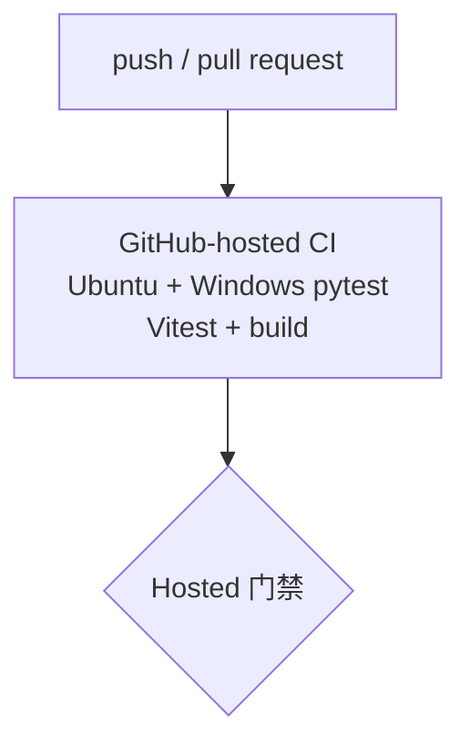

# CI 架构

CI 在 GitHub-hosted 无 GPU runner 上提供快反馈：`ci.yml` 在每次 push/PR 跑后端 pytest、前端 Vitest 与生产 build，以及不依赖真实 TTS 模型的拓扑/契约/工件测试。

## 门禁

```mermaid
flowchart TD
    Change["push / pull request"] --> Hosted["GitHub-hosted CI\nUbuntu + Windows pytest\nVitest + build"]
    Hosted --> Green{"Hosted 门禁"}
```

`.github/workflows/ci.yml` 在普通 hosted runner 上执行：

- 后端 `pytest backend -q`，Ubuntu 与 Windows；
- 前端 Vitest 与生产 build，Ubuntu；
- topology、worker 契约、工件传输、资源切换、指标判定和报告生成的无 GPU 测试。

这些测试不 import 真实 TTS 模型，也不证明目标机显存、音质或 LAN 恢复行为。macOS 本地执行同样只能验证硬件无关部分。真实 TTS / ComfyUI 端到端验证需要带模型和（如适用）GPU 的本机或受控环境，不在此 CI 内自动下载模型。

## Secrets 与本地配置

以下内容只来自 runner 本地或受保护 secrets，不提交：

- `deployment/app/topology*.local.json`；
- `deployment/app/repo-paths.local.json`；
- `data/validation/*.local.json`；
- 参考音频、GPT 权重路径和模型缓存。

仓库只提交脱敏示例和代码/测试。运行前使用 `git check-ignore -v` 确认真实文件被忽略，运行后检查日志脱敏。

## 发布判定

自动门禁包括服务契约、前端 build、后端测试和队列/解析/存储等无 GPU 行为。涉及真实模型能力、音频/ASR 指标、资源与性能、故障恢复的证据只能在具备真实模型与硬件的受控环境采集，作为人工验收记录，不由本 CI 签发。
