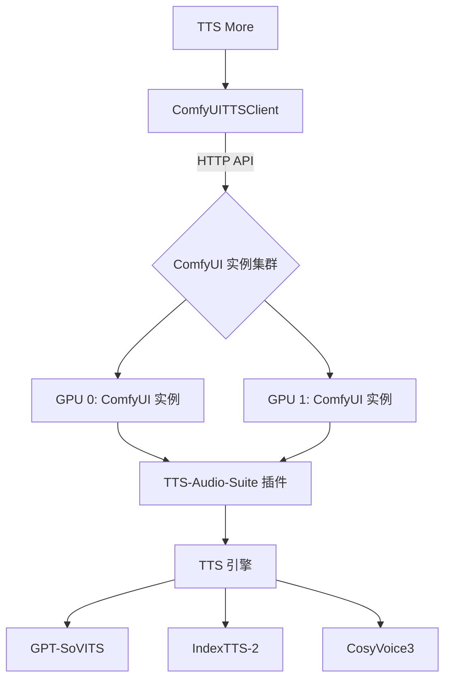
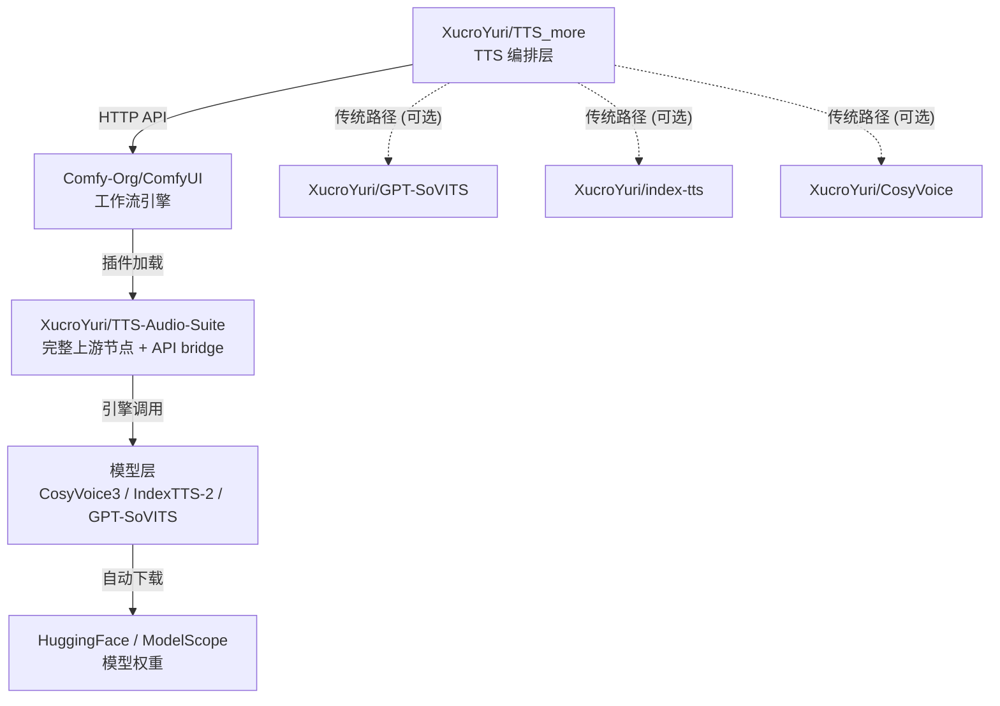

# ComfyUI TTS 后端接入指南

## 概述

ComfyUI 在 TTS More 体系中被定位为统一的 TTS 运行载体。通过集成 TTS-Audio-Suite 插件，ComfyUI 能够整合 GPT-SoVITS、IndexTTS-2 和 CosyVoice3 等多种引擎。这种架构使用 ComfyUI 内置的任务队列实现多引擎并行调度，为复杂的工作流提供稳定的推理环境。

## 架构



每个 ComfyUI 实例对应一个 `resource_group`。系统支持多设备并行执行，通过调度器将任务分发至不同的 GPU 资源。

## 前置条件

1. ComfyUI 已安装并运行，默认端口为 8188。
2. TTS-Audio-Suite 插件已安装。用户可以在 ComfyUI Manager 中搜索 "TTS Audio Suite" 进行一键安装。
3. CosyVoice3 模型已准备就绪。首次使用时系统会自动下载约 5.4GB 的模型文件。

## 快速开始

在 TTS More 工作台的 `接入 → TTS 服务` 页面添加 ComfyUI 端点。配置完成后，系统会将信息写入 `services.json`。

配置示例：

```json
{
  "service_id": "comfyui-local-cosyvoice",
  "provider_type": "comfyui",
  "api_contract": "comfyui-tts-v1",
  "engine": "cosyvoice",
  "base_url": "http://127.0.0.1:8188",
  "resource_group": "local-gpu-0",
  "capacity": 3,
  "priority": 10,
  "capabilities": ["tts", "cosyvoice", "wav_output", "reference_audio_voice"],
  "default_params": {
    "poll_interval": 2.0,
    "timeout_seconds": 600
  }
}
```

## 服务端点配置详解

| 字段 | 说明 |
| :--- | :--- |
| `service_id` | 服务的唯一标识符。 |
| `provider_type` | 固定为 `comfyui`。 |
| `api_contract` | 固定为 `comfyui-tts-v1`。 |
| `engine` | 指定引擎类型，可选 `cosyvoice`、`indextts-2` 或 `gpt-sovits`。 |
| `base_url` | ComfyUI 实例的访问地址。 |
| `resource_group` | 资源组名称。同一实例的不同引擎应使用相同的资源组以确保 GPU 串行。 |
| `capacity` | 并发容量。建议设置为 3，利用 ComfyUI 内部队列堆积任务。 |
| `priority` | 调度优先级，数值越小优先级越高。 |
| `capabilities` | 服务能力列表。 |
| `default_params` | 默认合成参数。 |

### 引擎配置示例

同一台 ComfyUI 实例运行多个引擎时，需为每个引擎创建独立端点，共享 `base_url` 和 `resource_group`：

```json
[
  {
    "service_id": "comfyui-gpu0-cosyvoice",
    "display_name": "ComfyUI GPU0 - CosyVoice3",
    "provider_type": "comfyui",
    "api_contract": "comfyui-tts-v1",
    "engine": "cosyvoice",
    "base_url": "http://192.168.1.10:8188",
    "resource_group": "comfyui-gpu-0",
    "capacity": 3,
    "priority": 10,
    "capabilities": ["tts", "cosyvoice", "wav_output", "reference_audio_voice", "zero_shot_voice"]
  },
  {
    "service_id": "comfyui-gpu0-indextts",
    "display_name": "ComfyUI GPU0 - IndexTTS-2",
    "provider_type": "comfyui",
    "api_contract": "comfyui-tts-v1",
    "engine": "indextts",
    "base_url": "http://192.168.1.10:8188",
    "resource_group": "comfyui-gpu-0",
    "capacity": 3,
    "priority": 20,
    "capabilities": ["tts", "indextts", "wav_output", "emotion_text", "emotion_audio"]
  },
  {
    "service_id": "comfyui-gpu1-cosyvoice",
    "display_name": "ComfyUI GPU1 - CosyVoice3",
    "provider_type": "comfyui",
    "api_contract": "comfyui-tts-v1",
    "engine": "cosyvoice",
    "base_url": "http://192.168.1.11:8188",
    "resource_group": "comfyui-gpu-1",
    "capacity": 3,
    "priority": 10,
    "capabilities": ["tts", "cosyvoice", "wav_output"]
  }
]
```

> **关键规则**：同一物理 GPU 上的多个引擎端点必须使用相同的 `resource_group`。调度器按资源组串行执行，确保同一 GPU 不会同时加载两个模型导致显存溢出。不同 `resource_group` 的任务可并行执行。

### 引擎参数映射

合成时通过 `parameters` 传入引擎特定参数，workflow builder 自动映射到 ComfyUI 节点输入：

**CosyVoice**:
| TTS More 参数 | ComfyUI 节点输入 | 说明 |
|:---|:---|:---|
| `model_path` | `CosyVoiceEngineNode.model_path` | 模型名，如 `Fun-CosyVoice3-0.5B-RL` |
| `speed` | `CosyVoiceEngineNode.speed` | 语速，0.5~2.0 |
| `instruct_text` | `CosyVoiceEngineNode.instruct_text` | 自然语言指令控制风格 |
| `reference_audio` | `LoadAudio` → `UnifiedTTSTextNode.opt_narrator` | 参考音频（需放在 ComfyUI input 目录） |
| `prompt_text` | `UnifiedTTSTextNode` | 参考音频对应的文本 |

**IndexTTS-2**:
| TTS More 参数 | ComfyUI 节点输入 | 说明 |
|:---|:---|:---|
| `model_path` | `IndexTTSEngineNode.model_path` | 模型名，如 `IndexTTS-2` |
| `temperature` / `top_p` / `top_k` | `IndexTTSEngineNode.*` | 采样参数 |
| `emotion_audio` | `IndexTTSEngineNode.emotion_audio` | 情绪参考音频 |

**GPT-SoVITS**:
| TTS More 参数 | ComfyUI 节点输入 | 说明 |
|:---|:---|:---|
| `gpt_weights_path` + `sovits_weights_path` | `GPTSovitsEngineNode.weight_pair` | 权重文件路径对 |
| `prompt_lang` / `text_lang` | `GPTSovitsEngineNode.ref_language` / `text_language` | 语言设置 |

## 多设备分布式部署

在拥有多台 GPU 机器的环境中，可以采用分布式部署拓扑。

- **拓扑示例**: 部署 3 台 GPU 机器，每台机器运行一个 ComfyUI 实例。
- **分配策略**: 为每个实例分配唯一的 `resource_group`（如 `gpu-node-1`、`gpu-node-2`）。
- **容量建议**: 建议设置 `capacity=3`。ComfyUI 内部队列可以处理积压任务，提高吞吐量。
- **共享资源**: 单机多引擎共享资源组时，调度器会确保任务按序进入 GPU，防止显存溢出。

## 模型分离模式

系统支持模型存放位置与 ComfyUI 运行载体分离，方便管理大规模模型库。

- `model_path`: 支持内置模型名（如 `Fun-CosyVoice3-0.5B-RL`）或本地路径（格式为 `local:ModelName`）。
- 可选参数: `cosyvoice_home`、`index_tts_home` 和 `gpt_sovits_home` 可指向外部模型目录。

示例配置：
将 CosyVoice 模型放置在 `D:\CosyVoice\pretrained_models\`，并在配置中指定该路径。

## 参考音频与音色克隆

CosyVoice 等引擎需要参考音频才能生成声音。如果 `narrator_voice` 设置为 `none`，输出将保持静音。

### 音色控制方式

1. **零样本克隆**: 提供 `reference_audio` 和 `prompt_text`，通过 `opt_narrator` 节点连接。
2. **内置音色**: 使用 `narrator_voice` 下拉选项选择示例语音，例如 `voices_examples/higgs_audio/zh_man_sichuan.wav`。
3. **指令控制**: 通过 `instruct_text` 使用自然语言指令控制情绪或风格。

参考音频文件需要放置在 ComfyUI 的 `input` 目录下。

## API 契约

ComfyUITTSClient 封装了与 ComfyUI 的交互逻辑：

- **健康检查**: 映射至 `/system_stats` 端点。
- **合成流程**: 调用 `/prompt` 提交工作流，轮询 `/history/{id}` 获取状态，最后通过 `/view` 获取音频结果。
- **资源释放**: 必要时调用 `/free` 释放显存。

工作流以 JSON 格式定义，描述了节点间的连接关系。

## 队列与 cluster_key

为了减少模型加载开销，系统使用 `cluster_key` 进行任务聚类。

- **CosyVoice**: 由 `mode`、`speaker`、`prompt_audio`、`prompt_text`、`instruct`、`speed` 和 `seed` 构成。
- **IndexTTS-2**: 由 `voice`、`emotion_mode`、`emotion_source` 及高级参数构成。
- **GPT-SoVITS**: 由 `weight_pair`、`ref_language`、`text_language`、`top_k`、`top_p` 和 `temperature` 构成。
- **直连模式**: 由 `engine`、`model_path`、`reference_audio`、`speed` 和 `seed` 构成。

## 故障排查

- **静音输出**: CosyVoice 需要参考音频才能生成有声音频。检查 `reference_audio` 参数是否正确配置，文件是否存在于 ComfyUI `input` 目录。如果未提供参考音频，系统会自动 fallback 到内置中文语音，若仍静音请检查 TTS-Audio-Suite 插件版本是否包含该语音文件。
- **超时错误**: 默认超时时间为 600 秒（`timeout_seconds`）。`lowvram` 模式下模型加载较慢，连续高并发请求可能触发超时，建议适当增大超时或降低并发。
- **性能下降**: 在 `--lowvram` 模式下，每次请求会重新加载模型。避免连续发送大量高并发请求，可通过 ComfyUI 启动参数 `--highvram` 或 `--normalvram` 改善。
- **崩溃恢复**: ComfyUI 进程崩溃后需手动重启。TTS More 会在下次请求时检测到连接失败并报错，不会自动重启 ComfyUI 进程。
- **模型下载**: 首次使用某引擎时，TTS-Audio-Suite 会自动下载模型（如 CosyVoice3 ~5.4GB）。下载期间请求会挂起，请耐心等待或提前下载模型到 `ComfyUI/models/TTS/` 目录。

## 安全

- **错误脱敏**: 系统使用 `scrub_error` 对敏感信息进行脱敏处理。
- **访问控制**: ComfyUI 默认不带认证机制。建议将其绑定至 `127.0.0.1`，或通过反向代理（如 Nginx）增加认证层。

## 从零部署指南

以下是从空白机器到完整可用的一站式部署步骤。共涉及 3 个 GitHub 项目。

### 项目清单

| 项目 | GitHub 地址 | 用途 | 必需 |
|:---|:---|:---|:---:|
| **TTS More** | `XucroYuri/TTS_more` (分支 `dev-xu/comfyui-integration`) | TTS 编排后端 + React 工作台 | 是 |
| **ComfyUI** | `Comfy-Org/ComfyUI` | TTS 运行载体，提供 HTTP API 和工作流引擎 | 是 |
| **TTS-Audio-Suite** | `XucroYuri/TTS-Audio-Suite` | 基于上游完整架构扩展的正式 fork；保留 15+ 引擎并提供 TTS More API bridge | 是 |
| **GPT-SoVITS** | `XucroYuri/GPT-SoVITS` | GPT-SoVITS 模型权重来源（传统 worker 路径；ComfyUI 路径下可选） | 否 |
| **IndexTTS** | `XucroYuri/index-tts` | IndexTTS 模型权重来源（传统 worker 路径；ComfyUI 路径下可选） | 否 |
| **CosyVoice** | `XucroYuri/CosyVoice` | CosyVoice 模型权重来源（传统 worker 路径；ComfyUI 路径下可选） | 否 |

> ComfyUI 路径下，TTS-Audio-Suite 会自动下载所需模型（首次使用）。GPT-SoVITS / IndexTTS / CosyVoice 三个 repo 仅在传统 worker 模式或模型分离模式下需要。

### 架构关系



### 部署步骤

#### 第一步：安装 ComfyUI

```powershell
# 克隆 ComfyUI
git clone https://github.com/Comfy-Org/ComfyUI.git
cd ComfyUI

# 创建虚拟环境并安装依赖
python -m venv .venv
.venv\Scripts\pip install torch torchvision torchaudio --index-url https://download.pytorch.org/whl/cu124
.venv\Scripts\pip install -r requirements.txt
```

macOS / Linux：
```bash
git clone https://github.com/Comfy-Org/ComfyUI.git
cd ComfyUI
python3 -m venv .venv
.venv/bin/pip install torch torchvision torchaudio
.venv/bin/pip install -r requirements.txt
```

#### 第二步：安装 TTS-Audio-Suite 插件

```powershell
cd ComfyUI/custom_nodes
git clone https://github.com/XucroYuri/TTS-Audio-Suite.git
cd TTS-Audio-Suite
..\..\.venv\Scripts\pip install -r requirements.txt
```

创建仅保存在本机的 `resources.yaml`，为三个引擎配置稳定 `resource_id` 与本地源码/模型路径；启动 ComfyUI 前设置 `TTS_AUDIO_SUITE_RESOURCES` 指向该文件。TTS More 只读取资源 ID，不接收这些私有路径。

#### 第三步：启动 ComfyUI

```powershell
cd ComfyUI
.venv\Scripts\python main.py --listen 0.0.0.0 --port 8188
```

验证：浏览器打开 `http://127.0.0.1:8188`，在节点列表搜索 "CosyVoice" 确认插件已加载。

#### 第四步：安装 TTS More

```powershell
git clone https://github.com/XucroYuri/TTS_more.git
cd TTS_more
git checkout dev-xu/comfyui-integration

# 安装依赖
python -m venv .venv
.venv\Scripts\pip install -e 'backend[dev]'
cd frontend && pnpm install && cd ..
```

#### 第五步：配置 ComfyUI 服务端点

创建 `data/local/services.json`：

```json
[
  {
    "service_id": "comfyui-cosyvoice",
    "display_name": "ComfyUI - CosyVoice3",
    "provider_type": "comfyui",
    "api_contract": "comfyui-tts-v1",
    "engine": "cosyvoice",
    "base_url": "http://127.0.0.1:8188",
    "mode": "external",
    "network_scope": "localhost",
    "resource_group": "local-gpu-0",
    "capacity": 3,
    "priority": 10,
    "capabilities": ["tts", "cosyvoice", "wav_output", "reference_audio_voice"],
    "default_params": {"resource_id": "cosyvoice-local"}
  },
  {
    "service_id": "comfyui-indextts",
    "display_name": "ComfyUI - IndexTTS-2",
    "provider_type": "comfyui",
    "api_contract": "comfyui-tts-v1",
    "engine": "indextts",
    "base_url": "http://127.0.0.1:8188",
    "mode": "external",
    "network_scope": "localhost",
    "resource_group": "local-gpu-0",
    "capacity": 3,
    "priority": 20,
    "capabilities": ["tts", "indextts", "wav_output", "emotion_text", "emotion_audio"],
    "default_params": {"resource_id": "indextts-local"}
  }
]
```

#### 第六步：启动 TTS More

```powershell
# 启动后端
.venv\Scripts\python -m uvicorn app.main:create_app --host 127.0.0.1 --port 8000

# 另开终端，启动前端
cd frontend && pnpm dev
```

打开 `http://127.0.0.1:5173`，进入 `接入 → TTS 服务`，确认 ComfyUI 端点状态为 "ready"。

#### 第七步：首次合成测试

在工作台创建项目 → 添加台词 → 选择 CosyVoice 引擎 → 点击生成。首次使用会自动下载 CosyVoice3 模型（~5.4GB），后续合成约 3 秒/条。

### 多机扩展

每增加一台 GPU 机器，只需：

1. 在该机器上完成第一、二、三步（安装 ComfyUI + TTS-Audio-Suite）
2. 在 TTS More 的 `services.json` 中添加新的端点，使用不同的 `resource_group`：
```json
{
  "service_id": "comfyui-gpu1-cosyvoice",
  "base_url": "http://192.168.1.11:8188",
  "resource_group": "comfyui-gpu-1",
  ...
}
```

不同 `resource_group` 的任务由 TTS More 自动并行调度，无需额外配置。
