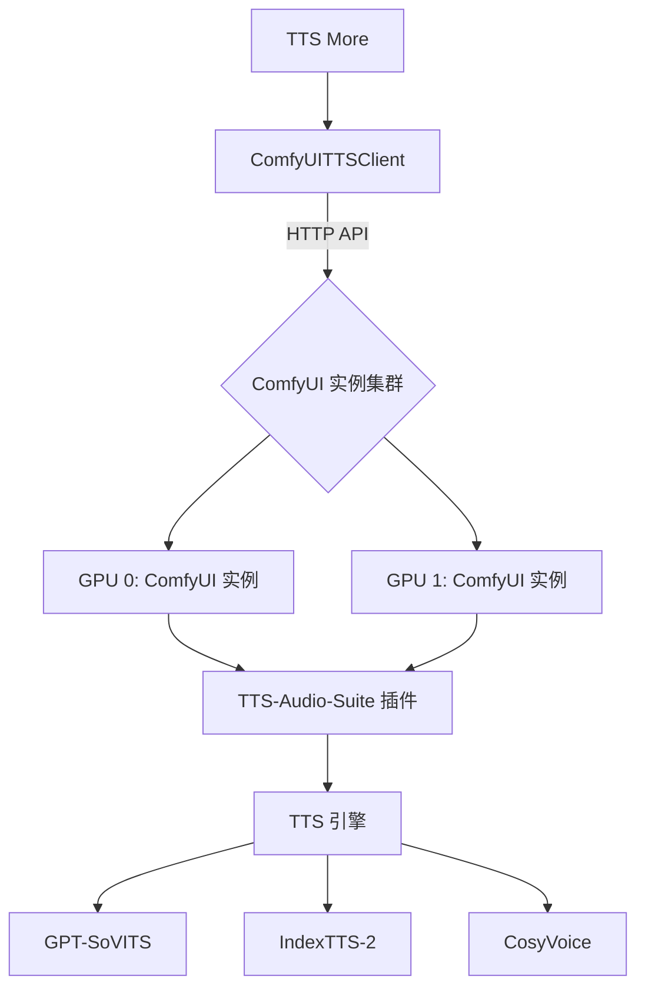
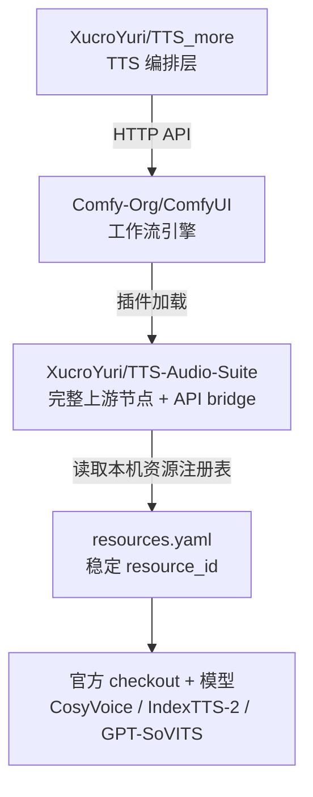

# ComfyUI TTS 后端接入指南

## 概述

ComfyUI 在 TTS More 体系中被定位为统一的 TTS 运行载体。通过集成 TTS-Audio-Suite 插件，ComfyUI 能够整合 GPT-SoVITS、IndexTTS-2 和 CosyVoice 等多种引擎。这种架构使用 ComfyUI 内置的任务队列执行工作流；TTS More 在单 GPU `resource_group` 上保持 `capacity=1`，避免多个重模型并发争用显存。

## 架构


```mermaid
flowchart TD
    TM["TTS More"] --> Client["ComfyUITTSClient"]
    Client -- "HTTP API" --> Instances{ComfyUI 实例集群}
    Instances --> Node1["GPU 0: ComfyUI 实例"]
    Instances --> Node2["GPU 1: ComfyUI 实例"]
    Node1 --> Plugin["TTS-Audio-Suite 插件"]
    Node2 --> Plugin
    Plugin --> Engines["TTS 引擎"]
    Engines --> GS["GPT-SoVITS"]
    Engines --> IT["IndexTTS-2"]
    Engines --> CV["CosyVoice"]
```

每个 ComfyUI 实例对应一个 `resource_group`。系统支持多设备并行执行，通过调度器将任务分发至不同的 GPU 资源。

## 前置条件

1. ComfyUI 已安装并运行，默认端口为 8188。
2. 已从 `XucroYuri/TTS-Audio-Suite` 安装包含 TTS More API bridge 的 v5.6.2 或更新版本；上游同名插件不包含这个 fork 专用契约。
3. GPT-SoVITS、IndexTTS 和 CosyVoice 的官方 checkout、兼容的 checkout-local Python 环境及模型均已准备就绪。TTS More 只通过资源注册表引用它们，不修改三个上游项目。
4. 已创建本机 `resources.yaml` 并设置 `TTS_AUDIO_SUITE_RESOURCES`，或将文件放入 ComfyUI 用户目录的 `tts_audio_suite/resources.yaml`。

### Bridge API 资源配置

从 TTS More 根目录复制模板并把 `resources: {}` 替换为本机实际资源：

```powershell
Copy-Item deployment\tts-repos\resources.yaml.example .\resources.yaml
$env:TTS_AUDIO_SUITE_RESOURCES = (Resolve-Path .\resources.yaml).Path
```

```bash
cp deployment/tts-repos/resources.yaml.example ./resources.yaml
export TTS_AUDIO_SUITE_RESOURCES="$(pwd)/resources.yaml"
```

资源 ID 是 TTS More 与插件之间的稳定模型标识。源码路径、权重路径和解释器路径只存在于本机注册文件中，不写入 `services.json`，也不得提交。修改注册文件后重启 ComfyUI，然后验证：

```bash
curl http://127.0.0.1:8188/api/tts-audio-suite/v1/capabilities
```

## 快速开始

在 TTS More 工作台的 `接入 → TTS 服务` 页面添加 ComfyUI 端点。配置完成后，系统会将信息写入 `services.json`。

配置示例：

```json
{
  "service_id": "comfyui-local-cosyvoice",
  "provider_type": "cosyvoice",
  "api_contract": "comfyui-tts-audio-suite-v1",
  "engine": "cosyvoice",
  "base_url": "http://127.0.0.1:8188",
  "resource_group": "local-gpu-0",
  "capacity": 1,
  "priority": 10,
  "capabilities": ["tts", "cosyvoice", "wav_output", "reference_audio_voice"],
  "default_params": {
    "resource_id": "cosyvoice-local",
    "poll_interval": 2.0,
    "timeout_seconds": 600
  }
}
```

## 三种稳定工作流模板

TTS More 的 ComfyUI builder 提供三个稳定名称，均复用同一套 `resource_id`、队列和 WAV 输出契约：

| `workflow_template` | 用途 | 必要输入 |
| :--- | :--- | :--- |
| `text-only` | 纯文本合成；会清除遗留的参考音频绑定 | `resource_id`、`text` |
| `reference-clone` | 使用上传后的参考音频进行音色克隆 | `resource_id`、`text`、`asset_id` |
| `controlled` | 在同一图结构中保留引擎控制项（如 GPT-SoVITS 切句、采样参数） | `resource_id`、`text` |

模板通过服务端点的 `default_params` 或单次任务 `parameters` 选择。例如：

```json
{
  "engine": "gpt-sovits",
  "workflow_template": "controlled",
  "resource_id": "gpt-sovits-local",
  "text": "你好，这是一次 ComfyUI 联动验证。",
  "how_to_cut": "按标点符号切",
  "temperature": 0.8
}
```

`reference-clone` 的 `asset_id` 必须来自 TTS-Audio-Suite 的音频上传接口；不能把本机路径直接写入工作流。对应插件仓库也提供可拖入 ComfyUI 的三份 API prompt 示例：GPT-SoVITS、IndexTTS 和 CosyVoice。示例中的资源 ID 是占位值，实际运行时必须替换为本机 `resources.yaml` 中已登记且 `capabilities` 报告为 `ready` 的资源。

## 服务端点配置详解

| 字段 | 说明 |
| :--- | :--- |
| `service_id` | 服务的唯一标识符。 |
| `provider_type` | 逻辑 TTS 提供方，使用 `cosyvoice`、`indextts` 或 `gpt-sovits`，以便角色绑定继续按引擎路由。 |
| `api_contract` | 固定为 `comfyui-tts-audio-suite-v1`。 |
| `engine` | 指定 TTS-Audio-Suite 工作流引擎，可选 `cosyvoice`、`indextts` 或 `gpt-sovits`。 |
| `base_url` | ComfyUI 实例的访问地址。 |
| `resource_group` | 资源组名称。同一实例的不同引擎应使用相同的资源组以确保 GPU 串行。 |
| `capacity` | 单 GPU 资源组的并发容量，默认设置为 1，避免同时装载多个重模型。 |
| `priority` | 调度优先级，数值越小优先级越高。 |
| `capabilities` | 服务能力列表。 |
| `default_params` | 默认合成参数。 |

### 引擎配置示例

同一台 ComfyUI 实例运行多个引擎时，需为每个引擎创建独立端点，共享 `base_url` 和 `resource_group`：

```json
[
  {
    "service_id": "comfyui-gpu0-cosyvoice",
    "display_name": "ComfyUI GPU0 - CosyVoice",
    "provider_type": "cosyvoice",
    "api_contract": "comfyui-tts-audio-suite-v1",
    "engine": "cosyvoice",
    "base_url": "http://<gpu-host-0>:8188",
    "resource_group": "comfyui-gpu-0",
    "capacity": 1,
    "priority": 10,
    "capabilities": ["tts", "cosyvoice", "wav_output", "reference_audio_voice", "zero_shot_voice"]
  },
  {
    "service_id": "comfyui-gpu0-indextts",
    "display_name": "ComfyUI GPU0 - IndexTTS-2",
    "provider_type": "indextts",
    "api_contract": "comfyui-tts-audio-suite-v1",
    "engine": "indextts",
    "base_url": "http://<gpu-host-0>:8188",
    "resource_group": "comfyui-gpu-0",
    "capacity": 1,
    "priority": 20,
    "capabilities": ["tts", "indextts", "wav_output", "emotion_text", "emotion_audio"]
  },
  {
    "service_id": "comfyui-gpu1-cosyvoice",
    "display_name": "ComfyUI GPU1 - CosyVoice",
    "provider_type": "cosyvoice",
    "api_contract": "comfyui-tts-audio-suite-v1",
    "engine": "cosyvoice",
    "base_url": "http://<gpu-host-1>:8188",
    "resource_group": "comfyui-gpu-1",
    "capacity": 1,
    "priority": 10,
    "capabilities": ["tts", "cosyvoice", "wav_output"]
  }
]
```

> **关键规则**：同一物理 GPU 上的多个引擎端点必须使用相同的 `resource_group`。调度器按资源组串行执行，确保同一 GPU 不会同时加载两个模型导致显存溢出。不同 `resource_group` 的任务可并行执行。

### 引擎参数映射

合成时通过 `parameters` 传入引擎特定参数，workflow builder 自动映射到 ComfyUI 节点输入：

**CosyVoice**:
| TTS More 参数 | ComfyUI 节点输入 | 说明 |
|:---|:---|:---|
| `resource_id` | `TTSExternalCosyVoiceEngine.resource_id` | TTS-Audio-Suite `resources.yaml` 中的资源 ID |
| `speed` | `TTSExternalCosyVoiceEngine.speed` | 语速，0.5~2.0 |
| `instruct_text` | `TTSExternalCosyVoiceEngine.instruct_text` | 自然语言指令控制风格 |
| `reference_audio` | `TTSExternalAudioAsset.asset_id` → `UnifiedTTSTextNode.opt_narrator` | TTS More 上传参考音频后传入 asset id |
| `prompt_text` | `TTSExternalAudioAsset.reference_text` | 参考音频对应的文本 |

**IndexTTS-2**:
| TTS More 参数 | ComfyUI 节点输入 | 说明 |
|:---|:---|:---|
| `resource_id` | `TTSExternalIndexTTSEngine.resource_id` | TTS-Audio-Suite `resources.yaml` 中的资源 ID |
| `temperature` / `top_p` / `top_k` | `TTSExternalIndexTTSEngine.*` | 采样参数 |
| `reference_audio` | `TTSExternalAudioAsset.asset_id` → `UnifiedTTSTextNode.opt_narrator` | TTS More 上传参考音频后传入 asset id |

**GPT-SoVITS**:
| TTS More 参数 | ComfyUI 节点输入 | 说明 |
|:---|:---|:---|
| `resource_id` | `TTSExternalGPTSovitsEngine.resource_id` | TTS-Audio-Suite `resources.yaml` 中的资源 ID，权重路径由资源配置持有 |
| `prompt_lang` / `text_lang` | `TTSExternalGPTSovitsEngine.ref_language` / `text_language` | 语言设置 |
| `top_k` / `top_p` / `temperature` | `TTSExternalGPTSovitsEngine.*` | 采样参数 |

## 多设备分布式部署

在拥有多台 GPU 机器的环境中，可以采用分布式部署拓扑。

- **拓扑示例**: 部署 3 台 GPU 机器，每台机器运行一个 ComfyUI 实例。
- **分配策略**: 为每个实例分配唯一的 `resource_group`（如 `gpu-node-1`、`gpu-node-2`）。
- **容量建议**: 每个单 GPU `resource_group` 设置 `capacity=1`。通过增加 ComfyUI 实例并使用不同资源组扩展并行能力。
- **共享资源**: 单机多引擎共享资源组时，调度器会确保任务按序进入 GPU，防止显存溢出。

## 模型分离模式

模型、官方推理源码和 ComfyUI 可以位于不同目录。`resources.yaml` 中的 `source_root` 指向官方 TTS checkout，`model_dir` 或权重字段指向现有模型。插件把官方项目当作推理库调用，不需要启动它们的 WebUI，也不修改这些项目。

- CosyVoice / IndexTTS：配置 `source_root` 与 `model_dir`。
- GPT-SoVITS：配置 `source_root`、GPT/SoVITS 权重以及 BERT/CNHuBERT 模型目录。
- 默认使用各 checkout 的 `.venv`；三个引擎都可通过私有 `python_executable` 字段指定兼容解释器。该字段必须是现有的绝对普通文件，不能是 symlink、junction 或其他 Windows reparse 路径。

## 参考音频与音色克隆

CosyVoice 等引擎需要参考音频才能生成声音。如果 `narrator_voice` 设置为 `none`，输出将保持静音。

### 音色控制方式

1. **零样本克隆**: 提供 `reference_audio` 和 `prompt_text`，通过 `opt_narrator` 节点连接。
2. **内置音色**: 使用 `narrator_voice` 下拉选项选择示例语音，例如 `voices_examples/higgs_audio/zh_man_sichuan.wav`。
3. **指令控制**: 通过 `instruct_text` 使用自然语言指令控制情绪或风格。

TTS More 会通过 TTS-Audio-Suite 资产接口上传参考音频，并在合成结束后删除临时资产；服务端点需要允许 ComfyUI 实例访问 TTS More 上传的音频内容。

## API 契约

ComfyUITTSClient 封装了与 ComfyUI 的交互逻辑：

- **健康检查**: 映射至 `/system_stats` 端点。
- **合成流程**: 调用 `/prompt` 提交工作流，轮询 `/history/{id}` 获取状态，最后通过 `/view` 获取音频结果。
- **资源释放**: 必要时调用 `/free` 释放显存。

工作流以 JSON 格式定义，描述了节点间的连接关系。

## 队列与 cluster_key

为了减少模型加载开销，系统使用 `cluster_key` 进行任务聚类。

- **CosyVoice**: 由 `mode`、`speaker`、`prompt_audio`、`prompt_text`、`instruct`、`speed` 和 `seed` 构成。
- **IndexTTS-2**: 由 `voice`、`emotion_mode`、`emotion_source` 及高级参数构成。
- **GPT-SoVITS**: 由 `weight_pair`、`ref_language`、`text_language`、`top_k`、`top_p` 和 `temperature` 构成。
- **直连模式**: 由 `engine`、`model_path`、`reference_audio`、`speed` 和 `seed` 构成。

## 故障排查

- **静音输出**: CosyVoice 零样本模式需要有效参考音频和对应文本。确认资产上传成功、`resource_id` 正确，并检查 `/history/{prompt_id}` 的节点错误。
- **超时错误**: 默认超时时间为 600 秒（`timeout_seconds`）。`lowvram` 模式下模型加载较慢，连续高并发请求可能触发超时，建议适当增大超时或降低并发。
- **性能下降**: 在 `--lowvram` 模式下，每次请求会重新加载模型。避免连续发送大量高并发请求，可通过 ComfyUI 启动参数 `--highvram` 或 `--normalvram` 改善。
- **崩溃恢复**: ComfyUI 进程崩溃后需手动重启。TTS More 会在下次请求时检测到连接失败并报错，不会自动重启 ComfyUI 进程。
- **资源未就绪**: 调用 capabilities 端点检查三个 `resource_id` 是否 `ready`。Bridge 模式不会替你启动三个项目的 WebUI；缺失的 checkout-local 环境或模型路径会在 ComfyUI 启动/执行日志中明确报错。

## 安全

- **错误脱敏**: 系统使用 `scrub_error` 对敏感信息进行脱敏处理。
- **访问控制**: ComfyUI 默认不带认证机制。建议将其绑定至 `127.0.0.1`，或通过反向代理（如 Nginx）增加认证层。

## 从零部署指南

以下是从空白机器到完整可用的一站式部署步骤。共涉及 3 个 GitHub 项目。

### 项目清单

| 项目 | GitHub 地址 | 用途 | 必需 |
|:---|:---|:---|:---:|
| **TTS More** | `XucroYuri/TTS_more` (`master`) | TTS 编排后端 + React 工作台 | 是 |
| **ComfyUI** | `Comfy-Org/ComfyUI` | TTS 运行载体，提供 HTTP API 和工作流引擎 | 是 |
| **TTS-Audio-Suite** | `XucroYuri/TTS-Audio-Suite` | 基于上游完整架构扩展的正式 fork；保留 15+ 引擎并提供 TTS More API bridge | 是 |
| **GPT-SoVITS 官方 checkout + 模型** | 官方架构 | 仅在启用 GPT-SoVITS 资源时需要；作为推理库和模型来源，不启动 WebUI | 按引擎 |
| **IndexTTS 官方 checkout + 模型** | 官方架构 | 仅在启用 IndexTTS 资源时需要；作为推理库和模型来源，不启动 WebUI | 按引擎 |
| **CosyVoice 官方 checkout + 模型** | 官方架构 | 仅在启用 CosyVoice 资源时需要；作为推理库和模型来源，不启动 WebUI | 按引擎 |

> 三个 TTS checkout 的代码保持官方状态；TTS More 和 TTS-Audio-Suite 只通过稳定路径调用它们。仅有模型文件通常不足以复现官方预处理与推理流程，因此保留 checkout-local 推理环境，但无需三个 WebUI 服务。

### 架构关系


```mermaid
flowchart TD
    TM["XucroYuri/TTS_more<br/>TTS 编排层"] -- "HTTP API" --> CF["Comfy-Org/ComfyUI<br/>工作流引擎"]
    CF -- "插件加载" --> TAS["XucroYuri/TTS-Audio-Suite<br/>完整上游节点 + API bridge"]
    TAS -- "读取本机资源注册表" --> RR["resources.yaml<br/>稳定 resource_id"]
    RR --> M["官方 checkout + 模型<br/>CosyVoice / IndexTTS-2 / GPT-SoVITS"]
```

### 部署步骤

#### 第一步：安装 ComfyUI

```powershell
# 克隆 ComfyUI
git clone https://github.com/Comfy-Org/ComfyUI.git
cd ComfyUI

# 创建虚拟环境；PyTorch/CUDA 组合按 ComfyUI 官方说明和本机驱动选择
python -m venv .venv
.venv\Scripts\pip install -r requirements.txt
```

macOS / Linux：
```bash
git clone https://github.com/Comfy-Org/ComfyUI.git
cd ComfyUI
python3 -m venv .venv
.venv/bin/pip install -r requirements.txt
```

#### 第二步：安装 TTS-Audio-Suite 插件

```powershell
cd ComfyUI/custom_nodes
git clone https://github.com/XucroYuri/TTS-Audio-Suite.git
cd TTS-Audio-Suite
$env:TTS_AUDIO_SUITE_INSTALL_PROFILE = "tts_more_targets"
..\..\.venv\Scripts\python.exe install.py
```

`tts_more_targets` 只安装并注册 TTS More 工作流所需的桥接节点，降低 ComfyUI 主环境的依赖冲突面；完整插件源码和上游引擎仍保留。安装器完成后运行 `..\..\.venv\Scripts\python.exe -m pip check`。

#### 第三步：启动 ComfyUI

```powershell
cd ComfyUI
$env:TTS_AUDIO_SUITE_RESOURCES = "<absolute-path-to-resources.yaml>"
.venv\Scripts\python main.py --listen 127.0.0.1 --port 8188
```

验证 capabilities 返回目标资源且 `ready=true`，并确认 ComfyUI `/object_info` 包含 `TTSExternalGPTSovitsEngine`、`TTSExternalIndexTTSEngine`、`TTSExternalCosyVoiceEngine`、`TTSExternalAudioAsset`、`UnifiedTTSTextNode` 和 `SaveAudio`。

只有确实需要局域网访问时才改用 `--listen 0.0.0.0`，并同时配置主机防火墙、可信网段和反向代理认证；ComfyUI 原生端点不应直接暴露到公网。

#### 第四步：安装 TTS More

```powershell
git clone https://github.com/XucroYuri/TTS_more.git
cd TTS_more

# 安装依赖
python -m venv .venv
.venv\Scripts\pip install -e 'backend[dev]'
cd frontend && pnpm install && cd ..
```

#### 第五步：配置 ComfyUI 服务端点

创建 `data/local/services.json`：

```json
[
  {
    "service_id": "comfyui-cosyvoice",
    "display_name": "ComfyUI - CosyVoice",
    "provider_type": "cosyvoice",
    "api_contract": "comfyui-tts-audio-suite-v1",
    "engine": "cosyvoice",
    "base_url": "http://127.0.0.1:8188",
    "mode": "external",
    "network_scope": "localhost",
    "resource_group": "local-gpu-0",
    "capacity": 1,
    "priority": 10,
    "capabilities": ["tts", "cosyvoice", "wav_output", "reference_audio_voice"],
    "default_params": {"resource_id": "cosyvoice-local"}
  },
  {
    "service_id": "comfyui-indextts",
    "display_name": "ComfyUI - IndexTTS-2",
    "provider_type": "indextts",
    "api_contract": "comfyui-tts-audio-suite-v1",
    "engine": "indextts",
    "base_url": "http://127.0.0.1:8188",
    "mode": "external",
    "network_scope": "localhost",
    "resource_group": "local-gpu-0",
    "capacity": 1,
    "priority": 20,
    "capabilities": ["tts", "indextts", "wav_output", "emotion_text", "emotion_audio"],
    "default_params": {"resource_id": "indextts-local"}
  }
]
```

#### 第六步：启动 TTS More

```powershell
# 启动后端
.venv\Scripts\python -m uvicorn app.main:create_app --host 127.0.0.1 --port 8000

# 另开终端，启动前端
cd frontend && pnpm dev
```

打开 `http://127.0.0.1:5173`，进入 `接入 → TTS 服务`，确认 ComfyUI 端点状态为 "ready"。

#### 第七步：首次合成测试

在工作台创建项目 → 添加台词 → 选择 CosyVoice 引擎 → 点击生成。验收至少包括：ComfyUI prompt 成功、前端历史出现记录、下载到非空 WAV，并在结束后确认插件 runtime 与临时资产均已释放。不要用 `/health` 或 capabilities 单独代替真实合成证据。

### 多机扩展

每增加一台 GPU 机器，只需：

1. 在该机器上完成第一、二、三步（安装 ComfyUI + TTS-Audio-Suite）
2. 在 TTS More 的 `services.json` 中添加新的端点，使用不同的 `resource_group`：
```json
{
  "service_id": "comfyui-gpu1-cosyvoice",
  "base_url": "http://<gpu-host>:8188",
  "resource_group": "comfyui-gpu-1",
  ...
}
```

不同 `resource_group` 的任务由 TTS More 自动并行调度，无需额外配置。
