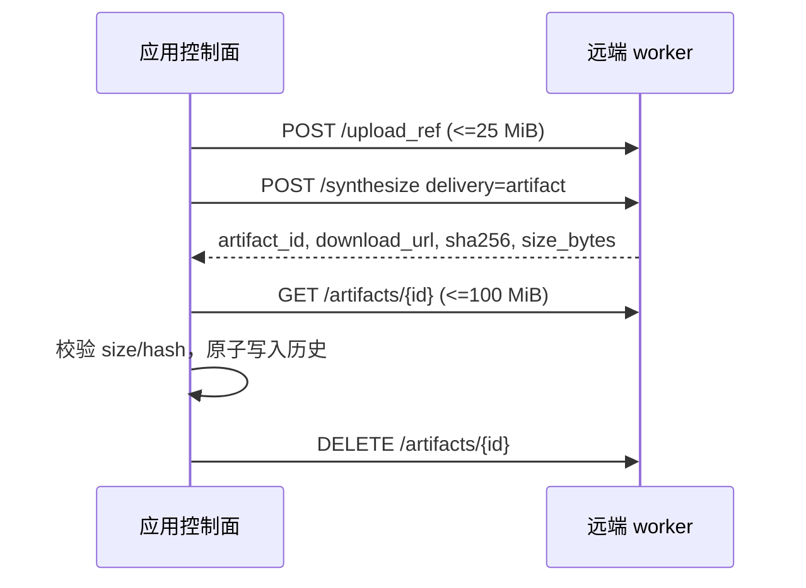

# 四机 LAN CUDA 验收 Runbook

本 runbook 验证一台应用控制节点加三台独立 Windows CUDA worker。范围仅限可信 LAN；公网、TLS 和反向代理不在本门禁内。总体阈值见 [CUDA 全流程闭环验证](cuda-e2e-validation.md)。

## 1. 节点职责

| topology 节点 | 角色 | 本地内容 | 正式服务 |
|---|---|---|---|
| `app-controller` | 应用控制面、验证器、Playwright、OpenSSH 控制端 | 完整 TTS More 应用 checkout | 无本地 worker |
| `gpt-worker` | GPU worker | 轻量 TTS More checkout + 一个 GPT-SoVITS repo | `local-gpt-sovits-main` |
| `index-worker` | GPU worker | 轻量 TTS More checkout + 一个 IndexTTS repo | `local-indextts` |
| `cosy-worker` | GPU worker | 轻量 TTS More checkout + 一个 CosyVoice repo | `local-cosyvoice` |

每台 GPU 节点均需 Windows 11/Server、CUDA 12.8 和至少 16 GB VRAM。worker checkout 提供锁文件、部署脚本和 `backend/app/workers`，但不需要启动前端或应用后端。

## 2. OpenSSH 与 LAN 前提

基线控制方式是 Windows OpenSSH。控制节点必须能够使用密钥无交互登录三个 worker；远端 PowerShell 路径、checkout 路径和 SSH 用户由 runner 本地配置或受保护 secret 提供，不写入 topology。

认证前逐项检查：

1. 四台机器时间同步，时钟偏差满足日志关联要求；
2. `tts-app.lan`、`tts-gpt.lan`、`tts-index.lan`、`tts-cosy.lan` 或实际 hostname 能双向解析，且四个节点解析到互不重复的非 loopback IP；
3. 控制节点可连接各 worker 的 TCP 22、9880/9881/9882；
4. Windows 防火墙只允许可信 LAN 源访问对应 worker 端口；
5. 三个端口没有被旧 worker 占用；
6. SSH host key 已固定，认证过程不使用关闭 host key 校验的临时参数。

示例检查：

```powershell
w32tm /query /status
Resolve-DnsName tts-gpt.lan
Test-NetConnection tts-gpt.lan -Port 22
Test-NetConnection tts-gpt.lan -Port 9880
ssh tts-gpt.lan 'powershell -NoProfile -Command "$PSVersionTable.PSVersion"'
```

## 3. 创建真实 topology 和 fixture

在控制节点复制脱敏示例：

```powershell
Copy-Item deployment\app\topology.four-node-lan.example.json deployment\app\topology.four-node-lan.local.json
Copy-Item deployment\app\repo-paths.example.json deployment\app\repo-paths.local.json
Copy-Item deployment\validation\fixture.example.json data\validation\cuda-fixture.local.json
```

将 `host` 替换为控制节点实际可访问的 hostname 或静态 IP。三个 worker 的 `bind_host` 通常为 `0.0.0.0`，但防火墙必须限制可信 LAN。每个正式 service ID 必须恰好出现一次；不要把服务放到 `app-controller.services`。每个 GPU 节点使用独立资源组，例如 `gpt-worker:cuda-0`，基线 `capacity: 1`。

每台 worker 维护自己的 `repo-paths.local.json`，并由人类确认本节点负责的 repo 路径。当前 OpenSSH 总入口不转发 `-RepoPaths`，因此可签发认证的自动部署要求三个远端 checkout 使用 `repo.lock.json` 相对 `-RemoteRoot` 的路径，且三台机器使用同一个 `-RemoteRoot`。分布式认证禁止 `-SkipDeploy`；不同根目录或额外路径映射必须先扩展总入口的远端参数传递并补测，不能靠预部署绕过身份检查。控制节点创建 `data/validation/cuda-fixture.local.json`；参考音频由 `POST /upload_ref` 传输，不要求四台机器共享路径。distributed topology 不接受 loopback、重复 host；总入口还会拒绝重复 DNS IP 和重复 Windows `MachineGuid`，`MachineGuid` 原值只在内存比较，不写入证据。

```powershell
git check-ignore -v deployment\app\topology.four-node-lan.local.json
git check-ignore -v data\validation\cuda-fixture.local.json
```

## 4. 逐节点部署

控制器应通过 `run-cuda-validation.ps1 -Mode distributed` 的 OpenSSH 编排执行远端部署。排障时可在各节点本地执行等价命令。

GPT 节点：

```powershell
.\scripts\deploy-local-tts.ps1 `
  -Profile worker-node `
  -Topology deployment\app\topology.four-node-lan.local.json `
  -Node gpt-worker `
  -Targets default `
  -RepoPaths deployment\app\repo-paths.local.json `
  -Device CU128
```

Index 和 Cosy 节点分别使用 `-Node index-worker`、`-Node cosy-worker`。`worker-node` 会从 topology 读取本节点唯一服务和 LAN `bind_host`，只同步、安装和准备该服务 repo。

首次分布式认证应清理各节点 repo/venv 并完整准备。日常发布可以复用模型缓存，但必须重新同步锁定 repo、安装依赖、复制 provider 附加脚本并重新渲染配置。远端命令、退出码和日志必须回传控制节点；任一节点部署失败即停止认证。

## 5. 启动 worker 与应用控制面

各 worker 节点：

```powershell
.\scripts\start-service-workers.ps1 `
  -Topology deployment\app\topology.four-node-lan.local.json `
  -Node <gpt-worker|index-worker|cosy-worker> `
  -RepoPaths deployment\app\repo-paths.local.json `
  -Detach
```

控制节点只部署应用并渲染远端地址：

```powershell
.\scripts\deploy-local-tts.ps1 `
  -Profile app-only `
  -Topology deployment\app\topology.four-node-lan.local.json `
  -Node app-controller `
  -Targets default `
  -Device CU128
```

检查 `data/local/services.json`：三个 `base_url` 分别指向三个 worker；`mode` 为 `external`，`network_scope` 为 `lan`，`managed` 为 `false`，`start_command` 为空。应用 supervisor 不得尝试启动、停止或重启这些远端进程。

## 6. 工件与契约预检

从控制节点检查三个服务的 `/health`、`/capabilities`、`/status`。全部必须声明 `artifact-transfer`。验证器在缺少该 capability 时应在上传或合成前失败。

跨机闭环为：



不得使用 UNC、SMB、NFS 或相同绝对路径作为通过条件。worker 使用 UUID 文件名，未取走工件按 24 小时 TTL 清理。

## 7. 执行分布式验证

```powershell
$RunId = "distributed-$(Get-Date -Format yyyyMMdd-HHmmss)"
.\scripts\run-cuda-validation.ps1 `
  -Mode distributed `
  -Services data\local\services.json `
  -Fixture data\validation\cuda-fixture.local.json `
  -Topology deployment\app\topology.four-node-lan.local.json `
  -SshUser <ssh-user> `
  -RemoteRoot <remote-tts-more-checkout> `
  -Output "data\validation\runs\$RunId" `
  -RequireBaseline
```

也可以通过 `TTS_MORE_VALIDATION_SSH_USER` 和 `TTS_MORE_VALIDATION_REMOTE_ROOT` 提供两个值。完整认证不能传 `-Node`、`-SkipDeploy`、`-SkipStart` 或 `-SkipFaultRecovery`；这些排障捷径会被总入口拒绝。单节点排障应直接使用第 4/5 节的下层部署与启动命令，不会签发认证。应用节点始终读取 topology 的 `app_node`。第一次分布式认证用于建立首个分布式 warm p95，因此移除 `-RequireBaseline`；总入口会自动为三个远端部署增加 `-CleanRepos`。通过并批准后写入受控 fixture。之后的分布式回归和所有稳定 release 都必须保留该开关，此时重新同步/安装但保留模型缓存。

控制器在远端部署前读取本机 `git rev-parse HEAD`，并要求每个轻量 checkout 在 fetch 前、detached checkout 后都保持 `git status --porcelain --untracked-files=all` 为空，最终 `HEAD` 与控制器一致；任一 tracked/untracked 修改、无法取得提交或校验失败都会立即中止，不能用修改版或旧版 worker/脚本完成认证。

核心验证器自动覆盖三个正式服务的 5 个模型能力用例，并要求三个 `/status.device_uuid` 均存在且互不相同。UUID 解析会考虑显式 `cuda:N` 和 `CUDA_VISIBLE_DEVICES` 的物理设备映射。GPU workflow 随后由 Playwright 提交 30 条混合队列，每服务 10 条，并要求队列执行期间至少两个正式服务同时具有加载签名。控制器在每个 worker 启动远端 `nvidia-smi` 采样，结束时将 CSV 和该节点 worker 日志复制到 `worker-logs/<node>/`。单节点 warm p95 与已批准分布式基线比较，退化不得超过 30%。

Playwright 从控制节点运行同一套工作台流程：加载验证项目，确认三服务 ready，执行 30 条真实任务，等待队列完成，并抽查三个服务各一条历史音频可以通过 `/api/audio` 读取。

## 8. 故障与恢复

PowerShell 总入口强制执行故障注入；`distributed` 模式传入 `-SkipFaultRecovery` 会在认证开始前失败：

1. 控制器通过 OpenSSH 停止一个 worker 的监听进程；
2. 应用在 15 秒内把该服务标记为降级或不可用，应用进程不崩溃，另外两个服务保持 ready；
3. 控制器重启该节点 worker，等待三个 `/health` 全部 ready；
4. 在 `recovery/` 重新执行核心 CUDA 用例；
5. 将结果写入 `fault-recovery.json`，并归档远端日志和 GPU 时序。

若 15 秒内未降级、其他服务被连带中断、应用退出、worker 无法重启或恢复后的核心重试失败，门禁失败。远端服务必须保持 `managed:false`，不能由应用本地 supervisor 接管。

## 9. 签核

首次分布式认证通过后才建立分布式性能基线并启用稳定发布门禁。把 `summary.json`、JUnit、Playwright、worker 日志、四台 `nvidia-smi`、30 条重叠证据和人工听审写入 [验收记录](cuda-e2e-acceptance-record.md)。首次认证两名审核者；发布至少一名。任何缺失或异常都阻止发布。
