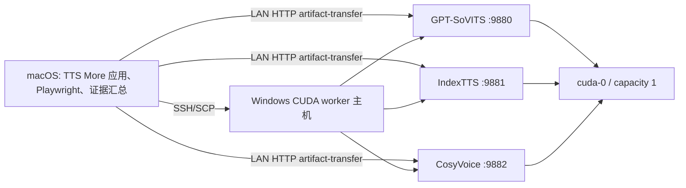
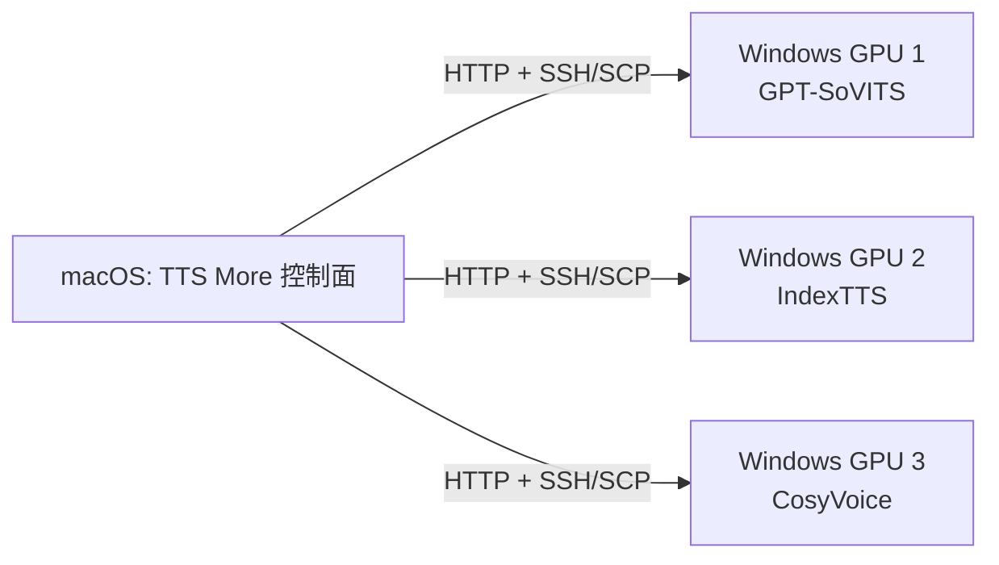

# macOS 应用控制面与 LAN Windows CUDA 验证

本文定义第二套 CUDA 闭环测试方案：TTS More 应用本体运行在 macOS，本机通过可信局域网调用 Windows CUDA worker。方案覆盖一台远端 GPU 主机承载三个服务，以及三台远端 GPU 主机各承载一个服务。

当前状态：**补充集成门禁设计已批准，正式发布门禁自动化尚未实现。** 在跨平台编排器完成前，本方案可以证明真实应用闭环和 LAN 工件传输，但不能替代 [Windows CUDA 正式认证](cuda-e2e-validation.md)。

文中的 `<...>` 表示运行前必须由操作者填写的本地值，不是未决设计项；真实值不得提交到仓库。

## 1. 目标与结论等级

本方案验证：

- macOS 上的后端、前端、队列和历史记录不依赖本地 CUDA；
- 三个正式服务可以作为 `managed:false` 的 LAN endpoint 被发现和调用；
- 参考音频上传、远端合成、哈希下载、本地原子写入和远端清理形成完整闭环；
- 单远端 GPU 场景按共享资源组顺序加载、卸载，不发生模型并驻导致的 OOM；
- 三远端 GPU 场景可以并行处理，并在单节点故障时保持另外两个服务可用；
- 30 条真实工作台任务、历史音频播放、自动音频指标、ASR 和人工听审都有可追溯证据。

阶段一只能使用以下结论：

- `补充门禁通过`：本方案规定的功能、证据和人工检查全部完成；
- `自动闭环通过，人工听审待完成`；
- `失败`；
- `阻塞`。

阶段一不得写“稳定发布 CUDA 门禁通过”。只有第 11 节的跨平台编排和身份门禁完成后，才能把三远端拓扑升级为正式发布门禁。

## 2. 两级拓扑

### 2.1 共享 GPU 拓扑



一台 Windows CUDA 主机运行三个独立 worker 进程，三个服务属于同一 `resource_group`，`capacity: 1`。此拓扑用于证明远端共享 GPU 的切换卸载、显存恢复和全应用闭环，不测试三模型并行。

主机级故障会让三个服务同时不可用，这是预期故障域。应用必须继续运行、保留失败任务并在主机恢复后允许重试。

### 2.2 三 GPU 拓扑



三台 Windows CUDA 主机各负责一个正式 service ID，使用互不相同的主机、Windows 机器身份、GPU UUID 和资源组。此拓扑用于证明真实并行、节点级故障隔离和分布式性能，是未来升级为正式门禁的目标拓扑。

## 3. 固定控制通道

macOS 到 Windows 固定使用 OpenSSH：

- 密钥无交互登录，不允许在脚本中写密码；
- `StrictHostKeyChecking yes`，使用专用 `known_hosts` 固定每台 worker 的 host key；
- 远端命令只调用锁定 TTS More checkout 中的 PowerShell 脚本；
- SCP 只回收指定验证目录中的日志和 GPU 证据；
- topology 不保存 SSH 用户、私钥路径或密码；
- Windows 防火墙仅允许 macOS 控制节点访问 TCP 22 和所需 worker 端口；
- 前端 `5173` 和应用后端 `8000` 在本门禁中必须只绑定 macOS 的 `127.0.0.1`。

建议在 macOS 的 `~/.ssh/config` 使用脱敏别名：

```sshconfig
Host gpt-worker
    HostName <gpt-worker-lan-host>
    User <validation-user>
    IdentityFile ~/.ssh/<validation-key>
    IdentitiesOnly yes
    StrictHostKeyChecking yes
    UserKnownHostsFile ~/.ssh/known_hosts_tts_more
```

SSH `Host` alias 必须与 topology 节点名一致。三 GPU 拓扑使用 `gpt-worker`、`index-worker`、`cosy-worker`，共享 GPU 拓扑使用 `shared-worker`。首次写入 host key 必须由人类通过设备控制台或其他可信渠道核对指纹，不能使用 `StrictHostKeyChecking no`。

## 4. 共同前提

### macOS 控制节点

- 当前支持的 macOS、Python 3.11、Git、Node.js、pnpm、OpenSSH；
- TTS More 完整 checkout、应用 `.venv`、前端依赖和 Playwright Chromium；
- `faster-whisper large-v3` 及可用模型缓存；
- 三份本地参考音频，以及 GPT worker 上 `v2ProPlus`、`v2Pro` 的远端权重路径；
- 足够保存 30 条以上 WAV、Playwright trace 和远端日志的磁盘空间。

### 每台 Windows worker

- Windows 11 或 Windows Server；
- NVIDIA 驱动支持 CUDA 12.8，至少 16 GB VRAM；
- Python、Git、PowerShell、OpenSSH Server、`nvidia-smi`；
- TTS More 轻量 checkout 与本节点负责的 TTS repo；
- 防火墙只允许可信 macOS 控制节点访问；
- 相同 TTS More commit，checkout 在部署前后保持干净。

所有参与机器必须时间同步。所有真实 hostname、IP、SSH 用户、机器路径、权重、参考音频和审核者身份只保存在被忽略的本地配置或受控验收记录中。

## 5. 从零准备代码

macOS 和所有 Windows worker 都从同一远端取得代码，并锁定同一个完整提交 SHA。可以使用 GitHub，也可以使用正确的 Gitee 组织仓库：

```text
https://github.com/XucroYuri/TTS_more.git
https://gitee.com/chengdu-flower-food/TTS_more.git
```

macOS：

```bash
git clone --branch dev-xu/cuda-e2e-validation --single-branch \
  https://gitee.com/chengdu-flower-food/TTS_more.git
cd TTS_more
git rev-parse HEAD
python3.11 -m venv .venv
.venv/bin/python -m pip install --upgrade pip
.venv/bin/python -m pip install -e 'backend[dev]'
.venv/bin/python -m pip install faster-whisper
pnpm --dir frontend install --frozen-lockfile
pnpm --dir frontend cuda:e2e:install
```

Windows worker：

```powershell
git clone --branch dev-xu/cuda-e2e-validation --single-branch `
  https://gitee.com/chengdu-flower-food/TTS_more.git C:\TTS\TTS_more
Set-Location C:\TTS\TTS_more
git checkout --detach <controller-commit-sha>
git status --porcelain --untracked-files=all
```

认证记录必须保存 macOS 和每台 worker 的 `git rev-parse HEAD`。任一节点 SHA 不一致或 checkout 不干净时停止测试。

## 6. 私有 topology 与 fixture

在 macOS 创建：

```bash
cp deployment/validation/fixture.example.json data/validation/cuda-fixture.local.json
```

fixture 的字段和安全要求沿用 [CUDA 总入口](cuda-e2e-validation.md#validation-fixture)。真实路径可通过 `TTS_MORE_VALIDATION_*` 环境变量提供。

路径语义必须区分：

- `references.*` 是 macOS 控制节点上的本地参考音频，应用通过 `/upload_ref` 发送给 worker；
- `gpt_weights.*` 是 GPT worker 可以直接访问的 Windows 权重路径，不通过 artifact 协议传输；
- 两种拓扑若使用不同的远端权重路径，应创建两份分别被忽略的 fixture，不能在运行中手改同一份证据输入。

### 共享 GPU 示例

创建被忽略的 `deployment/app/topology.macos-shared.local.json`：

```json
{
  "schema_version": 1,
  "name": "macos-lan-shared-gpu",
  "app_node": "app-controller",
  "nodes": {
    "app-controller": {
      "role": "app",
      "host": "<mac-controller-lan-host>",
      "bind_host": "127.0.0.1",
      "services": [],
      "resource_group": "app",
      "capacity": 1
    },
    "shared-worker": {
      "role": "worker",
      "host": "<windows-gpu-lan-host>",
      "bind_host": "0.0.0.0",
      "services": [
        "local-gpt-sovits-main",
        "local-indextts",
        "local-cosyvoice"
      ],
      "resource_group": "shared-worker:cuda-0",
      "capacity": 1
    }
  }
}
```

### 三 GPU 示例

从 `deployment/app/topology.four-node-lan.example.json` 复制为 `topology.macos-three-worker.local.json`。将 `app-controller.host` 改为 macOS 的 LAN hostname，并把三个 worker host 改为实际地址。三个正式 service ID 必须各自唯一归属一个 worker。

每台 Windows worker 还需创建自己的 `deployment/app/repo-paths.local.json`，由人类确认本节点实际 TTS repo 路径。私有文件必须通过 `git check-ignore -v` 验证不会被提交。

topology 同样不会随 Git clone 分发。macOS 必须通过 SCP 将本次 topology 复制到每台 worker checkout 的相同相对路径，并在控制节点和所有 worker 上核对 SHA-256。运行期间不得单独修改某个节点的副本。

## 7. 阶段一执行流程

阶段一采用“SSH 控制 + 现有部署脚本 + macOS 应用闭环 + 手工证据汇总”。它是可审计的补充测试，但当前不会生成正式 `distributed_orchestration_verified:true`。

### 7.1 非 GPU 回归

在 macOS 先执行：

```bash
.venv/bin/python -m pytest backend/tests -q
.venv/bin/python -m compileall -q backend scripts
pnpm --dir frontend test
pnpm --dir frontend build
git diff --check
```

### 7.2 SSH 与网络预检

从 macOS 验证：

```bash
ssh gpt-worker 'powershell.exe -NoLogo -NoProfile -Command "$PSVersionTable.PSVersion"'
ssh gpt-worker 'powershell.exe -NoLogo -NoProfile -Command "nvidia-smi"'
```

同时记录 DNS 解析、TCP 22、worker 端口、时钟、Windows 版本、驱动、CUDA、GPU UUID 和 VRAM。三 GPU 拓扑要求三个 hostname/IP、Windows `MachineGuid` 和 GPU UUID 全部唯一；原始 `MachineGuid` 只在内存中比较，不写入公开证据。

### 7.3 远端部署

阶段一允许管理员在各 Windows 节点本地执行命令，也可以由 macOS SSH 调用同一命令。共享节点：

```powershell
.\scripts\deploy-local-tts.ps1 `
  -Profile worker-node `
  -Topology deployment\app\topology.macos-shared.local.json `
  -Node shared-worker `
  -Targets default `
  -RepoPaths deployment\app\repo-paths.local.json `
  -Device CU128 `
  -CleanRepos

.\scripts\start-service-workers.ps1 `
  -Topology deployment\app\topology.macos-shared.local.json `
  -Node shared-worker `
  -RepoPaths deployment\app\repo-paths.local.json `
  -Detach
```

三 GPU 拓扑分别使用 `gpt-worker`、`index-worker`、`cosy-worker`。每个节点只部署 topology 分配给它的服务。首次认证使用 `-CleanRepos`；日常回归可以保留模型缓存，但仍需同步锁定 commit、安装依赖和重新复制附加包。

### 7.4 macOS 渲染外部服务

```bash
.venv/bin/python scripts/tts_more_deploy.py render-services \
  --profile app-only \
  --platform posix \
  --topology deployment/app/topology.<profile>.local.json \
  --node app-controller \
  --output data/local/services.json
```

检查三个服务均为：

- `mode: external`；
- `network_scope: lan`；
- `managed: false`；
- `start_command` 为空；
- `base_url` 指向 topology 对应 Windows host；
- 声明 `artifact-transfer`。

应用本地 supervisor 不得启停远端 worker。

### 7.5 契约和工件预检

从 macOS 访问三个 worker 的 `/health`、`/capabilities` 和 `/status`。必须确认：

- `ready:true`；
- `tts` 和 `artifact-transfer` capability；
- `tts_more_commit` 与控制节点一致；
- `cuda_runtime:12.8`；
- `device_uuid`、`memory`、`loaded`、`model` 存在；
- `POST /upload_ref`、`GET /artifacts/{id}`、`DELETE /artifacts/{id}` 路径安全和大小限制有效。

参考音频和输出不得通过 SMB、NFS、UNC 或相同绝对路径传递。

### 7.6 启动应用和工作台测试

在 macOS 一个终端只启动绑定 loopback 的应用后端：

```bash
TTS_MORE_SERVICE_MODE=real .venv/bin/python -m uvicorn app.main:app \
  --app-dir backend \
  --host 127.0.0.1 \
  --port 8000
```

当前 `scripts/start-dev.sh` 最终调用前端包的 `vite --host 0.0.0.0`，因此在绑定行为修正前不得用于本门禁。Playwright 会自行在 `127.0.0.1:5173` 启动前端，并将 API 代理到本地后端。

在另一个终端运行 Playwright。共享 GPU 拓扑使用非 `distributed` 模式，从而要求最多一个正式服务具有加载签名：

```bash
export TTS_MORE_RUN_CUDA_E2E=1
export TTS_MORE_CUDA_FIXTURE=data/validation/cuda-fixture.local.json
export TTS_MORE_CUDA_VALIDATION_MODE=single-release
pnpm --dir frontend cuda:e2e
```

三 GPU 拓扑改为：

```bash
export TTS_MORE_CUDA_VALIDATION_MODE=distributed
pnpm --dir frontend cuda:e2e
```

Playwright 必须完成 30 条真实任务，每服务 10 条；队列全部完成，三个服务各有一条历史音频可通过 `/api/audio` 读取。三 GPU 拓扑要求至少两个服务存在重叠加载窗口。

### 7.7 模型和合成矩阵

除 30 条工作台队列外，还需保留以下独立样本：

| 服务 | 必测能力 |
|---|---|
| GPT-SoVITS | 默认 `v2ProPlus`、显式 `v2Pro`、参考音频 artifact 上传 |
| IndexTTS | 情绪文本模式 |
| CosyVoice | zero-shot、cross-lingual |

共享 GPU 拓扑必须证明 provider 切换前先卸载旧模型，30 秒内显存回到已记录基线 +1 GiB，且任一时刻最多一个正式模型驻留。三 GPU 拓扑必须证明三台 worker 的 GPU UUID 不同，并记录每节点 warm p95。

### 7.8 故障恢复

共享 GPU 拓扑执行两级故障：

1. 停止一个 worker 进程，确认对应服务在 15 秒内降级，另外两个进程仍可访问；
2. 停止整台 Windows worker，确认三个服务均降级，但 macOS 应用不退出、历史不损坏；恢复主机后重试成功。

三 GPU 拓扑停止一个节点，要求另外两个服务继续完成任务；重启节点后重新执行该服务核心样本。远端服务必须始终保持 `managed:false`。

## 8. 音质、文本和性能门槛

自动和人工阈值沿用正式 CUDA 计划：

- WAV >1 KiB，0.5-30 秒；
- RMS > -50 dBFS；
- 削波率 <=1%；
- 静音率 <90%；
- `faster-whisper large-v3` 单条 CER <=0.40，整体 CER <=0.25；
- 无 OOM，峰值空闲显存 >=512 MiB；
- 冷加载 <=10 分钟，短句 <=5 分钟；
- 后续回归 warm p95 相比批准基线退化 <=30%；
- 人工听审四项均 >=3/5，总均分 >=3.5。

阶段一的现有 macOS Playwright 只自动证明应用闭环，不会签发完整 CUDA `summary.json`。音频、ASR、远端显存和性能数据必须作为补充证据单独记录；缺少这些证据时只能报告“应用闭环通过”，不能报告“补充门禁通过”。

## 9. 证据目录

每次运行在 macOS 使用独立目录：

```text
data/validation/runs/macos-lan-<profile>-<timestamp>/
├── controller.log
├── environment.md
├── topology.sha256
├── fixture.sha256
├── commit-map.json
├── service-contracts.json
├── app-backend.log
├── playwright-junit.xml
├── playwright-artifacts/
├── wav/
├── audio-metrics.json
├── asr-results.json
├── fault-recovery.json
├── worker-logs/<node>/
├── nvidia-smi/<node>.csv
└── human-listening-review.md
```

`commit-map.json` 记录控制器和 worker commit；机器身份只保存加盐哈希或唯一性结论。公开工件不得包含内网 IP、hostname、用户名、绝对路径、SSH 指纹原文、参考音频隐私数据或密钥。

## 10. 阶段一验收表

| 门禁 | 共享 GPU | 三 GPU |
|---|---|---|
| Git 与部署 | 控制器和共享 worker commit 一致；远端 clean deploy | 控制器和三个 worker commit 一致；每节点只准备一个服务 |
| 服务发现 | 三 endpoint ready、external、unmanaged | 三个独立 host ready |
| 资源 | 最多一个模型加载，切换卸载和显存恢复 | 三个 GPU UUID 唯一，至少两个并行加载 |
| 合成 | 5 个能力样本和每服务 10 条队列 | 相同 |
| 工件 | 上传、合成、哈希下载、本地历史、远端删除 | 相同，禁止共享盘 |
| 故障 | 单进程和整机故障；应用存活 | 单节点 15 秒降级；其他节点继续 |
| UI | 30 条完成，三条历史音频可播放 | 相同，并有加载重叠证据 |
| 质量 | WAV、CER、性能和两名首次审核者 | 相同 |

建议顺序固定为：非 GPU 回归 -> 共享 GPU -> 三 GPU -> 故障恢复 -> 人工听审。共享 GPU 失败时不得继续三 GPU 认证。

## 11. 阶段二跨平台正式门禁设计

以下接口是计划新增内容，当前仓库尚未实现：

```text
scripts/run-lan-validation.py
scripts/run-lan-validation.sh
scripts/run-lan-validation.ps1

--mode lan-shared | lan-distributed
--deployment clean | release
--topology <path>
--fixture <path>
--ssh-config <path>
--remote-root <path>
--output <path>
--require-baseline
```

`clean` 删除并重建服务 repo/venv，用于首次认证；`release` 重新同步锁定提交、安装依赖和渲染配置，但保留已批准模型缓存。正式入口不提供跳过部署、启动、身份检查、GPU 监控或故障恢复的参数。

正式自动化要求所有 Windows worker 使用同一个不含空格的绝对 `--remote-root`，例如 `C:\TTS\TTS_more`，以保证 SSH/SCP 路径解析一致。阶段一人工排障可以使用其他路径，但不能据此签发正式通过结果。

实现应遵循以下边界：

1. Python 编排核心负责 topology、节点选择、commit 锁定、一次性 preflight、报告和退出码；`.sh`/`.ps1` 只做薄包装。
2. Windows OpenSSH executor 只负责编码 PowerShell、执行、退出码、日志和 SCP，不把远端命令散落在验证逻辑中。
3. 控制器身份使用 macOS 平台 UUID，worker 使用 Windows `MachineGuid`；原值只在内存比较，证据保存运行时加盐哈希。
4. GPU 证据只从 worker 收集，macOS 不要求本地 `nvidia-smi`。
5. `lan-shared` 允许三个服务共享一个 worker 和 GPU UUID，并强制 `capacity:1`、无加载重叠和显存恢复。
6. `lan-distributed` 强制三个独立 worker、host/IP/机器身份/GPU UUID 唯一，并要求加载重叠和单节点故障恢复。
7. 复用现有 `artifact-transfer`、音频指标、ASR、JUnit 和人工听审格式，不建立第二套结果协议。
8. 一次性 preflight 绑定 topology SHA-256、fixture SHA-256、控制器 commit、节点 commit、SSH host key 哈希和 12 小时时间窗，原始令牌在结束时清除。

必须补充跨平台单测、macOS 自托管控制 runner 集成测试、Windows 远端命令契约测试、共享/独立 GPU 拓扑测试和故障注入测试。

## 12. 升级为正式门禁的条件

只有全部满足后，`lan-distributed` 才能加入稳定发布门禁：

1. macOS 不再调用 Windows-only `run-cuda-validation.ps1`；
2. 远端 clean deploy、启动、监控、故障和证据回收均可由一个跨平台入口重复执行；
3. 不能通过直接运行 Python、复用旧 preflight 或跳过部署/启动/故障来签发通过结果；
4. 三个 worker commit、机器身份和 GPU UUID 都由自动预检核验；
5. 自动生成完整 JSON、JUnit、WAV、ASR、GPU、Playwright 和恢复证据；
6. 至少完成一次共享 GPU 补充认证和一次三 GPU 首次认证；
7. 两名审核者完成首次人工听审；
8. 与 Windows 控制节点的正式分布式结果对比，没有未解释的功能或性能差异。

升级前，Windows 单机和四机认证仍是稳定发布真相源。本方案不覆盖公网、TLS、反向代理、Linux GPU、商业 TTS 或不受信任网络。
