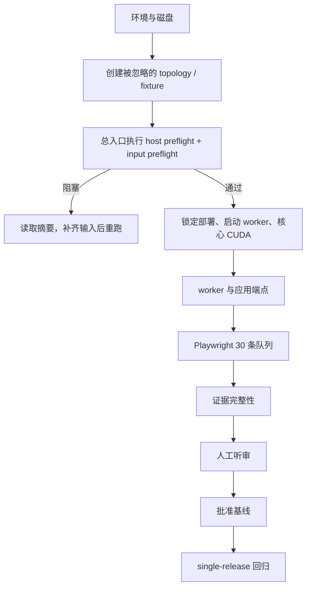

# 单机 Windows CUDA 验收 Runbook

这是唯一可复制执行的 Windows 单机认证入口。跨拓扑契约见 [CUDA 验证契约](cuda-e2e-validation.md)，人工签核见 [验收记录模板](cuda-e2e-acceptance-record.md)。

## 完整路径



正式运行只调用一次总入口。项目根内使用默认 repo 路径或可选 `RepoPaths` 都由总入口完成部署和启动；不要先手动部署或启动。

## 1. 环境

要求 Windows、Python 3.11、conda、Git、Node.js、pnpm、PowerShell、`nvidia-smi`。NVIDIA 驱动必须支持 CUDA 12.8，GPU 至少 16 GB VRAM。系统盘、repo 盘、模型缓存盘和输出盘都要有足够空间。

```powershell
$ErrorActionPreference = "Stop"
python --version
conda --version
git --version
node --version
pnpm --version
nvidia-smi

if (Test-Path -LiteralPath .venv) {
    throw "首次 single-clean 需要新的应用 .venv；请使用新 checkout，或经人类确认后删除旧环境再重跑。"
}
python -m venv .venv
& .\.venv\Scripts\python.exe -m pip install --upgrade pip
& .\.venv\Scripts\python.exe -m pip install -e 'backend[dev]'
& .\.venv\Scripts\python.exe -m pip install faster-whisper
pnpm --dir frontend install --frozen-lockfile
pnpm --dir frontend cuda:e2e:install
```

日常 `single-release` 复用已认证的应用 `.venv`，但仍要确认 Python 为 3.11、conda 可用且依赖安装成功。

## 2. 被忽略的本机配置

```powershell
New-Item -ItemType Directory -Force data\validation | Out-Null
Copy-Item deployment\app\repo-paths.example.json deployment\app\repo-paths.local.json
Copy-Item deployment\app\topology.single-windows.example.json deployment\app\topology.single-windows.local.json
Copy-Item deployment\validation\fixture.example.json data\validation\cuda-fixture.local.json

git check-ignore -v deployment\app\repo-paths.local.json
git check-ignore -v deployment\app\topology.single-windows.local.json
git check-ignore -v data\validation\cuda-fixture.local.json
```

由人类确认 `repo-paths.local.json`。fixture 必须提供三份参考音频、四个 GPT/SoVITS 权重、prompt、测试文本和审核者。可以设置模板中的 `TTS_MORE_VALIDATION_*` 环境变量，不要把真实路径或身份写入仓库。

锁定提交的唯一来源是仓库根 `repo.lock.json`。单机 topology 的三个正式服务必须属于 `gpu-worker`，共享 `resource_group: cuda-0`、`capacity: 1`。

## 3. 首次 `single-clean`

下面是正式首次认证命令。总入口先运行 host preflight 和 input preflight；未满足 Python 3.11、conda、磁盘、GPU、Playwright 或 fixture 要求时，会在清理和 worker 等待前阻塞。

```powershell
$RunId = "single-clean-$(Get-Date -Format yyyyMMdd-HHmmss)"
& .\scripts\run-cuda-validation.ps1 `
  -Mode single-clean `
  -Services data\local\services.json `
  -Fixture data\validation\cuda-fixture.local.json `
  -Topology deployment\app\topology.single-windows.local.json `
  -Node gpu-worker `
  -RepoPaths deployment\app\repo-paths.local.json `
  -Output "data\validation\runs\$RunId"
```

`single-clean` 会先展示解析后的项目相对清理范围（selected repo labels），再清理这些 repo 内的模型和 venv。清理范围不包含应用 `.venv`、fixture 或 repo 清单以外的目录。看到的 label 与已确认配置不一致时立即停止。

阻塞时先读：

- `environment-preflight.json`：host preflight 的 Python、conda、磁盘、GPU、ASR 和 Playwright 结论；
- `summary.json`：input preflight 的 fixture、参考音频、权重、审核者和基线结论。

不要在输入阻塞时启动或等待 worker。

## 4. Worker 与应用端点

核心入口通过后，保存三个 worker 的端点证据。`/capabilities` 必须包含 `tts` 和 `artifact-transfer`；`/status` 必须报告 CUDA 12.8、加载状态、模型和显存字段。

```powershell
Invoke-RestMethod http://127.0.0.1:9880/health
Invoke-RestMethod http://127.0.0.1:9880/capabilities
Invoke-RestMethod http://127.0.0.1:9880/status
Invoke-RestMethod http://127.0.0.1:9881/health
Invoke-RestMethod http://127.0.0.1:9881/capabilities
Invoke-RestMethod http://127.0.0.1:9881/status
Invoke-RestMethod http://127.0.0.1:9882/health
Invoke-RestMethod http://127.0.0.1:9882/capabilities
Invoke-RestMethod http://127.0.0.1:9882/status
```

启动应用工作台；只停止该命令打印的本次 PID，不按端口强杀未知进程。

```powershell
.\scripts\start-dev.ps1
Invoke-RestMethod http://127.0.0.1:8000/api/health
Invoke-RestMethod http://127.0.0.1:8000/api/services/status
Invoke-WebRequest -UseBasicParsing http://127.0.0.1:5173
```

## 5. 独立 Playwright 门禁

核心 CUDA 通过不等于 UI 通过。在同一运行中设置唯一项目 ID，再执行 30 条真实混合队列。

```powershell
$env:TTS_MORE_RUN_CUDA_E2E = "1"
$env:TTS_MORE_CUDA_VALIDATION_MODE = "single-clean"
$env:TTS_MORE_CUDA_E2E_PROJECT_ID = "cuda-$RunId"
$env:TTS_MORE_CUDA_FIXTURE = (Resolve-Path data\validation\cuda-fixture.local.json).Path
$env:TTS_MORE_E2E_BASE_URL = "http://127.0.0.1:5173"
$env:TTS_MORE_API_TARGET = "http://127.0.0.1:8000"
pnpm --dir frontend cuda:e2e
```

成功判据：30 条任务完成，每个正式服务 10 条；单机同时最多一个加载签名；三个服务各有一条历史音频可由 `/api/audio` 读取。证据是 `frontend/test-results/playwright-junit.xml`；失败时同时保留 trace、screenshot 和 video。

## 6. 证据与状态

证据分两类：

- **受控原始证据**：`controller.log`、`wav/`、worker 原始日志、Playwright trace/video、真实 GPU UUID、审核者身份和签名。仅留在本机运行目录或受控存储。
- **脱敏可共享证据**：脱敏 summary、JUnit、聚合 GPU 指标、hash-only 引用和无身份的审核状态。只有这一类可以进入 PR 或普通 GitHub artifact。

核心报告使用五个机器状态：

| 状态 | 含义 |
|---|---|
| `blocked` | 环境、fixture、凭据或人类输入缺失 |
| `core_failed` | 核心 CUDA 自动门禁失败 |
| `diagnostic_core_passed` | 使用 Skip 开关完成核心诊断，不可认证 |
| `core_passed_ui_pending` | 核心通过，Playwright 未完成 |
| `automatic_passed_human_pending` | 核心与 Playwright 通过，等待人工听审 |

人类最终结论只有四个：认证通过、自动门禁通过，人工待完成、失败、阻塞。不要把任一机器中间状态写成认证通过。

## 7. 人工听审与基线

打开受控原始运行目录的 `human-listening-review.md`，并填写 [验收记录](cuda-e2e-acceptance-record.md)。首次 `single-clean` 有 6 个输出，每个输出由两名审核者独立评分，共 12 行。每个单项至少 3/5，总均分至少 3.5。

人工签核完成后才批准首个 `performance_baseline.warm_p95_seconds`。把有限正数写入私有 fixture，记录批准人和基线运行 ID。

## 8. `single-release` 回归

发布回归仍只调用一次总入口，并强制批准基线。

```powershell
$RunId = "single-release-$(Get-Date -Format yyyyMMdd-HHmmss)"
& .\scripts\run-cuda-validation.ps1 `
  -Mode single-release `
  -Services data\local\services.json `
  -Fixture data\validation\cuda-fixture.local.json `
  -Topology deployment\app\topology.single-windows.local.json `
  -Node gpu-worker `
  -RepoPaths deployment\app\repo-paths.local.json `
  -Output "data\validation\runs\$RunId" `
  -RequireBaseline
```

随后把 Playwright 模式改为 `single-release`，使用新的项目 ID 再运行第 5 节命令。自动门禁和人工听审都通过后，才可写“认证通过”。

## 仅诊断

`SkipDeploy` 或 `SkipStart` 只用于保留现有环境的 diagnostic 排障。任何带 Skip 开关的运行都必须是 `certifiable: false`、`diagnostic_core_passed`，不可认证，也不可建立或批准基线。
