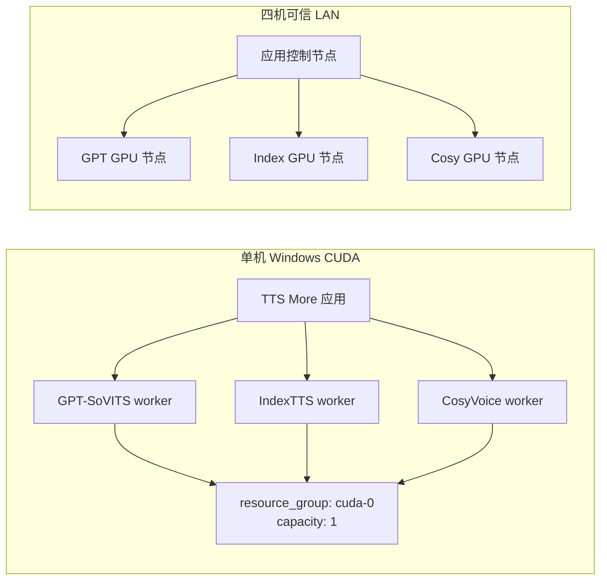

# CUDA 全流程闭环验证

本文是 TTS More Windows CUDA 正式验收的唯一总入口。单机操作见 [单机 runbook](cuda-e2e-single-node.md)，四机操作见 [分布式 runbook](cuda-e2e-distributed.md)，签核使用 [验收记录模板](cuda-e2e-acceptance-record.md)。当前 macOS 运行应用、Windows CUDA 运行远端 worker 的第二套方案见 [macOS LAN 验证](cuda-e2e-macos-lan.md)；跨平台编排完成前，该方案属于补充门禁，不替代本文的正式门禁。在新 Windows 设备上通过 Codex 接续执行时，直接使用 [Windows CUDA Codex 验证交接 Prompt](cuda-windows-codex-handoff-prompt.md)。

## 目标与边界

正式认证平台固定为：

- Windows 11 或 Windows Server；
- NVIDIA 驱动支持 CUDA 12.8，部署脚本使用 `-Device CU128`；
- 每台推理节点至少 16 GB VRAM；
- 应用控制面和 worker 位于可信 LAN；
- 三个正式服务 ID 为 `local-gpt-sovits-main`、`local-indextts`、`local-cosyvoice`。

本门禁不覆盖公网暴露、TLS、反向代理、Linux GPU、商业 TTS、真实 LLM parser。不要因为 LAN 验收通过就推断这些场景已经可发布。

## 两种认证拓扑



单机必须让应用和三个 worker 同时在线，但三个服务共享 `cuda-0`，按队列顺序加载。切换 provider 前，编排器调用旧 worker 的 `/unload`，清除加载状态并触发 GC/CUDA cache 释放。高显存设备上的多模型并发只是扩展测试，不代替 `capacity: 1` 的必过路径。

分布式基线是一台应用控制节点加三台独立 GPU worker。每个 worker 节点保留一份轻量 TTS More checkout，只准备自己负责的一个 TTS repo 和模型；不要求运行前端或应用后端。

macOS 控制面的混合 LAN 方案另行覆盖一台共享 GPU worker 和三台独立 GPU worker。当前 Windows PowerShell 总入口依赖控制节点注册表、Windows venv 路径和本地 `nvidia-smi`，不能在 macOS 上签发正式分布式通过结果；具体阶段划分和升级条件以 [macOS LAN 验证](cuda-e2e-macos-lan.md) 为准。

混合 LAN 方向在专用分支 `dev-xu/macos-lan-cuda-validation` 验证，并依赖本 Windows CUDA 基础分支。主 worktree 的未提交内容不得进入该分支；分支流向、阶段结论和合并条件由混合 LAN runbook 单独约束。

## 配置接口

### Topology manifest

脱敏示例：

- `deployment/app/topology.single-windows.example.json`
- `deployment/app/topology.four-node-lan.example.json`

复制为 `deployment/app/topology.<name>.local.json` 后填入真实 hostname 或 IP。`topology*.local.json` 已被 `.gitignore` 忽略。

顶层字段固定为 `schema_version`、`name`、`app_node`、`nodes`。每个 `nodes.<name>` 必须声明：

| 字段 | 含义 |
|---|---|
| `role` | `app` 或 `worker` |
| `host` | 应用访问该节点时使用的 LAN hostname/IP |
| `bind_host` | worker 监听地址；分布式通常为 `0.0.0.0` |
| `services` | 此 worker 唯一负责的正式 service ID 列表 |
| `resource_group` | 同一 GPU 上需要串行和切换卸载的资源组 |
| `capacity` | 资源组并发容量；基线为 `1` |

部署工具会拒绝缺字段、未知节点、重复服务归属，以及没有恰好归属一个 worker 的已选服务。单机三个正式服务必须同属 `cuda-0`；四机示例分别使用 `<node>:cuda-0`。

部署入口：

```powershell
.\scripts\deploy-local-tts.ps1 `
  -Profile local-all|app-only|worker-node `
  -Topology deployment\app\topology.<name>.local.json `
  -Node <node-name> `
  -Targets default `
  -RepoPaths deployment\app\repo-paths.local.json `
  -Device CU128
```

底层 CLI 的等价参数是 `render-services --profile ... --topology ... --node ...` 和 `start-workers --topology ... --node ...`。`app-only` 为每个正式服务渲染独立远端 `base_url`，并设置 `mode: external`、`managed: false`；远端 worker 不可由应用的本地 supervisor 启停。`worker-node` 只渲染指定节点负责的服务，并把 topology 的 `bind_host` 传给 worker 启动命令。

### Validation fixture

真实资产清单放在 `data/validation/cuda-fixture.local.json`，该路径已忽略。不要提交参考音频、权重路径、机器路径或审核者身份。fixture 固定包含：

- `schema_version`、`name`；
- `service_ids`，且 GPT 必须是 `local-gpt-sovits-main`；
- `references`，分别指向 GPT-SoVITS、IndexTTS、CosyVoice 的参考音频；
- `gpt_weights.v2ProPlus` 和 `gpt_weights.v2Pro` 的 GPT/SoVITS 权重；
- `prompts` 与 `test_texts`；
- `reviewers`；
- `asr`，`required` 固定为 `true`，模型固定为 `large-v3`，不能通过 fixture 关闭文本门禁；
- 可选的 `performance_baseline.warm_p95_seconds`；首次认证省略，认证通过并批准后写入后续发布 fixture；对象一旦存在，该值必须是有限的 `0 < value <= 300`，空对象、`null`、无穷值或异常大值会被拒绝；
- `worker_logs`，记录三个 worker 日志来源。

从 `deployment/validation/fixture.example.json` 复制本机 fixture。示例通过 `${TTS_MORE_VALIDATION_*}` 环境变量引用真实路径；验证器会展开环境变量，并拒绝未解析变量或不存在的参考音频。fixture 和 topology 的 SHA-256 都要写入验收记录。

### 仓库边界

CUDA 编排、topology、验证器、worker 外壳和文档属于 TTS More 应用仓库。`deployment/tts-repos/<provider>/` 是复制到各 TTS repo 部署环境的附加包，不把 TTS More 应用代码混入上游 repo。GPT-SoVITS 三分支收敛仍在其 fork 仓库内单独进行；本门禁只验证 `repo.lock.json` 已锁定的 `local-gpt-sovits-main` 提交，不重写分支收敛计划。

## 跨机工件协议

三个 `tts-more-v1` worker 均声明 `artifact-transfer`，统一提供：

| 端点 | 作用 |
|---|---|
| `POST /upload_ref` | 上传音频参考文件，默认最大 25 MiB |
| `GET /artifacts/{id}` | 下载受控输出，最大 100 MiB |
| `DELETE /artifacts/{id}` | 下载验证后删除远端输出 |

`SynthesizeRequest.delivery` 兼容 `path` 和 `artifact`。同机可验证两种模式；外部 worker 必须使用 `artifact`。worker 使用 UUID 文件名并按 24 小时 TTL 清理。应用上传本地参考音频后合成，检查 `size_bytes` 和 `sha256`，再原子写入本地历史；校验成功后删除远端工件。外部 endpoint 未声明 `artifact-transfer` 时，预检直接失败，不假设共享盘或相同路径。

### 当前自动化覆盖

| 层级 | 当前已实现 | 仍需 Windows CUDA 或人工证据 |
|---|---|---|
| 无 GPU 测试 | topology 校验；工件路径/大小/哈希；远端 capability 预检；共享资源切换卸载；统一 `/status`；WAV/CER/性能判定；JSON/JUnit 模板 | 不能证明真实模型可 import、音质、显存或 LAN 行为 |
| CUDA 验证器 | 三服务契约、5 个核心模型用例、单机 `path`/`artifact`、每例 load/status/synthesize/unload、WAV、ASR、显存/耗时、`nvidia-smi`、报告 | 必须在 Windows CUDA 实跑，不能用无 GPU 单测代替 |
| Playwright | 三服务 ready、30 条真实混合队列（每服务 10 条）、队列完成、三条代表性历史和 `/api/audio` >1 KiB | 单机最多一个 load state；分布式至少两个服务出现重叠 load state |
| 分布式恢复与证据 | OpenSSH 停止一个 worker，15 秒降级、其他服务 ready、应用存活、重启后核心重试；自动收集远端 worker 日志和每节点 `nvidia-smi` | 需要 runner SSH 权限和真实四机拓扑 |
| 人工听审 | 自动生成 `human-listening-review.md` | 分数和签名必须由审核者填写 |

在核心验证器扩展到完整矩阵前，额外门禁证据与 `summary.json` 一起归档；缺少任何一项仍按失败处理。macOS 单测通过不能替代 Windows CUDA 认证。

## 执行模式

CUDA 验证入口使用固定模式：

```powershell
.\scripts\run-cuda-validation.ps1 `
  -Mode single-clean|single-release|distributed `
  -Services data\local\services.json `
  -Fixture data\validation\cuda-fixture.local.json `
  -Output data\validation\runs\<run-id>
```

`single-release`、已建立基线后的 `distributed` 和所有 release workflow 必须增加 `-RequireBaseline`。第一次 `single-clean` 会忽略该开关；第一次分布式认证为了建立首个分布式基线，可在手动 workflow 中将 `require_baseline:false`，通过并批准后立即把 warm p95 写回受控 fixture。release 事件始终强制基线检查，不能由输入关闭。

Python 核心入口接受 `--mode`、`--services`、`--fixture`、`--output`、`--require-baseline`，但 `distributed` 还必须由 PowerShell 总入口传入一次性 `--distributed-preflight`。该工件将随机令牌哈希绑定到 topology SHA-256、控制器 commit 和 12 小时时间窗；原始令牌只存在当前 PowerShell 进程并在 `finally` 清除，因此直接运行 Python 或复用旧工件不能生成通过的分布式认证。分布式 PowerShell 入口还读取 `-Topology`、`-SshUser`、`-RemoteRoot`，也可从 `TTS_MORE_VALIDATION_SSH_USER` 和 `TTS_MORE_VALIDATION_REMOTE_ROOT` 读取后两项。控制节点通过 Windows OpenSSH 调用各 worker 节点的部署脚本。完整 `distributed` 门禁拒绝 `-Node`、`-SkipDeploy`、`-SkipStart` 和 `-SkipFaultRecovery`；单节点排障使用下层 `deploy-local-tts.ps1`/`start-service-workers.ps1`，不得产出认证通过结果。

- `single-clean`：首次认证。清除服务 repo 和 venv 后从锁定提交完整部署并重新下载模型，建立 16 GB 单机性能基线。
- `single-release`：日常发布。保留模型缓存，但重新同步 `repo.lock.json` 锁定提交、安装依赖、复制附加脚本并重新渲染服务配置。
- `distributed`：四机认证。控制节点核对 topology 后通过 OpenSSH 准备三个 worker，再以 `app-only` 渲染三个独立 LAN endpoint。

具体清理边界和命令分别见两份 runbook。不能把 `single-release` 当作第一次认证。

## 必过矩阵

| 门禁 | 单机 Windows CUDA | 四机可信 LAN |
|---|---|---|
| 部署 | `single-clean` 首次全新部署；后续 `single-release` 复用模型缓存 | 控制节点通过 OpenSSH 为三个节点分别部署一个目标 repo |
| 静态预检 | 锁定提交、venv、模型、三个 worker 的 `cuda_runtime:12.8`、磁盘、VRAM >=16 GB、三服务配置 | 时间同步、四节点 host/IP/MachineGuid 唯一、端口、防火墙、service 唯一归属、三个 GPU UUID 唯一 |
| 服务契约 | 三 worker 同时在线；`health/capabilities/status/load/unload` 全通过 | 应用从三个地址发现服务；均为 `managed:false` |
| 合成 | 每服务 3 条短文本，混合队列 30 条；GPT 额外跑 `v2Pro` | 三节点并行处理 30 条，至少两个 GPU 节点存在重叠运行窗口 |
| 模型能力 | GPT 默认 `v2ProPlus` 和显式 `v2Pro`；IndexTTS 情绪文本；CosyVoice zero-shot 与 cross-lingual | 相同 |
| 工件 | 本地 `path` 和 `artifact` 都通过 | 上传参考音频、远端合成、哈希下载、本地历史、远端删除闭环 |
| 音频 | WAV >1 KiB；0.5-30 秒；RMS > -50 dBFS；削波率 <=1%；静音率 <90% | 相同 |
| 文本 | `faster-whisper large-v3`：单条 CER <=0.40，整体 CER <=0.25 | 相同 |
| 资源性能 | 无 OOM；峰值空闲显存 >=512 MiB；卸载后 30 秒内回到基线 +1 GiB；冷加载 <=10 分钟；短句 <=5 分钟 | warm p95 不得比已批准基线退化超过 30% |
| 故障恢复 | provider 切换先卸载；失败任务写入 manifest，应用不崩溃 | 停止一个节点后 15 秒内降级；其他服务继续；重启后重试成功 |
| UI | Playwright 加载验证项目，确认三服务 ready，完成 30 条真实任务，队列结束后抽查三条 `/api/audio` | 同一流程通过远端服务完成并证明加载重叠 |
| 人工听审 | 首次认证两名审核者，发布至少一名 | 清晰度、音色相似度、情绪/韵律、伪影控制各 >=3/5，总均分 >=3.5 |

验证器的核心用例包含 `gpt-v2ProPlus`、`gpt-v2Pro`、`index-emotion-text`、`cosyvoice-zero-shot`、`cosyvoice-cross-lingual`；单机另跑 GPT artifact 往返。Playwright 的 30 条队列为每个正式服务分配 10 条，覆盖“每服务至少 3 条”。发布记录必须同时引用核心报告、Playwright JUnit、故障恢复和远端证据；缺少任何必过项都按失败处理。

## 输出与判定

每次运行使用独立 `<run-id>` 目录：

```text
data/validation/runs/<run-id>/
├── controller.log              # PowerShell 总入口 transcript
├── orchestration-preflight.json # 分布式 topology/commit/一次性令牌哈希绑定
├── summary.json
├── junit.xml
├── nvidia-smi.csv
├── wav/
├── worker-log-references.json
├── worker-logs/                 # 分布式每节点 nvidia-smi 与 worker 日志
├── distributed-evidence.json
├── fault-recovery.json
├── recovery/                    # worker 重启后的核心重试报告
└── human-listening-review.md
```

`summary.json` 是核心模型门禁真相源；Playwright JUnit/trace 记录 30 条应用闭环与重叠状态；`fault-recovery.json` 记录 15 秒降级和恢复重试；`distributed-evidence.json`、`worker-logs/` 保存远端日志和每节点 GPU 时序。将 `human-listening-review.md` 的结果转录到 [验收记录模板](cuda-e2e-acceptance-record.md)，补充提交、topology/fixture hash、机器信息、运行 URL、异常和签名。

首次 `single-clean` 通过后才建立单机 16 GB 性能基线；首次 `distributed` 通过后才启用稳定发布的分布式门禁。每个稳定版本必须同时提供单机自动化运行 URL、分布式自动化运行 URL和人工听审记录。任一自动门禁失败、必需结果缺失、阈值超限或人工签核不足都阻止发布。

## CI 与敏感信息

`.github/workflows/windows-gpu-validation.yml` 使用自托管标签：

```yaml
runs-on: [self-hosted, Windows, X64, cuda, tts-more-gpu]
```

支持 `workflow_dispatch`，并监听 release 的 `prereleased`、`published`。稳定版 `published` 要求单机和分布式 job 都成功。人工听审仍需发布负责人核对，workflow 成功不能单独替代最终签核。真实 topology、fixture、SSH 用户、私钥、参考音频和权重路径只存在 runner 本地或受保护 variable/secret，不写入日志，不上传为公开工件。上传工件前检查其中没有 hostname、IP、用户名、绝对路径和音频隐私信息；需要保留的验收证据放到访问受控的存储。
