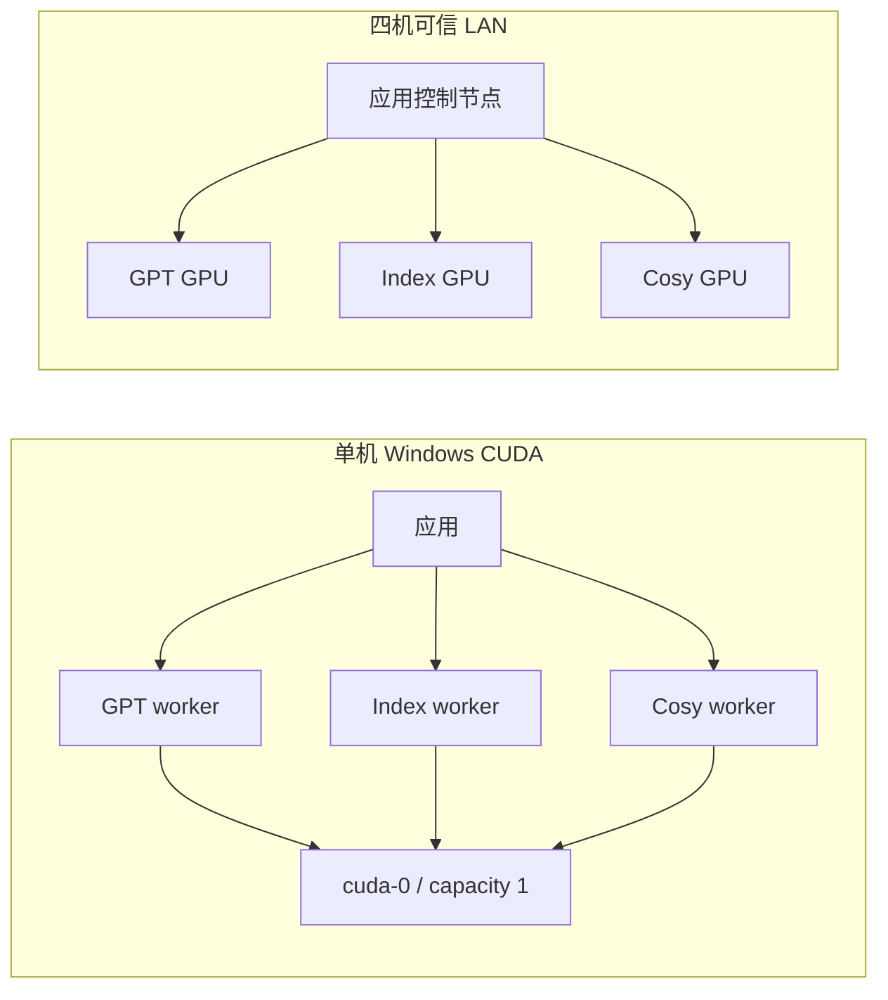
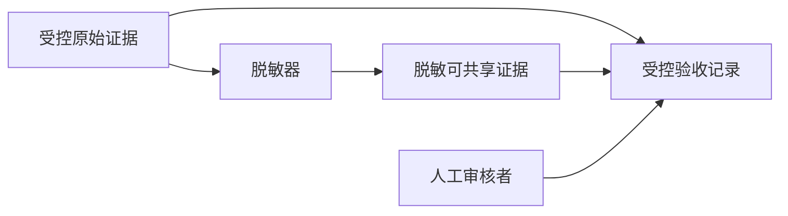

# CUDA 验证契约

本文只定义跨拓扑契约、阈值、状态和证据语义。Windows 单机命令只从 [单机 Runbook](cuda-e2e-single-node.md) 复制；四机命令见 [分布式 Runbook](cuda-e2e-distributed.md)。签核使用 [验收记录模板](cuda-e2e-acceptance-record.md)。

## 认证边界

- 正式控制面：Windows 11 或 Windows Server、Python 3.11。
- Windows GPT-SoVITS 正式准备：conda。
- 推理节点：NVIDIA 驱动支持 CUDA 12.8，至少 16 GB VRAM。
- 锁定来源：仓库根 `repo.lock.json`。
- 正式服务：`local-gpt-sovits-main`、`local-indextts`、`local-cosyvoice`。
- 网络：单机 localhost；分布式仅可信 LAN。

本契约不证明公网、TLS、反向代理、Linux GPU、商业 TTS 或真实 LLM parser 可以发布。

## 拓扑

Topology 顶层固定为 `schema_version`、`name`、`app_node`、`nodes`。每个节点声明 `role`、`host`、`bind_host`、`services`、`resource_group`、`capacity`。每个正式服务必须恰好属于一个 worker。

单机三个服务共享 `cuda-0`、`capacity: 1`；三个进程可以在线，但模型必须按资源组串行加载和卸载。分布式要求四台 Windows 机器身份不同、三个 GPU UUID 不同、时间同步且端口可达。

脱敏示例位于：

- `deployment/app/topology.single-windows.example.json`
- `deployment/app/topology.four-node-lan.example.json`

真实 topology 必须被 Git 忽略。

## Fixture

脱敏模板为 `deployment/validation/fixture.example.json`。真实 fixture 至少包含：

- 三个正式 service ID；
- GPT、Index、Cosy 三份参考音频；
- GPT `v2ProPlus` 和 `v2Pro` 的四个 GPT/SoVITS 权重；
- prompt、测试文本和 worker 日志引用；
- `faster-whisper large-v3`，且 `asr.required` 固定为 `true`；
- 首次 `single-clean` 至少两名审核者，发布回归至少一名；
- 发布回归使用已批准的正数 `performance_baseline.warm_p95_seconds`。

Input preflight 在部署和 worker 等待前展开环境变量，检查参考音频、权重、审核者和基线。未解析变量、文件不存在或 ASR 依赖缺失都产生 `blocked`。

## 服务契约

每个正式 worker 必须提供：

| 端点 | 必要语义 |
|---|---|
| `/health` | `ready:true`，并能核对 TTS More commit |
| `/capabilities` | 至少包含 `tts`；跨机还需 `artifact-transfer` |
| `/status` | `device`、CUDA 12.8、`loaded`、`model`、显存和 GPU UUID |
| `/load` | 加载指定 profile 与真实参数 |
| `/unload` | 清除加载状态并回收显存 |

单机应用健康端点为 `/api/health`，服务汇总端点为 `/api/services/status`。应用后端和前端必须来自本次 checkout，不能复用未核对身份的旧进程。

## 工件协议

外部 worker 使用 `artifact` 交付：应用上传参考音频，worker 以 UUID 文件名合成，应用校验大小和 SHA-256、原子写入历史，再删除远端工件。本机还必须验证 `path` 与 `artifact` 两种模式。

限制：上传参考音频默认最多 25 MiB，下载工件最多 100 MiB，远端文件按 TTL 清理。未声明 `artifact-transfer` 时直接失败，不假设共享盘或相同绝对路径。

## 必过矩阵

| 门禁 | 单机 | 四机可信 LAN |
|---|---|---|
| 部署 | 首次全新部署；发布回归重新同步锁定提交和依赖 | 控制节点为三个 worker 分别部署一个正式服务 |
| Host preflight | Python 3.11、conda、磁盘、CUDA、VRAM、ASR、Playwright、非任务 GPU 进程 | 加上 DNS、SSH、时钟、机器和 GPU 唯一性 |
| Input preflight | fixture、3 参考音频、4 权重、审核者、基线 | 相同，远端资产还需节点探针 |
| 核心模型 | GPT 两版本、Index 情绪文本、Cosy zero-shot/cross-lingual | 相同 |
| 工件 | GPT path 与 artifact | 上传、合成、hash 下载、历史写入、远端删除 |
| WAV | >1 KiB；0.5–30 秒；RMS > -50 dBFS；削波 <=1%；静音 <90% | 相同 |
| ASR | 单条 CER <=0.40；整体 CER <=0.25 | 相同 |
| 性能 | 无 OOM；空闲显存 >=512 MiB；卸载 30 秒内回到基线 +1 GiB；冷加载 <=10 分钟；短句 <=5 分钟 | 加上 warm p95 回归 <=30% |
| Playwright | 30 条真实任务，每服务 10 条；最多一个加载签名；三条历史音频可读 | 至少两个 GPU 节点出现重叠加载 |
| 人工听审 | 首次 6 个 case × 2 人；发布至少 1 人 | 首次至少 2 人 |
| 故障恢复 | provider 切换先卸载，失败不使应用崩溃 | 停止一个 worker 后 15 秒内降级，其他服务继续，重启后重试成功 |

## 状态语义

机器状态固定为：

| 状态 | 判定 |
|---|---|
| `blocked` | 外部输入或主机条件缺失，尚未进入有效门禁 |
| `core_failed` | 核心 CUDA 自动门禁失败 |
| `diagnostic_core_passed` | Skip 诊断通过，但 `certifiable:false` |
| `core_passed_ui_pending` | 核心通过，UI 未通过或未运行 |
| `automatic_passed_human_pending` | 核心与 UI 通过，等待人工听审 |

人类最终结论为：认证通过、自动门禁通过，人工待完成、失败、阻塞。只有所有自动证据和所需人工签核齐全时才是认证通过。

## 证据边界

**受控原始证据**包括 `controller.log`、`wav/`、`worker-logs/`、Playwright trace/video、真实 hostname/IP/用户名/绝对路径、GPU UUID、审核者身份和签名。它们可能包含声音生物特征、token、请求体和机器指纹，默认不得上传到普通 GitHub artifact、PR 或公开仓库。

**脱敏可共享证据**只包含脱敏 summary、JUnit、聚合 GPU 指标、hash-only worker 引用和无身份审核状态。发布前必须由显式 sanitization manifest 证明没有私有字段。

验收记录分别填写受控原始证据位置和脱敏可共享证据位置。Fixture/topology 只记录安全名称和 SHA-256，不记录绝对路径或展开后的资产路径。
