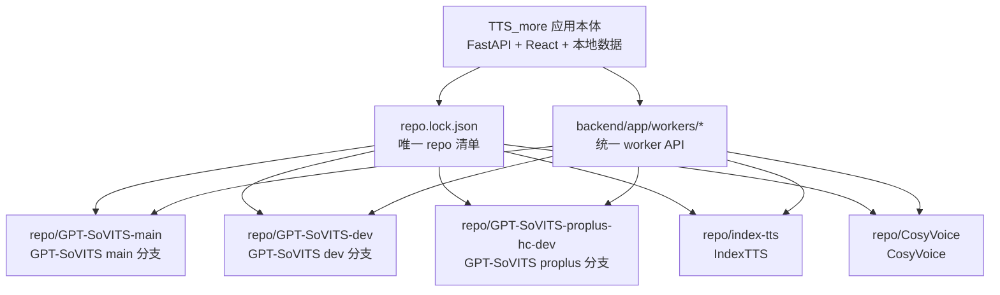

# 当前阶段说明与简化计划

本文面向两类读者：正在使用工作台的人，以及接下来继续开发的 Agent。目标是先把项目边界讲清楚，再列出哪些设计需要删减、合并或后移。

## 一句话状态

TTS More 是应用本体。它不直接改写模型仓库，而是把 GPT-SoVITS、IndexTTS、CosyVoice 三类 TTS 服务接成统一的 `tts-more-v1` worker，再由工作台完成剧本解析、角色音色、队列调度和生成历史。

## 仓库结构



这里有一个容易混淆的点：用户侧说“三个 TTS 服务”，指的是三类引擎：GPT-SoVITS、IndexTTS、CosyVoice。锁文件有五个可选目标，但默认部署只有三个：GPT-SoVITS main、IndexTTS、CosyVoice。GPT-SoVITS dev 和 proplus-hc-dev 只用于显式回归与旧功能审计。

## 推荐部署路径

默认路径只保留三个动作：

先创建并核对完整确认文件；即使路径与 lock 默认值相同也必须提供：

```bash
cp deployment/app/repo-paths.example.json deployment/app/repo-paths.local.json
```

1. 更新：`scripts/update.sh --repo-paths deployment/app/repo-paths.local.json` 或 `scripts/update.ps1 --repo-paths deployment/app/repo-paths.local.json`
2. 准备服务 repo、依赖和模型：`scripts/prepare-tts-repos.sh --sync-repos --repo-paths deployment/app/repo-paths.local.json` 或 `scripts/prepare-tts-repos.ps1 -SyncRepos -RepoPaths deployment/app/repo-paths.local.json`
3. 启动应用和 worker：`make dev`、`scripts/start-service-workers.sh --repo-paths deployment/app/repo-paths.local.json`

服务 repo 内还可以写入可复制的轻量更新脚本：

```bash
scripts/tts-more.sh install-update-scripts --repo-paths deployment/app/repo-paths.local.json
```

生成的 `tts-more-update.sh`、`tts-more-update.ps1`、`tts-more-update.py`、`tts-more-update.json` 必须作为一个 portable updater bundle 一起复制到单独的 TTS 服务部署设备上。**repositories with submodules do not receive the standalone updater**；它们 **must be updated from TTS More managed sync-repos**，因为 standalone updater 不处理 submodule，安装命令会报告 managed-sync-only 且不写入四个文件。sidecar **does not store installer-host absolute executable paths**；运行时 **resolves Git independently on the destination device**，使用固定安装目录或目标机显式 `TTS_MORE_TRUSTED_GIT`。updater 先验证 actual origin identity，再由 actual transport 决定 SSH；**sidecar transport does not override the actual origin transport**。因此实际 HTTPS origin 不要求 SSH，实际 SSH/scp origin 需要目标机 trusted SSH，可由 `TTS_MORE_TRUSTED_SSH` 指定。updater 从 GitHub fast-forward 当前服务 repo 到对应分支最新版；如需回到锁定提交，可加 `--pinned`。

## 当前已具备的能力

- `repo.lock.json` 锁定五个可选部署目标的远端、分支、提交、端口、服务 id 和 `default_selected`；默认只选择三个正式服务。
- `scripts/tts_more_deploy.py sync-repos --repo-paths deployment/app/repo-paths.local.json` 可以拉取或重置服务 repo；submodule 只在最终 superproject state 后解析，relative URL 基于 validated actual origin，并逐个通过 GitHub allowlist 后更新。HTTPS-only submodules 不需要 SSH，任一 SSH submodule 都需要 trusted SSH。
- `probe-network` 会选择 ModelScope、HF Mirror、Hugging Face、PyPI 镜像等下载源，并把缓存路径集中到 `data/cache`。
- `render-services` 会从 repo 清单生成 `data/local/services.json`，避免手写服务配置。
- worker 统一暴露 `tts-more-v1`，应用本体只需要看统一 API，而不是每个模型仓库的内部调用细节。

## 对抗性审查结论

### 1. 概念层级仍然偏多

问题：同一个任务会出现 provider、engine、service、worker、resource_group、cluster、binding、profile 等词。它们在实现里有价值，但不应该同时出现在默认用户路径里。

改进：
- 默认 UI 只说“解析服务”“TTS 服务”“角色音色”“生成队列”。
- `resource_group`、`cluster_key`、加载签名只放到诊断或高级设置。
- 文档分层：先写用户动作，再写实现字段。

### 2. 角色音色路径太重

问题：用户真正想做的是“给当前剧本角色选一个可用音色”，但角色面板同时承载扫描、导入、权重目录、绑定清单、全局角色库维护。

改进：
- 默认视图只显示当前剧本角色、当前音色、选择常用音色、临时参考音频。
- “维护音色库”作为二级入口，包含扫描、导入、模型目录和权重绑定。
- Agent 操作文本固定为“给此角色选择音色”，避免在“绑定/Profile/候选”之间推断。

### 3. Inspector 默认态过像配置台

问题：当前行生成前暴露过多服务路由、生成方式、权重、参考、情绪参数和诊断字段。普通用户会不知道哪些必须填。

改进：
- 默认只保留当前角色、当前音色、参考音频摘要、生成文本、生成本行、试听结果。
- 高级设置折叠且默认关闭。
- 路由失败时再显示服务选择、权重与参考、加载签名等诊断字段。

### 4. 批量生成文案不够精确

问题：`生成当前列表` 对人和 Agent 都不够明确。实际行为是优先生成已选台词；没有选择时生成筛选结果。

改进：
- 按状态改文案：有选择时显示“生成已选台词”；无选择时显示“生成筛选结果”。
- 按钮旁用一句短状态解释范围，不写长规则。

### 5. 一键更新语义刚刚补齐，仍需真实机器验证

问题：原有 `sync-repos` 负责服务 repo 同步，但没有一个“应用本体 + 服务 repo + 服务配置”的统一 update 动作，也没有服务 repo 内可复制的更新脚本。

已改进：
- 新增 `tts_more_deploy.py update`，默认保护已有 `data/local/services.json`，并拒绝更新有本地改动的服务 repo；需要重写服务配置时显式加 `--force-render-services`，需要硬重置服务 repo 时显式加 `--force-reset-repos`。
- 新增 `scripts/update.sh` 和 `scripts/update.ps1`。
- 新增 `install-update-scripts`，向不含 submodule 的服务 repo 写入四文件轻量 updater；含 submodule 的 repo 只报告必须走 managed `sync-repos`，不安装 standalone updater。

剩余风险：
- 真实服务 repo 尚未全部克隆，无法在本机验证服务 repo 内脚本实际执行。
- Gitee 镜像固定为 `https://gitee.com/chengdu-flower-food/TTS_more`；后续同步必须核对该组织仓库，不能推送到同名个人仓库。

## 任务分解

### P0：保持更新和部署入口稳定

- 保留 `scripts/update.* --repo-paths deployment/app/repo-paths.local.json` 作为应用本体更新入口。
- 保留 `scripts/tts-more.* --repo-paths deployment/app/repo-paths.local.json` 作为部署工具入口。
- 所有服务 repo 同步继续从 `repo.lock.json` 读取，不新增第二份清单。
- 验收：`tts_more_deploy.py update --dry-run --repo-paths deployment/app/repo-paths.local.json`、`sync-repos --dry-run --repo-paths deployment/app/repo-paths.local.json`、`doctor --repo-paths deployment/app/repo-paths.local.json` 均可运行。

### P1：压缩默认 UI 文案和入口

- `解析` 面板标题改为“剧本解析服务”。
- `接入` 面板默认只保留 provider、服务地址、检测并保存。
- `生成当前列表` 改为按选择状态展示“生成已选台词”或“生成筛选结果”。
- `重跑` 统一改为“重新生成”。
- 验收：桌面和移动截图无横向溢出，主路径按钮文本不需要解释内部字段。

### P1：角色面板分层

- 默认层：当前剧本角色和当前音色。
- 维护层：扫描、导入、模型目录、绑定清单。
- 验收：首次打开角色面板时，焦点在当前剧本角色，不在全局维护任务。

### P2：文档分层

- README 只保留主路径和入口。
- `docs/deployment.md` 讲部署命令和网络源。
- `docs/open-source-tts-services.md` 前半写用户/Agent 操作，后半写内部路由字段。
- 验收：Agent 只读 README 和本文件，就能判断下一步该运行哪个命令。

### P2：真实机器验证

- 在有 GPU、模型、参考音频的机器上跑真实 worker。
- 验证 `tts-more-update.*` 在每个服务 repo 内 fast-forward 成功。
- 跑 `TTS_MORE_RUN_REAL_TTS=1` 的真实合成测试。

## 待用户醒来处理

- 后续发布提交需同时核对 GitHub 与 Gitee 组织仓库的目标分支 SHA，保持双远端记录一致。
- 在目标 GPU 上完成 GPT-SoVITS 收敛分支 CUDA 门禁；通过后合入 fork `main`，首个稳定版本发布后删除远端 proplus 分支并永久保留归档标签。
- 在目标 GPU 设备上确认模型下载源、CUDA/conda 路线和真实音频验收样本；managed prepare 当前不支持 micromamba。
