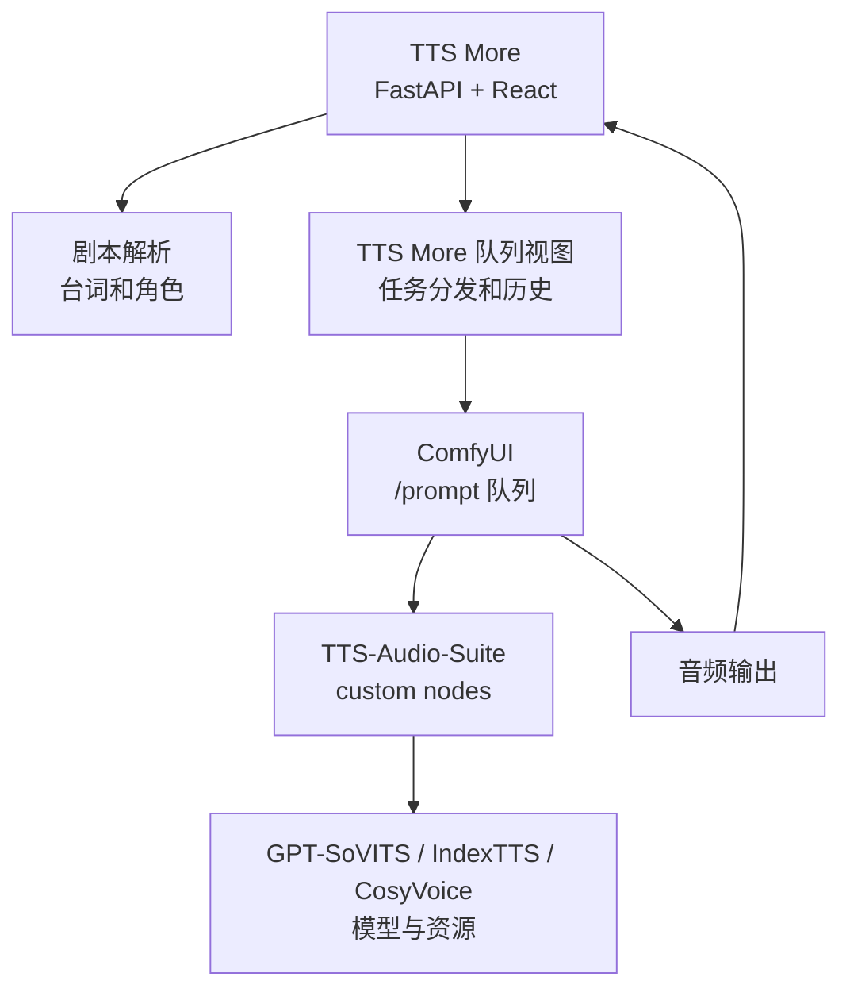

# 当前阶段说明与简化计划

本文面向正在使用工作台的人，以及接下来继续开发的 Agent。目标是把当前项目边界讲清楚：TTS More 做剧本和任务编排，ComfyUI + TTS-Audio-Suite 做音频生成和模型运行。

## 一句话状态

TTS More 是剧本配音工作台。它负责剧本解析、角色音色、批量任务、队列可视化和生成历史；实际 TTS 推理交给 ComfyUI，具体 GPT-SoVITS、IndexTTS、CosyVoice 能力交给 `XucroYuri/TTS-Audio-Suite` custom node 和对应模型资源。

```mermaid
flowchart TD
    App["TTS More\nFastAPI + React"] --> Script["剧本解析\n台词和角色"]
    App --> Queue["TTS More 队列视图\n任务分发和历史"]
    Queue --> ComfyUI["ComfyUI\n/prompt 队列"]
    ComfyUI --> Plugin["TTS-Audio-Suite\ncustom nodes"]
    Plugin --> Models["GPT-SoVITS / IndexTTS / CosyVoice\n模型与资源"]
    ComfyUI --> Output["音频输出"]
    Output --> App
```

## 当前已具备的能力

- 后端已有 `ComfyUITTSClient`，可以提交 ComfyUI `/prompt`，轮询 `/history/{prompt_id}`，并从 `/view` 下载音频。
- `workflow_builder.py` 已为 GPT-SoVITS、IndexTTS、CosyVoice 生成 TTS-Audio-Suite 工作流，并要求每个端点提供稳定 `resource_id`。
- 服务合同已支持正式的 `comfyui-tts-audio-suite-v1`，同时保留旧 `comfyui-tts-v1` 兼容合同。
- `data/services.json` 默认登记三个禁用态 ComfyUI 外部端点，分别对应 GPT-SoVITS、IndexTTS、CosyVoice。
- 角色绑定配置中的 `resource_id`、参考音频和 prompt text 会保留到生成任务参数中。
- 生成队列 item 已能记录 ComfyUI prompt id/status，前端队列和台词行会展示外部 prompt 状态。

理论可用性验证记录见 [TTS More + ComfyUI 理论可用性验证](theoretical-usability-validation.md)。

## 推荐部署路径

1. 安装并启动 ComfyUI，默认地址 `http://127.0.0.1:8188`。
2. 在 `ComfyUI/custom_nodes` 安装 `XucroYuri/TTS-Audio-Suite`。
3. 为 TTS-Audio-Suite 准备本机 `resources.yaml`，配置 GPT-SoVITS、IndexTTS、CosyVoice 的 `resource_id`、模型路径和必要资源。
4. 在 TTS More 中启用对应 ComfyUI 服务端点，确认 `api_contract` 为 `comfyui-tts-audio-suite-v1`，`provider_type` 为实际 TTS 引擎。
5. 在工作台完成剧本导入、角色音色绑定和批量台词生成。

完整部署细节见 [ComfyUI TTS 后端接入指南](comfyui-integration.md)。

## 当前边界

- 本次验证不连接真实 GPU、ComfyUI、TTS-Audio-Suite 或模型资源，只验证 TTS More 侧合同、路由、工作流提交、状态回传和 UI 展示。
- 真实音频质量、模型下载、显存释放、插件节点兼容性和大批量吞吐，需要在目标 GPU 机器上单独验收。
- ComfyUI 负责真实任务队列，但 TTS More 仍维护自己的批量任务状态，用于项目历史、错误展示和前端可视化。

## 遗留路径

仓库仍保留旧 worker、Gradio WebUI、portable package、服务 repo 同步和 CUDA 验证相关代码。它们主要用于历史迁移审计和已有测试夹具，不再是推荐运行路径。

后续如需继续减复杂度，应拆成独立清理阶段：

1. 删除或隐藏旧 portable/worker UI 入口。
2. 将部署文档只保留 ComfyUI 和商业 HTTP 服务两类路径。
3. 清理不再运行的 worker 脚本、测试和发布物生成逻辑。
4. 在真实 GPU 机器完成 ComfyUI + TTS-Audio-Suite 的端到端音频验收后，再删除旧合成路径。

## 下一阶段建议

- 用真实 ComfyUI 实例跑一条 CosyVoice、IndexTTS、GPT-SoVITS 样例台词，确认工作流节点和 `resource_id` 配置。
- 跑一批 20 条以上台词，观察 ComfyUI 队列、TTS More 队列状态、失败回传和输出历史。
- 收集真实模型加载、卸载和显存释放证据，再决定是否让 TTS More 更激进地并发提交 prompt。
