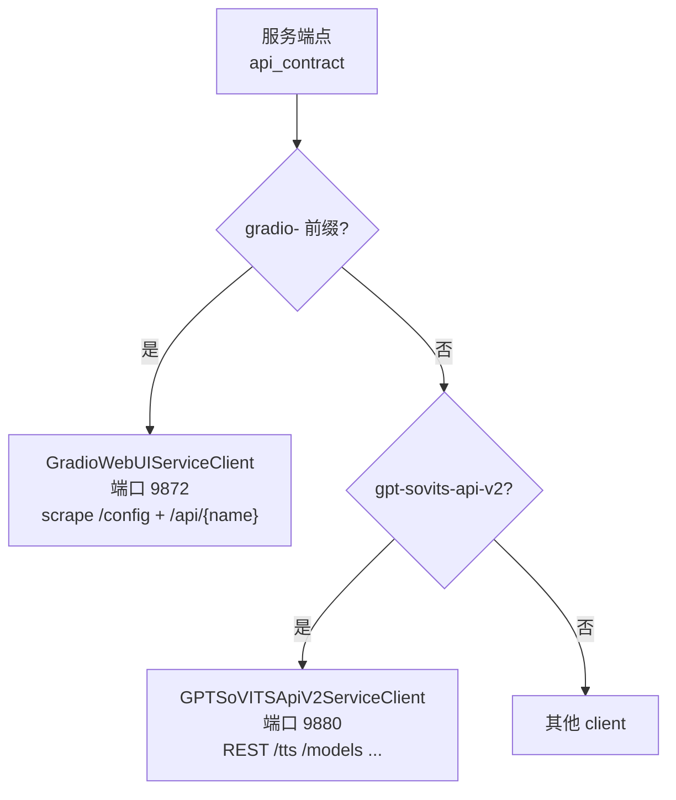
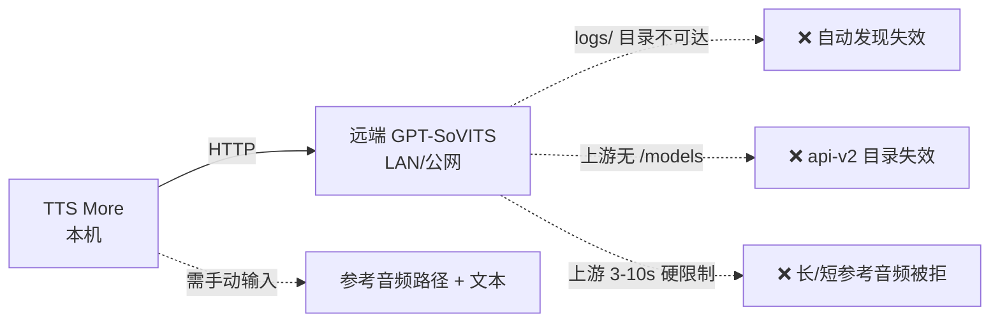

# GPT-SoVITS 接入能力分析

本文档分析 TTS More 对 GPT-SoVITS 的接入方式、fork 专属能力的边界，以及在局域网分布式/公网部署场景下的短板与方案。

## 两条接入路径

TTS More 内置两个 GPT-SoVITS client，按 `api_contract` 选择：

- **Gradio 路径**（`gradio-gpt-sovits-webui`，默认）：scrape Gradio `/config`，调 `change_gpt_weights`/`change_sovits_weights`/`get_tts_wav`，以及 fork 专属的 `on_select_ref_audio`/`update_model_choices`。
- **api-v2 路径**（`gpt-sovits-api-v2`）：REST 调 `/tts`、`/set_gpt_weights`、`/set_sovits_weights`（上游有）+ `/models`、`/models/{}/samples`（fork 新增）。

## 能力对照表

| 能力 | fork-Gradio 假设 | 上游官方是否可用 | api-v2 路径 |
|---|---|---|---|
| 合成音频 | `get_tts_wav` api_name（硬性门） | ✅ 上游有 | `POST /tts` ✅ |
| 切换权重 | `change_gpt_weights`/`change_sovits_weights` | ✅ 上游有 | `GET /set_*_weights` ✅ |
| 合成扩展参数 `if_freeze`/`aux_ref`/`sample_steps`/`super_sampling`/`parallel_infer` | 位置参数（services.py:673-678），匹配 v2ProPlus fork | ❌ 上游 `get_tts_wav` 参数更少，多余参数可能被忽略或报错 | n/a（api-v2 用命名 JSON） |
| 训练样本→参考音频自动绑定 | `on_select_ref_audio` api_name（services.py:645-653） | ❌ fork 专属 | `GET /models/{}/samples`（fork） |
| 模型/logs 下拉发现 | `update_model_choices`/`refresh_ref_audio_choices` + 标签 `GPT模型列表`/`SoVITS模型列表` | ❌ fork 新增（代码注释 1261-1264 明说上游没有 api_name） | `GET /models`（fork） |
| 训练样本文本 | 读 `2-name2text.txt`（role_library.py:514） | ✅ 磁盘布局上游相同 | `samples[].text`（fork） |
| 情绪/括注 | `audio_metadata.json` sidecar（TTS More 侧） | n/a | `samples[].emotion`（fork） |
| 参考音频上传 | 标准 Gradio `/upload` | ✅ | fork `POST /upload_ref`（但 api-v2 client 未用） |
| 健康检查 | `GET /config` + api_name 存在 | ✅ | `GET /docs`（上游 FastAPI） |
| 3–10s 参考音频硬限制 | 不强制（TTS More 不查） | ❌ 上游 `raise OSError` 阻断 | fork 放宽为软警告 |

**关键结论**：合成（生成音频）对上游可行；模型/参考音频**自动发现是 fork 专属**。

## 局域网分布式部署的短板

当 GPT-SoVITS 部署在远端（LAN/公网）时：

1. **`logs/` 目录不可达**：TTS More 的 `scan_logs_reference_audio_samples` 需要读远端 `logs/<exp>/5-wav32k/` 和 `2-name2text.txt`。远端机器的文件系统 TTS More 访问不到，自动发现返回空。
2. **上游无 `/models`、`/models/{}/samples`**：api-v2 目录调用 404，`main.py:1493` 记 `api_v2_unreachable`，目录回退到 Gradio/文件系统——但文件系统也不可达。
3. **上游 3–10s 硬限制**：`inference_webui.py:853-856` 和 `TTS.py:815-817` 的 `raise OSError` 会阻断合法的长/短参考音频（除非打 fork 的 Task 5 补丁）。
4. **结果**：远端上游官方 GPT-SoVITS 只能手动输入参考音频路径（且路径得是远端机器上的路径）+ prompt 文本，自动绑定工作流失效。

## 方案

### 方案 A：部署 fork（当前推荐）

部署 `https://github.com/XucroYuri/GPT-SoVITS` fork，它已实现：
- Gradio WebUI 的"训练角色选择"组（模型名下拉 → 自动绑定 GPT/SoVITS 权重、训练样本音频、参考文本、情绪）。
- `api_v2.py` 的 `/models`、`/models/{}/samples`、`/status`、`/upload_ref` 四端点。
- 3–10s 硬限制放宽为软警告。

**局限**：fork 兼容性较窄，需与上游同步维护。

### 方案 B：在任意 GPT-SoVITS 上实现四端点

若必须用上游官方或其他 fork，按 `docs/agent-prompts/gpt-sovits-fork-enhancement.md` 在该构建上实现：
- `GET /models`：扫描 `GPT_weights_v2ProPlus`/`SoVITS_weights_v2ProPlus` + `logs/`，返回角色列表 + 权重 + 样本数。
- `GET /models/{name}/samples`：解析 `logs/<name>/2-name2text.txt` + 扫 `5-wav32k/`，返回样本（含文本）。
- `GET /status`：当前权重/版本/设备。
- `POST /upload_ref`：跨机上传参考音频。

这样 TTS More 通过 api-v2 路径即可获得与 fork 等价的远程发现能力，**不依赖 Gradio scrape**（更适合无头服务器/分布式）。

### 方案 C：纯手动 + 合成 only

对上游官方 GPT-SoVITS，不做自动发现，只做合成：
- 配置 `api_contract="gpt-sovits-api-v2"`，用 `/tts` + `/set_*_weights`。
- 参考音频路径 + prompt 文本由用户手动填（路径需是远端机器上的绝对路径）。
- 打 Task 5 补丁放宽时长限制。

**适用**：临时接入、不要求自动发现的生产场景。

## 推荐

- **本机/单机**：fork + Gradio 路径（自动发现完整）。
- **局域网分布式**：fork + api-v2 路径（`/models` 远程发现，无头友好），或方案 B 在目标机构建上实现四端点。
- **公网**：fork + api-v2 + `TTS_MORE_API_TOKEN` + 反向代理，参考音频用 `POST /upload_ref` 上传（api-v2 client 目前未用此端点，可作为后续增强）。

## 后续可增强项（非阻塞）

- api-v2 client 接入 `/upload_ref`（当前只用 Gradio `/upload`），让公网部署的参考音频上传走 REST 而非 Gradio。
- api-v2 client 接入 `/status`（当前用 `/docs` 做健康检查），获得当前权重状态。
- 合成扩展参数（`if_freeze` 等）对上游做兼容降级（参数过多时自动裁剪）。
