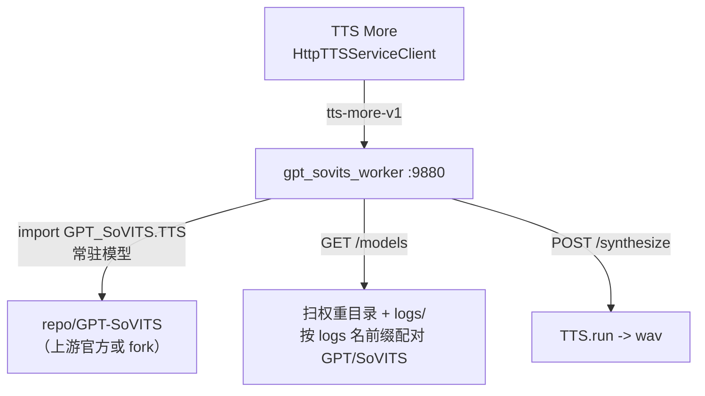

# GPT-SoVITS 接入方案

TTS More 通过**非侵入式 worker** 接入 GPT-SoVITS，对上游官方版本和 fork 版本都能用，不依赖 Gradio WebUI 的能力披露。

## 方案：非侵入式 worker（主路径）

`backend/app/workers/gpt_sovits_worker.py` 是一个 FastAPI 脚本，在 GPT-SoVITS repo 的 Python 环境里运行，直接 import 上游 `GPT_SoVITS.TTS_infer_pack.TTS`，暴露完整 REST API。**不改上游任何文件。**

### 能力对照（worker vs Gradio vs fork api_v2）

| 能力 | worker（主路径） | Gradio 兜底 | fork api_v2 |
|---|---|---|---|
| 合成音频 | ✅ `TTS.run` | ✅ `get_tts_wav` | ✅ `/tts` |
| 切换权重 | ✅ `init_t2s/vits_weights` | ✅ `change_*_weights` | ✅ `/set_*_weights` |
| 模型/角色发现 | ✅ `GET /models`（扫权重目录，上游兼容） | ❌ fork 专属 api_name | ❌ `/models` 是 fork 新增 |
| 参考音频+文本发现 | ✅ `GET /models/{}/samples`（解析 name2text） | ❌ fork 专属 | ❌ fork 新增 |
| 上游官方兼容 | ✅ | ⚠️ 部分（合成可用，发现失效） | ⚠️ 部分（合成可用，发现 404） |
| 参考音频时长限制 | ✅ 不强制 | ❌ 上游 raise OSError | ✅ fork 放宽 |
| 跨机上传参考音频 | ✅ `POST /upload_ref` | ✅ Gradio `/upload` | ✅ fork `/upload_ref` |

### 模型名发现（上游兼容的关键）

worker 不依赖 fork 的 Gradio 下拉 api_name。它从权重文件名提取统一的 logs 名前缀（剥离 `-e<N>`/`_e<N>_s<N>`/`epoch=` 等后缀，这是所有 GPT-SoVITS 训练版本的共享约定），GPT 和 SoVITS 权重按前缀配对成角色。这是上游官方也兼容的方法。

详见 `backend/app/workers/discovery.py`（`extract_logs_name_from_weight`、`scan_weight_files`、`read_name2text_records`）。

### 情绪/括注

情绪/括注信息是 fork 版本单独增加的，TTS More 侧用 `audio_metadata.json` sidecar 保留（无数据留空），不进 worker。worker 只负责合成与发现，情绪元数据由 TTS More 角色库管理。

## Gradio 兜底

`GradioWebUIServiceClient`（`services.py`）保留为兜底：用户已有上游/fork Gradio WebUI 仍可接入（`api_contract: gradio-gpt-sovits-webui`），但无自动发现，参考音频需手动输入。合成路径对上游可用。

## 分布式部署

worker 可部署在 LAN/公网 GPU 机器上。本机 TTS More 通过 `services.json` 指向远端 worker 端点（`mode: external`）。远端只需克隆上游 repo + torch + 模型 + 启动 worker。参考音频跨机走 `POST /upload_ref`。

这避免了 fork 深度改造带来的兼容性下降——任意 GPT-SoVITS 构建都能用 worker 获得完整能力。

## 详见

- [Worker 架构](workers.md) — 三个 worker 的启动、端口、加载策略。
- `backend/app/workers/gpt_sovits_worker.py` — 实现。
- `backend/app/workers/discovery.py` — 发现助手。
