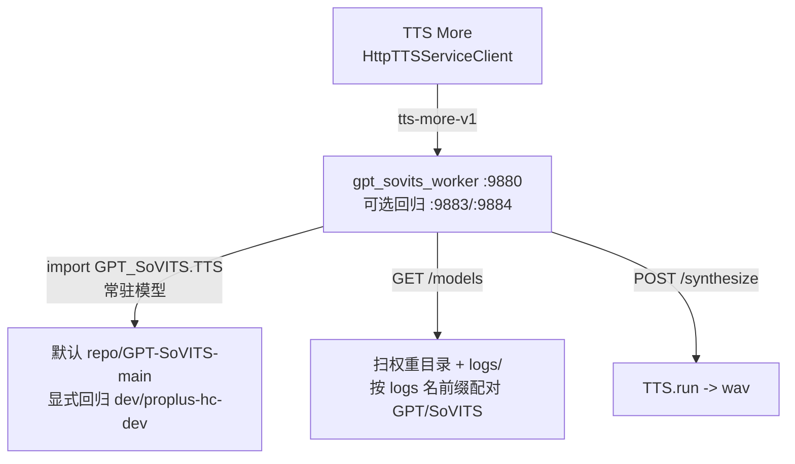

# GPT-SoVITS 接入方案

TTS More 通过**非侵入式 worker** 接入 GPT-SoVITS，对上游官方版本和 fork 版本都能用，不依赖 Gradio WebUI 的能力披露。

## 方案：非侵入式 worker（主路径）

`backend/app/workers/gpt_sovits_worker.py` 是一个 FastAPI 脚本，在 GPT-SoVITS repo 的 Python 环境里运行，直接 import 上游 `GPT_SoVITS.TTS_infer_pack.TTS`，暴露完整 REST API。**不改上游任何文件。**



### 能力对照（worker vs Gradio vs fork api_v2）

| 能力 | worker（主路径） | Gradio 兜底 | fork api_v2 |
|---|---|---|---|
| 合成音频 | ✅ `TTS.run` | ✅ `get_tts_wav` | ✅ `/tts` |
| 切换权重 | ✅ `init_t2s/vits_weights` | ✅ `change_*_weights` | ✅ `/set_*_weights` |
| 模型/角色发现 | ✅ `GET /models`（扫权重目录，上游兼容） | ❌ fork 专属 api_name | ✅ 收敛版本 `/models` |
| 参考音频+文本发现 | ✅ `GET /models/{}/samples`（解析 name2text） | ❌ fork 专属 | ✅ 收敛版本 `/models/{name}/samples` |
| 上游官方兼容 | ✅ | ⚠️ 部分（合成可用，发现失效） | ✅ 保持 `/tts` 和切换权重契约 |
| 参考音频时长限制 | ✅ 不强制 | ❌ 上游 raise OSError | ✅ 收敛版本改为软警告 |
| 跨机上传参考音频 | ✅ `POST /upload_ref` | ✅ Gradio `/upload` | ✅ 收敛版本 `/upload_ref` |

### 模型名发现（上游兼容的关键）

worker 不依赖 fork 的 Gradio 下拉 api_name。它从权重文件名提取统一的 logs 名前缀（剥离 `-e<N>`/`_e<N>_s<N>`/`epoch=` 等后缀，这是所有 GPT-SoVITS 训练版本的共享约定），GPT 和 SoVITS 权重按前缀配对成角色。这是上游官方也兼容的方法。

详见 `backend/app/workers/discovery.py`（`extract_logs_name_from_weight`、`scan_weight_files`、`read_name2text_records`）。

### 情绪/括注

情绪/括注信息是 fork 版本单独增加的。收敛版本会从六列 `.list` 和 `audio_metadata.json` sidecar 合并读取；TTS More 仍可独立管理角色库元数据，不把这些扩展字段作为默认 worker 依赖。

## Windows 可迁移准备与诊断

worker 从配置的 GPT-SoVITS repo 根目录推导 `GPT_SoVITS`、`ffmpeg-shared/bin` 和工作目录；不会把任意电脑的绝对路径或 `PYTHONPATH` 写入配置。上游同时使用 `GPT_SoVITS.*` 包导入和 `AR`、`TTS_infer_pack` 等顶层导入，所以两层目录都会由 worker 自动加入进程路径。上传参考音频和合成 artifact 默认写入 TTS More 的 `data/runtime/worker-artifacts/gpt-sovits`，而不是 GPT-SoVITS checkout；隔离部署可通过 `TTS_MORE_ARTIFACT_ROOT` 覆盖。

先在目标机器检查准备状态：

```powershell
.\.venv\Scripts\python.exe scripts\tts_more_deploy.py doctor --service-ids local-gpt-sovits-main --repo-paths deployment/app/repo-paths.local.json
```

Windows 的 `worker_prerequisites` 会分别报告：GPT package、官方安装器所需的 `conda`，以及 `ffmpeg-shared/bin` 中的 full-shared FFmpeg DLL。缺少任意一项时，运行准备脚本：

```powershell
.\scripts\prepare-tts-repos.ps1 -Targets local-gpt-sovits-main -Device CU128 -RepoPaths deployment\app\repo-paths.local.json
```

该脚本会使用锁文件中的相对 repo 路径准备环境、安装 worker 依赖，固定 `onnxruntime-gpu==1.26.0`（CUDA 12.8 兼容）、下载 full-shared FFmpeg，并在结束前实际 import GPT-SoVITS 和调用 `torchaudio.load` 读取临时 WAV；因此不会把“模型可加载”误判为“能读取参考音频”。先预览所有步骤但不要求本机已安装 Conda：

```powershell
.\scripts\prepare-tts-repos.ps1 -Targets local-gpt-sovits-main -SkipDownloads -DryRun -RepoPaths deployment\app\repo-paths.local.json
```

正式执行时缺少 Conda 会 fail-fast，并给出安装前置提示；安装器不会替每台机器选择或写死 Conda 安装位置。

## Gradio 兜底

`GradioWebUIServiceClient`（`services.py`）保留为兜底：用户已有上游/fork Gradio WebUI 仍可接入（`api_contract: gradio-gpt-sovits-webui`），但无自动发现，参考音频需手动输入。合成路径对上游可用。

## 分布式部署

worker 可部署在 LAN/公网 GPU 机器上。本机 TTS More 通过 `services.json` 指向远端 worker 端点（`mode: external`）。远端只需按 `repo.lock.json` 克隆目标 GPT-SoVITS 分支 + torch + 模型 + 启动 worker。参考音频跨机走 `POST /upload_ref`。

这使上游官方构建仍能通过 worker 获得完整能力，同时允许 fork `main` 提供原生扩展 API。默认部署只选择 GPT-SoVITS `main`；`dev` 和 `proplus-hc-dev` 只在显式回归命令中生成。

## 详见

- [Worker 架构](workers.md) — 三个 worker 的启动、端口、加载策略。
- `backend/app/workers/gpt_sovits_worker.py` — 实现。
- `backend/app/workers/discovery.py` — 发现助手。
