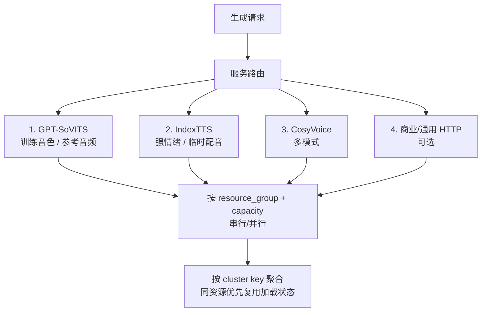

# 开源 TTS 服务接入与混合部署

TTS More 的核心开源 TTS 顺序固定为：

`GPT-SoVITS → IndexTTS → CosyVoice → TTS API`

TTS API 目前是占位入口，产品重点先放在 GPT-SoVITS、IndexTTS、CosyVoice 三个开源服务。

## provider 优先级与资源组调度



## 安装入口

先部署 TTS More：

```bash
git clone https://github.com/XucroYuri/TTS_more.git
```

如果还没有可用 TTS 服务，推荐先用部署脚本准备 repo 和 worker；已有 Gradio 服务也可以作为兼容端点接入。

```bash
python scripts/tts_more_deploy.py sync-repos --clean
python scripts/tts_more_deploy.py render-services --profile local-all --output data/local/services.json
```

`repo.lock.json` 会保留 GPT-SoVITS `main`、`dev`、`xucroyuri/proplus-hc-dev` 三个分支，以及 IndexTTS、CosyVoice。默认只拉取标记为 `default_selected` 的 GPT-SoVITS `main`、IndexTTS、CosyVoice；`dev` 与 `proplus-hc-dev` 需要显式选择。详见 [部署方案](deployment.md)。

本地 worker 部署 profile 和源选择彼此独立。`app-only`、`worker-node`、`local-all` 都可以复用同一份生成的 `data/local/network-profile.json`；也可以让每台机器各自运行一次 `probe-network`，让包索引和模型端点和它自己的网络环境对齐。

GPT-SoVITS `main` 是产品目标，`dev` 是回归目标，`proplus-hc-dev` 是待归档旧分支。TTS More 不再要求在工作台里填写本机 repo 路径；工作台只保存可检测的服务端点。

## 接入方式

在工作台打开 `接入 → TTS 服务`，选择一个开源 provider 后只需要配置一个字段：

```text
服务地址
```

点击“检测并保存”后，TTS More 会检测端点、协议和 provider 能力，并固定使用对应 provider 的契约：

- GPT-SoVITS：优先 `tts-more-v1` worker；兼容 `gradio-gpt-sovits-webui`
- IndexTTS：优先 `tts-more-v1` worker；兼容 `gradio-indextts2-webui`
- CosyVoice：优先 `tts-more-v1` worker；兼容 `gradio-cosyvoice-webui`

配置保存到 `data/local/services.json`。不要把局域网 IP、生成音频或真实角色配置写入 `data/templates/`。

## 状态判定

服务状态分为：

- `not_configured`：尚未配置。
- `endpoint_unreachable`：端点不可达。
- `partial`：部分可用，例如端口可达但能力或协议未完全确认。
- `ready`：端点与协议检测通过，可进入生成候选。

生成界面的服务下拉只显示当前 provider 下可解释的 `ready` 或 `partial` 端点。`blocked`、`disabled` 等状态只在服务管理面板中展示，不进入生成候选。

## 混合部署

理想部署方式是本机、局域网、云端混合使用：

- 高频使用或需要本机文件资源的服务可在本机启动 WebUI 后用 `127.0.0.1` 接入。
- 局域网机器通过内部 DNS 名称或手动输入的 endpoint 提供额外 GPU。
- 云端服务通过公网 URL 接入，适合高并发或远程资源。

每个 endpoint 都声明 `resource_group` 和 `capacity`。同一资源组按容量限制执行，不同资源组可以并行执行。

示例：

- `gradio-gpu-0 capacity=1`：本机或一台局域网机器上三个 WebUI 串行。
- `lan-studio-gpu capacity=1`：局域网机器独立执行。
- `cloud-cosyvoice-a10 capacity=2`：云端实例最多并发两个任务。

## 队列调度

队列按 `provider + service_id + cluster_key` 聚类，尽量减少模型反复加载。

GPT-SoVITS cluster key：

```text
service_id + logs + GPT 权重 + SoVITS 权重 + 参考音频 + 参考文本
```

IndexTTS cluster key：

```text
service_id + 参考音频 + 情绪模式 + 情绪来源 + 高级参数
```

CosyVoice cluster key：

```text
service_id + mode + speaker + prompt audio + prompt text + instruct + speed + seed
```

如果当前服务已经加载某个 cluster，队列会优先完成同 cluster 的待执行任务；否则选择待执行数量最多的 cluster，并通过等待时间避免长期饥饿。

## 进程边界

GPT-SoVITS、IndexTTS、CosyVoice 的主路径是本仓 `backend/app/workers/` 下的非侵入式 worker。worker 在上游 repo 的 Python 环境里运行，直接 import 上游模型，并暴露 `/health`、`/capabilities`、`/load`、`/synthesize`、`/unload`。TTS More 只保存 endpoint、检测契约、调用合成接口，并把生成音频写回项目历史；Gradio 只作为用户已有 WebUI 的兼容接入。

## 发布安全

提交前确认：

- `data/local/` 不提交。
- `.env.local` 不提交。
- `repo/` 不提交。
- 生成音频、模型权重、manifest 运行历史不提交。
- `data/templates/services.example.json` 只保留脱敏模板。
