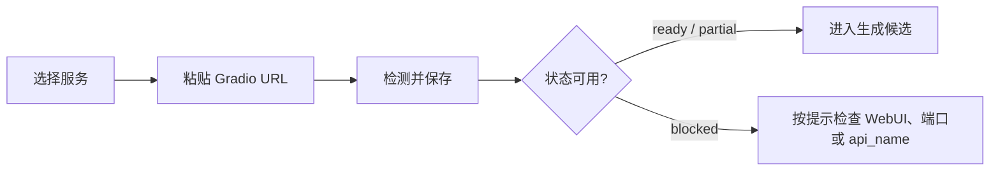

# 开源 TTS 服务接入

TTS More 不训练模型，也不管理上游 WebUI 的安装过程。它只保存一个已经启动的 Gradio endpoint，检测协议是否匹配，然后把剧本台词发送给可用服务。

当前核心顺序是：

```text
GPT-SoVITS -> IndexTTS -> CosyVoice -> TTS API
```

TTS API 仍是后续扩展入口；日常工作先围绕 GPT-SoVITS、IndexTTS、CosyVoice。

## 最短接入流程

在工作台顶部打开 `接入`：

1. 选择 `GPT-SoVITS`、`IndexTTS` 或 `CosyVoice`。
2. 粘贴已经运行的 Gradio WebUI 地址，例如 `http://tts-webui.local:9872`。
3. 点击 `检测并保存`。

检测通过或部分通过时，配置写入 `data/local/services.json`。这个文件只属于本机或团队内部环境，不提交。



## 状态怎么读

| 状态 | 含义 | 是否可保存 | 生成前下一步 |
| --- | --- | --- | --- |
| `not_configured` | 还没有 endpoint | 否 | 粘贴 Gradio URL |
| `endpoint_unreachable` | 端口或网络不可达 | 否 | 启动 WebUI，检查地址 |
| `partial` | 端点可达，但协议或能力没有完全确认 | 是 | 只在可解释时进入候选，生成前仍会检查 |
| `ready` | endpoint 与 Gradio contract 匹配 | 是 | 可以作为生成服务 |
| `blocked` | endpoint 或协议不能被当前 provider 使用 | 否 | 按提示检查地址、provider 或 WebUI 版本 |

工作台的服务下拉只展示当前 provider 下可解释的 `ready` 或 `partial` endpoint。`blocked`、`disabled` 和 mock endpoint 不进入生成候选。

兼容状态：

- `repo_missing`、`env_missing`、`repo_found` 属于旧本机仓库模式的兼容状态。
- 新接入不要从 repo path 开始，不要让 Agent 扫描本机模型仓库来判断服务是否可用。
- 如果旧数据里出现这些状态，主路径仍然是回到 `接入`，粘贴已经运行的 Gradio URL，然后 `检测并保存`。

## 常见失败

- 地址填错或 WebUI 没启动：先在浏览器打开 Gradio URL，确认能访问。
- 反向代理或公网地址不可达：先确认 `/config` 可访问。
- api_name 不匹配：确认选择的 provider 和实际 WebUI 是同一个项目。
- 局域网路径不可见：TTS More 只传 endpoint 和上传后的参考音频，不依赖对方机器上的本机路径。

## 队列怎么安排

普通用户不用手动理解 cluster key。系统会把相同服务、相同模型和相同参考音频的任务排在一起，减少反复加载模型的成本。

需要调并发时只看两个字段：

- `resource_group`：同一块 GPU 或同一台推理机器使用同一个组名。
- `capacity`：这个组最多同时跑多少条任务。

示例：

- `gradio-gpu-0 capacity=1`：本机或一台局域网机器串行执行。
- `lan-studio-gpu capacity=1`：局域网机器独立执行。
- `cloud-cosyvoice-a10 capacity=2`：云端实例最多并发两个任务。

## 进程边界

GPT-SoVITS、IndexTTS、CosyVoice 的安装、启动、停止和模型资源管理都由各自 WebUI 负责。TTS More 只做 endpoint 检测、任务调用、队列调度和生成历史保存。

提交前确认：

- `data/local/` 不提交。
- `data/parser_providers.json` 不提交。
- `.env.local` 不提交。
- `Project/` 不提交。
- `repo/`、模型权重、生成音频和真实角色配置不提交。
