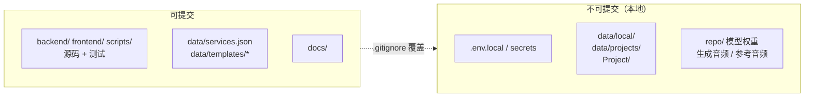
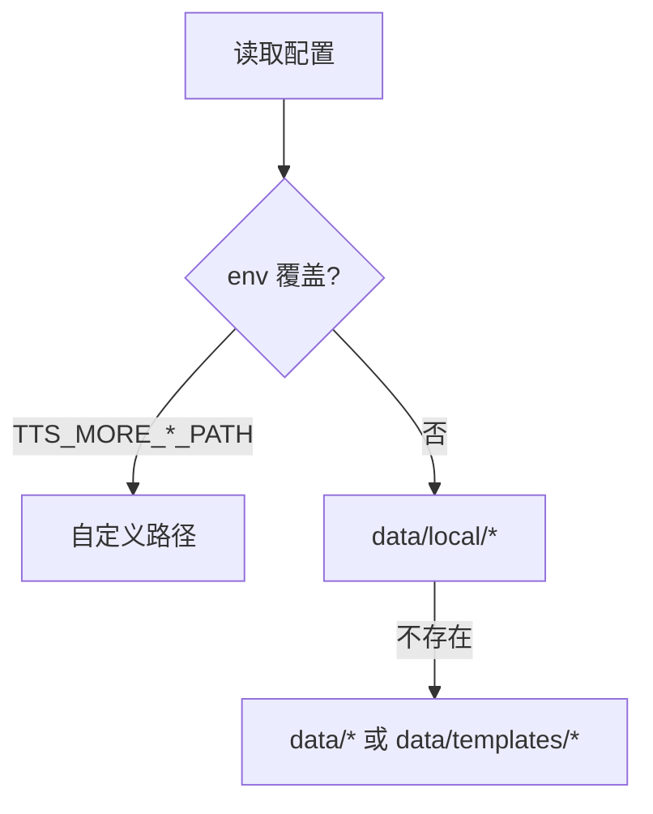

# 发布治理

TTS More 仓库只提交可复用框架、模板、测试和文档；真实运行产生的剧本、角色库、服务端点、模型路径、参考音频、生成音频和 API Key 只保存在本地运行目录或环境变量中。

## 可提交 vs 不可提交



**可提交：** `backend/`、`frontend/`、`scripts/` 源码与测试；脱敏的 `data/services.json` 与 `data/templates/*`；`docs/`。

**不可提交：** `data/local/`（本机配置/角色库/项目）、`data/projects/`、`Project/`（标题命名项目目录）、`.env.local` 与任何 secret、`repo/`、模型权重、生成音频、上传参考音频、演示剧本 prompt。

## 配置加载优先级



**服务配置：** `TTS_MORE_SERVICES_PATH` → `data/local/services.json` → `data/services.json` → `data/templates/services.example.json`

**角色库：** `TTS_MORE_CHARACTERS_PATH` → `data/local/characters.json` → `data/characters.json`（兼容旧）→ `data/templates/characters.example.json`

**剧本项目：** `TTS_MORE_PROJECTS_PATH` → `data/local/projects` → `data/projects` → 旧根目录（兼容）

新写入默认进入本地运行目录。

## 发布前检查

```bash
# macOS / Linux
.venv/bin/python -m pytest backend -q
# Windows: & .\.venv\Scripts\python.exe -m pytest backend -q

pnpm --dir frontend test
pnpm --dir frontend build

git check-ignore -v data/local/characters.json data/local/services.json .env.local repo/GPT-SoVITS/README.md
.venv/bin/python -m pytest backend/tests/test_release_governance.py -q
```

可提交文件中不得出现：本机绝对路径、局域网地址、UNC 路径、真实角色训练名、固定演示剧本、模拟项目数据、真实音频路径。`test_release_governance.py` 会自动扫描 `192.168.2.`、`\\192.168.`、`J:\`、`F:\` 等禁止令牌。
