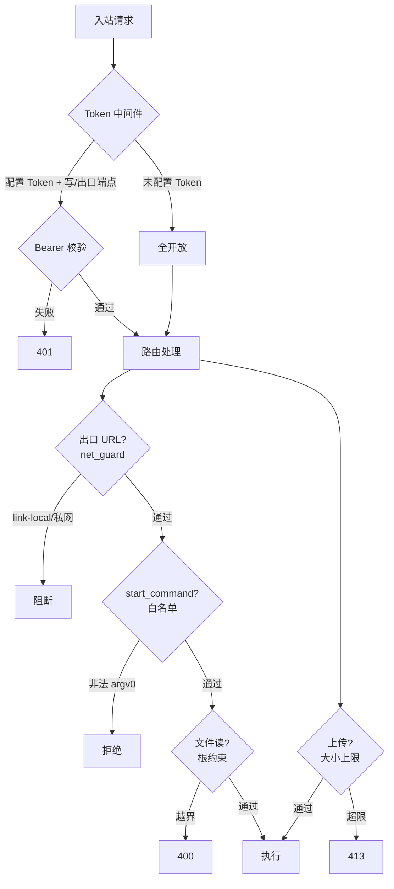

# 安全模型

本文档面向开发者与 Agent，描述 TTS More 后端的安全边界与约束。读这一篇即可了解"哪些操作被允许、哪些被拦截"。

## 威胁模型

TTS More 是**本地优先**的编排工具：默认绑 `127.0.0.1`，单用户使用。安全目标不是抵御公网攻击，而是：

1. 防止本机其他进程/用户无授权改写项目或启停服务；
2. 防止用户可写的配置（角色库）被用来读取任意文件或扫描内网；
3. 防止密钥经错误响应泄露；
4. 防止请求洪水耗尽资源。

若要公网暴露，请在后端前置反向代理并启用真实认证，**不要**直接把 `TTS_MORE_API_TOKEN` 模式暴露到公网。

## 防护分层

## 1. 认证（可选 Bearer Token）

- 环境变量 `TTS_MORE_API_TOKEN`。**未设置 = 开放模式**（所有请求放行，本地零摩擦）。
- 设置后：所有非 GET 的 `/api/*` 路由 + 网络出口 GET 路由（`/api/open-source-tts/detect`、`/api/services/*/test`、`/api/parser/providers/test`、`/api/character-library/scan` 等）要求 `Authorization: Bearer <token>`。
- 只读 GET（health、列表、audio/image 提供）保持开放，前端能无 Token 启动。
- `GET /api/auth/status` 返回 `{auth_required: bool}`，前端据此弹 Token 输入框。
- 比较用 `hmac.compare_digest`，无时序侧信道。
- 实现：`backend/app/auth.py`，中间件形式，不改每个路由签名。

## 2. SSRF 防护（`backend/app/net_guard.py`）

任何"服务器代为请求用户提供的 URL"的端点都经 `validate_egress_url` 校验：

- 只允许 `http`/`https`；
- 拒绝 loopback（除非 `allow_loopback`）、私网（除非 `allow_private`）、**link-local 永远拒绝**（`169.254.0.0/16`，覆盖云元数据 `169.254.169.254`）、unspecified、reserved、multicast；
- 域名解析后二次校验 IP（基础防 DNS rebinding）；
- 拒绝 `metadata.google.internal` 等元数据主机名。

覆盖点：`open_source_tts._probe_endpoint`（本地/LAN 放行，link-local 阻断）、`main.test_parser_provider`（loopback 放行）。

## 3. 错误脱敏（`scrub_error`）

异常字符串回显前先脱敏：`Bearer xxx`、`Authorization:` 头、URL query 里的 `key=`/`access_token=`/`api_key=`、`x-api-key`、`password=`。覆盖所有 `str(exc)` 回显点和 Gradio `response.text[:800]` 回显点。Gemini 把 key 放在 URL query，是重点防护对象。

## 4. 文件读根约束

`/api/audio` 和 `/api/assets/image` 的可读根白名单：

- `data_root`、`ref_root`、项目根；
- 来自 `services.json`（操作员受信任）的 `logs_root`/`weights_root`；
- 来自角色库配置（用户可写）的根**必须**在项目/数据根内，或显式在 `TTS_MORE_ALLOWED_DATA_ROOTS` 白名单中，否则丢弃。

`/api/assets/image` 用 magic-byte 校验（PNG/JPEG/WebP/GIF 签名），重命名的非图片文件会被拒。

## 5. 命令白名单（`supervisor._validate_executable`）

`start_command[0]` 必须满足其一：

- 裸名在白名单内（`python`/`python3`/`uvicorn`/`node`/`bash`/`sh`...，可通过 `TTS_MORE_ALLOWED_EXECUTABLES` 扩展）；
- 绝对/相对路径解析后落在项目根内。

不在白名单的裸名或项目外路径 → 返回 `{status: not manageable}`，不执行。`start_cwd`/`env` 另有 `_inside_project` 约束。所有 `subprocess` 调用用列表形、无 `shell=True`。

## 6. 上传限制

`MAX_UPLOAD_BYTES`（默认 25 MiB，`TTS_MORE_MAX_UPLOAD_BYTES` 可调）。三处上传端点（头像、角色参考音频、项目参考音频）在读取后校验字节数，超限返回 413。文件名 stem 限 64 字符、suffix 限 8。

## 7. DoS 防护（`queue.py`）

`GenerationJobManager`：

- `MAX_JOBS`（默认 200）：满则拒绝，返回 failed；
- `MAX_ACTIVE_JOBS`（默认 8）：共享 `ThreadPoolExecutor`，背压而非无限线程；
- `JOB_RETENTION_SECONDS`（默认 3600）：完成作业惰性清理；
- `cancel`：只翻 queued 项；`cancel_check` 在每条 line 派发前检查，已派发的单条合成跑完为止（受限于上游 HTTP）。

## 环境变量速查

| 变量 | 作用 | 默认 |
|---|---|---|
| `TTS_MORE_API_TOKEN` | 可选共享 Token | 未设置=开放 |
| `TTS_MORE_ALLOWED_EXECUTABLES` | 命令白名单扩展（`os.pathsep` 分隔） | 内置基础集 |
| `TTS_MORE_ALLOWED_DATA_ROOTS` | 文件读根额外白名单 | 空 |
| `TTS_MORE_MAX_UPLOAD_BYTES` | 上传上限 | 26214400 |
| `TTS_MORE_MAX_JOBS` | 作业队列上限 | 200 |
| `TTS_MORE_MAX_ACTIVE_JOBS` | 并发作业上限 | 8 |
| `TTS_MORE_JOB_RETENTION_SECONDS` | 作业保留时长 | 3600 |

## 已知不解决项

- 公网部署需前置反向代理 + 真实认证（单 Token 不够）；
- 在跑的单条合成无法中途打断（受限于上游 HTTP 调用）；
- 无 per-user 权限模型（单共享 Token）。
