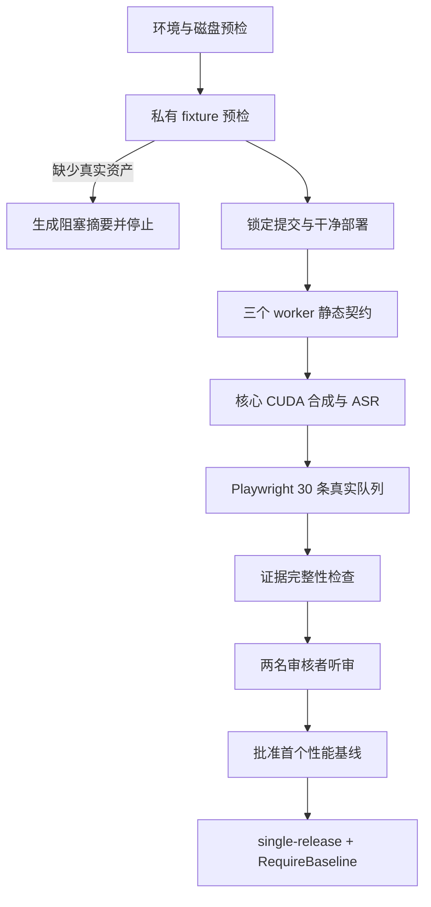

# Windows CUDA 验证加固设计

## 目标

把 Windows 单机 CUDA 验证整理成一条可重复、可审计、对人和 Agent 都清楚的认证路径。自动化必须尽早指出缺少的环境、私有资产或人工步骤；只有真实 CUDA 合成、ASR、性能、工作台队列和人工听审都具备证据时，才允许报告通过。

本轮工作只加固 `dev-xu/cuda-e2e-validation` 分支，不改写 TTS 上游仓库历史，不提交本机路径、参考音频、私有权重、审核者身份或未脱敏日志。

## 为什么采用分阶段加固

本机从空白环境执行后，已经复现出四类问题：Windows PowerShell 对 JSON 与原生命令输出的处理差异、上游依赖与 CUDA 12.8 组合不稳定、IndexTTS 辅助模型源不完整，以及文档与实际入口存在步骤和路径错位。只修单点会让下一台机器重复踩坑；整体重写又会扩大风险。

因此采用分阶段加固：保留现有验证器和报告格式，在每个真实故障点补最小修复与回归测试，再统一入口顺序、文本、文档和 CI 证据。

## 认证路径

关键顺序是“先检查不可替代的输入，再启动或等待昂贵服务”。未解析的参考音频或权重必须在 worker 等待前失败，并生成简短、可操作、机器可解析的报告。

## 工作流边界

### 1. 环境与部署

- 认证 Python 固定为 3.11。
- Windows GPT-SoVITS 官方安装器需要 conda；预检和文档必须明确说明。
- `repo.lock.json` 位于仓库根目录。
- CUDA Toolkit 或 `nvcc` 不是当前门禁的强制项；三个 worker 实际报告 `cuda_runtime: 12.8` 才是判定依据。
- Windows CU128 准备必须明确安装并探测对应 PyTorch 运行时，不能接受上游 requirements 临时选择的 CPU 或其他 CUDA 版本作为最终状态。
- 首次认证的应用 `.venv`、服务 checkout/venv 和模型来源必须在记录中说明。破坏性清理只作用于已经确认的本任务路径。

### 2. 自动门禁

- 非 GPU 回归：后端测试、Python 编译、前端测试和生产构建。
- 部署门禁：三个锁定提交、三个 venv、模型资源、doctor、`services.json` 三服务拓扑。
- worker 门禁：`/health`、`/capabilities`、`/status`，包含 `artifact-transfer`、CUDA 12.8 和显存字段。
- 核心门禁：五个模型用例、GPT path/artifact 对照、WAV、ASR/CER、显存回落、耗时和资源组串行约束。
- UI 门禁：Playwright 30 条真实混合队列、三服务历史音频和 `/api/audio`。
- 证据门禁：`summary.json`、JUnit、WAV、GPU 时序、worker 日志引用、Playwright 结果和人工听审模板齐全。

### 3. 人工门禁

第一次 `single-clean` 需要两名真实审核者。自动化可以生成听审模板和待办，但不能代签、猜测听感或把“自动门禁通过”写成“认证通过”。首个 warm p95 也只有在完整自动门禁和人工听审通过后才能批准为后续基线。

## 文本与交互原则

所有面向人或 Agent 的输出采用同一层次：

1. 第一行给结论：通过、失败或阻塞。
2. 第二层说明失败阶段和直接原因。
3. 第三层给最短可执行修复动作与证据路径。
4. 详细堆栈、机器路径和调试日志留在受控证据中，不堆入主摘要。

避免使用含糊表达，例如“可能需要检查配置”或“请参考相关日志”。应写成“fixture 中有 7 个环境变量未解析；填写三份参考音频和四个权重后重新运行”。错误信息既要适合人阅读，也要保留稳定的阶段名和结构化字段供 Agent 判断。

## 文档信息架构

- `docs/cuda-e2e-single-node.md`：唯一的 Windows 单机操作 Runbook，按执行顺序组织。
- `docs/cuda-windows-codex-handoff-prompt.md`：交接给 Agent 的任务边界、禁止事项、停止条件和最终报告格式，不重复整份 Runbook。
- `docs/cuda-e2e-validation.md`：跨拓扑的协议、门禁定义和证据语义。
- `docs/cuda-e2e-acceptance-record.md`：完成一次运行后填写的受控记录模板。
- `docs/deployment.md` 与 `deployment/**/README.md`：只解释通用部署接口，并链接到认证 Runbook。

文档中的命令必须与脚本参数一致。复杂的顺序和依赖使用 Mermaid；简单步骤仍使用短句和可复制命令，不为了视觉效果增加层级。

## 分阶段交付

### 阶段 1：冻结本机复现修复

提交并验证 Windows JSON 展平、原生命令 stderr、CU128 运行时、GPT torchcodec、Index 辅助模型和 CosyVoice 旧依赖兼容修复。该阶段不改变验证判定，只保证从头部署可执行。

### 阶段 2：前置门禁与自然语言摘要

让 fixture、环境、磁盘和必要工具检查发生在 worker 等待前。失败时仍生成 summary/JUnit/听审模板和简短控制器输出，并明确哪些事项可由 Agent修复、哪些需要真实资产或人类判断。

### 阶段 3：Runbook 与交接文档统一

修正根 `repo.lock.json`、conda、应用 venv、Playwright 独立步骤、`/capabilities` 命令、自定义 RepoPaths 和进程替换风险。删除重复叙述，保留一个自然执行顺序和一个跨拓扑定义来源。

### 阶段 4：GitHub Actions 与证据安全

核对自托管 GPU workflow 的环境预检、核心验证、Playwright、artifact 条件和失败时证据上传。公开 artifact 不得包含私有音频、真实路径、主机名、IP、用户名或审核者身份。

### 阶段 5：真实资产与人工收口

补齐三份参考音频、四个私有权重、真实文本和审核者后执行 `single-clean`。自动门禁通过后完成双人听审、批准 warm p95，再执行带 `-RequireBaseline` 的 `single-release`。

## GitHub 进度策略

每个阶段形成一个可独立回滚的提交，提交前运行覆盖该阶段的测试，推送后读取 GitHub 分支 SHA 确认一致。GitHub 与 Gitee 的同名验证分支保持同一提交，不使用强推。真实资产与运行证据只留在被忽略的本地目录或受控存储中。

## 完成标准

- 本机可在 Python 3.11、16 GB GPU 的 Windows 环境完成锁定部署，三个 worker 报告 CUDA 12.8。
- 缺少私有 fixture 时在昂贵服务等待前快速生成可理解的阻塞报告。
- 非 GPU 回归、文档治理测试、工作流静态检查和部署 doctor 均通过。
- GitHub 与 Gitee 验证分支 SHA 一致，每个阶段有清晰提交记录。
- 真实 CUDA、Playwright、人工听审或基线中任何一项缺证据时，最终状态保持阻塞或待人工完成。

## 当前不可替代的外部输入

Agent 无法独立创建可信的说话人参考音频、私有 GPT/SoVITS 权重或两名审核者的听感结论。本轮自动工作应把除此之外的问题全部解决，并把剩余输入收敛成醒后可一次性完成的短清单。
