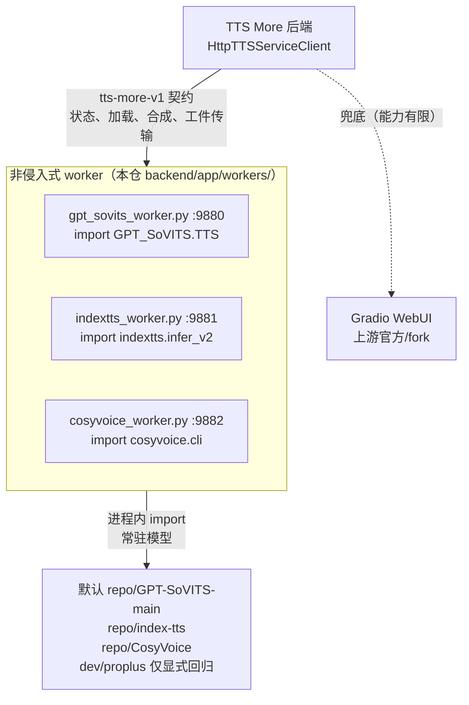
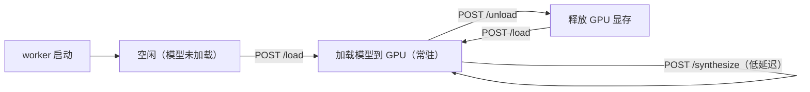

# TTS Worker 架构

TTS More 通过**非侵入式 worker** 接入三个开源 TTS 服务（GPT-SoVITS、IndexTTS、CosyVoice）。每个 worker 是一个 FastAPI 脚本，在上游 repo 的 Python 环境里运行，**直接 import 上游模型类**，暴露统一的 REST 契约。

主路径是 worker-first：工作台只需要一个“服务地址”，不要求用户理解上游 WebUI、repo 路径或模型内部目录。已有 Gradio 服务仍可作为兼容端点接入，但不要把 Gradio 写成唯一方案。

## 本机四仓工作台与 LAN 边界

Windows 便携交付仍然是四个可独立启动的文件夹，不是把三个 worker 合并进 TTS More 进程：

1. 将 `TTS-More`、`GPT-SoVITS`、`IndexTTS`、`CosyVoice` 解压到任意可写目录，建议四个文件夹同级放置。
2. 双击实际需要运行的组件 `Start.cmd`；或者先启动 TTS More，在“本地便携 TTS 服务”三张卡片中选择对应文件夹，再逐个启动。
3. 工作台没有“全部启动”行为，不会自动批量启动三个 TTS。GPT-SoVITS、IndexTTS、CosyVoice 的启动、停止、修复和日志始终相互独立。
4. 本机 loopback 用户可以维护包路径并执行本地控制。LAN worker 只通过注册地址参与健康检查、加载、合成与工件传输，必须保持 `mode:external`、`network_scope:lan`、`managed:false`；不能远程浏览目录、启动、停止或修复 Windows 包。
5. `bootstrap` 首次启动联网补齐并校验锁定资产，成功后可离线；`full` 只在本地构建，包含运行条件，解压后离线运行，禁止作为 GitHub Release 资产上传。
6. 路径跟随每台电脑和盘符变化。worker 配置不能写死 Conda、Python、模型或仓库绝对路径；同级包优先用相对 locator 解析，本机绝对路径只作为 `data/local/services.json` 中的最后发现提示。

本地控制 token 由当前 TTS More 后端进程生成，前端只保存在当前页面内存中，不写入本地存储、URL 或日志；工作台 API 不接受 UI 传入的命令、工作目录或环境变量，也不会终止未知端口所有者。普通用户的完整初始化与修复步骤见 [部署方案](deployment.md#普通用户windows-四包解压即用)。

## 架构



**为什么不用 Gradio：** Gradio API 不是为 TTS More 设计的。上游官方 GPT-SoVITS 的 Gradio 不暴露模型列表、参考音频自动绑定等能力；fork 版本有但兼容性窄。worker 直接 import 模型，暴露完整 API，对上游官方版本也能用。Gradio 作为兜底保留（用户已有上游 Gradio 仍可接入，但无自动发现）。

## Agent 决策规则

1. 用户要接入或排障 TTS 服务时，先确认服务地址和契约，不要求填写本机 repo 路径。
2. 能使用 `tts-more-v1` worker 时优先使用 worker。
3. 用户已经运行 Gradio 时，可以按兼容 contract 接入；提示能力可能少于 worker。
4. 不把真实服务地址、模型路径、参考音频名或角色训练名写进可提交文档。

## 契约

所有 worker 暴露统一的 **tts-more-v1** 标准契约，由 `HttpTTSServiceClient`（`services.py`）消费，无需新 client 代码：

| 端点 | 作用 |
|---|---|
| `GET /health` | 就绪状态、repo 是否找到、模型是否已加载 |
| `GET /capabilities` | 能力声明（tts / trained-weights / reference-audio / ...） |
| `POST /load` | 加载/切换模型配置（权重、参考音频）；常驻模式首次加载模型 |
| `POST /synthesize` | 合成音频，写 wav 到 output_path |
| `POST /unload` | 释放常驻模型（释放 GPU 显存）；下次 /load 重建 |
| `GET /status` | 统一报告 `device`、`loaded`、模型和显存 |
| `POST /upload_ref` | 安全上传参考音频，默认最大 25 MiB |
| `GET /artifacts/{id}` | 下载 UUID 标识的输出，最大 100 MiB |
| `DELETE /artifacts/{id}` | 应用校验并落盘后删除远端输出 |

统一上传上限由 `TTS_MORE_MAX_UPLOAD_BYTES` 配置；GPT-SoVITS worker 额外兼容既定的 `GPT_SOVITS_MAX_UPLOAD_BYTES`，其值优先于统一变量。两者未设置时均为 25 MiB。

GPT-SoVITS worker 额外暴露**发现端点**（替代 Gradio scrape + fork api_v2 改造）：

| 端点 | 作用 |
|---|---|
| `GET /models` | 列出训练角色 + GPT/SoVITS 权重 + 样本数（按 logs 名前缀配对，按 epoch/step 排序） |
| `GET /models/{name}/samples` | 训练音频 + 参考文本（解析 `2-name2text.txt` + 扫 `5-wav32k/`） |
| `GET /status` | 在统一状态字段之外报告当前权重/版本 |

## 模型加载策略：常驻 + 可 unload



模型在首次 `/load` 时在进程内构造一次并常驻，`/synthesize` 直接调用（低延迟）。`/unload` 释放显存，下次 `/load` 重建。IndexTTS 的每行子进程模式作为 fallback（`TTS_MORE_INDEXTTS_RESIDENT=0`）。

多个服务共享同一 `resource_group` 时，队列在切换 provider 前先调用当前 worker 的 `/unload`，清除加载签名和 load state，再加载目标服务。worker 的 unload 会执行 Python GC，并在 CUDA 可用时调用 cache 释放。统一 `/status` 同时报告 `cuda_runtime` 和 `device_uuid`；正式 CUDA 门禁要求三个 worker 都实际运行在 `12.8`，分布式模式还要求 GPU UUID 互不相同。单机 16 GB 基线要求三个进程同时在线、模型按 `capacity:1` 顺序驻留；多模型并发不作为基础门禁。

## 启动

```bash
# macOS / Linux
cp deployment/app/repo-paths.example.json deployment/app/repo-paths.local.json
make workers
# 或：scripts/start-service-workers.sh --services local-gpt-sovits-main,local-indextts --repo-paths deployment/app/repo-paths.local.json

# Windows
Copy-Item deployment\app\repo-paths.example.json deployment\app\repo-paths.local.json
.\scripts\start-service-workers.ps1 -Services local-gpt-sovits-main,local-indextts -RepoPaths deployment\app\repo-paths.local.json
```

worker 启动信息来自 `repo.lock.json`，由 `scripts/tts_more_deploy.py` 渲染。每个 worker 在其 repo 的 venv 里运行（torch/CUDA 解析）。如需生成本机服务配置：

完整 repo 确认文件是 mandatory even when the lock paths are unchanged：

```bash
cp deployment/app/repo-paths.example.json deployment/app/repo-paths.local.json
python scripts/tts_more_deploy.py render-services --profile local-all --output data/local/services.json --repo-paths deployment/app/repo-paths.local.json
```

普通验证使用默认 GPT-SoVITS `main`。分支回归时通过 `--service-ids dev` 或 `--service-ids all` 显式生成配置，并且一次只启动一个 GPT-SoVITS 分支，避免同时加载多个大模型占满显存。

## 端口约定

| 服务 | 端口 | worker 模块 |
|---|---|---|
| GPT-SoVITS main | 9880 | `app.workers.gpt_sovits_worker:app` |
| GPT-SoVITS dev | 9883 | `app.workers.gpt_sovits_worker:app` |
| GPT-SoVITS proplus-hc-dev | 9884 | `app.workers.gpt_sovits_worker:app` |
| IndexTTS | 9881 | `app.workers.indextts_worker:app` |
| CosyVoice | 9882 | `app.workers.cosyvoice_worker:app` |

## 服务注册

`data/services.json` 的提交模板只声明三个正式 worker（GPT-SoVITS main、IndexTTS、CosyVoice），默认 `enabled:false`、`setup_state:not_configured`。`repo.lock.json` 仍保留 dev/proplus 回归条目；部署脚本只有在显式选择后才会把它们写入 `data/local/services.json`。生成配置会写入 `start_command`/`start_cwd`/`env`/`repo_path`，由 `ServiceSupervisor` 启停，`HttpTTSServiceClient` 自动消费。

## 分布式部署与工件传输

worker 可部署在可信 LAN GPU 机器上，本机 TTS More 通过 `services.json` 的 `base_url` 远程调用（`mode: external`、`network_scope: lan`、`managed: false`）。当前 CUDA 发布门禁不覆盖公网、TLS 或反向代理。远端机器只需：

1. 保留轻量 TTS More checkout，获得锁文件、部署脚本和 worker；
2. 复制 `deployment/app/repo-paths.example.json`，核对完整 `service_id` 与绝对路径映射；
3. 只准备本节点负责的上游 repo、torch/CUDA 和模型；
4. 运行 `scripts/start-service-workers.sh --repo-paths deployment/app/repo-paths.local.json --topology deployment/app/topology.four-node-lan.local.json --node <worker>` 启动服务；
5. 应用节点以 `app-only` 渲染每个服务的独立 LAN 地址。

`SynthesizeRequest.delivery` 支持 `path` 和 `artifact`。`path` 默认关闭，部署器仅在 loopback bind 的本机 worker 上设置 `TTS_MORE_WORKER_ALLOW_PATH_DELIVERY=1`；LAN worker 即使收到恶意绝对路径也拒绝写入。外部 worker 强制使用 `artifact`，并且必须声明 `artifact-transfer`。应用把本地参考音频上传到 worker，远端返回 `artifact_id`、`download_url`、`sha256`、`size_bytes`；应用校验大小和 SHA-256 后原子写入本地历史，再删除远端工件。worker 使用 UUID 文件名，未取走工件按 24 小时 TTL 清理；应用侧参考音频上传缓存会在 worker TTL 前失效并重新上传。缺少 capability 时预检失败，不假设共享文件系统。

拓扑和完整协议验证见 [CUDA 全流程闭环验证](cuda-e2e-validation.md)。

## 参考音频时长限制解除（GPT-SoVITS）

上游 GPT-SoVITS 在 `_set_prompt_semantic` 中硬限制参考音频 3–10 秒（16kHz 下 48000–160000 采样点），超限直接 `raise OSError`。TTS More 不认为这是需要硬限制的设计——更长/更短的参考音频是合法输入。

worker 在 import `TTS` 类后、构造实例前，**进程内 monkey-patch** `_set_prompt_semantic`，仅去掉长度检查，保留全部语义提取逻辑（librosa 加载、hubert 特征、codes、prompt_semantic）。这是进程内补丁，**不改上游任何文件**，对上游官方和 fork 都生效。

设 `TTS_MORE_ENFORCE_REF_DURATION=1` 可恢复上游原始硬限制（操作员可选）。

## 文件清单

| 文件 | 作用 |
|---|---|
| `backend/app/workers/gpt_sovits_worker.py` | GPT-SoVITS worker（标准契约 + 发现） |
| `backend/app/workers/cosyvoice_worker.py` | CosyVoice worker（标准契约，4 模式） |
| `backend/app/workers/indextts_worker.py` | IndexTTS worker（标准契约） |
| `backend/app/workers/indextts_subprocess.py` | IndexTTS 适配器（常驻 + 子进程 fallback） |
| `backend/app/workers/indextts_line_launcher.py` | IndexTTS 每行 CLI（子进程模式用） |
| `backend/app/workers/discovery.py` | 共享发现助手（logs 名提取、权重扫描、name2text 解析） |
| `backend/app/workers/contracts.py` | 标准请求 schema |
| `backend/app/workers/artifacts.py` | 三 worker 共用的上传、下载、删除、限额和 TTL 模块 |
| `backend/app/workers/runtime.py` | 统一 CUDA 状态与显存释放助手 |
| `backend/app/workers/gpt_sovits_launcher.py` | **LEGACY** runpy 重执行上游 api_v2（被 worker 取代） |

## 待 GPU 环境验证

- GPT-SoVITS worker 真实合成（`TTS.run` → wav）；
- CosyVoice 上游 import 路径 + 推理方法签名（`cosyvoice.cli.cosyvoice.CosyVoice`）；
- IndexTTS 常驻模式推理。

这些在 macOS 上无法验证（无 GPU/torch）。契约、topology、工件和指标判定单测通过后仍不能替代 CUDA 门禁；GPT-SoVITS 收敛代码在真实默认 `v2ProPlus`、显式 `v2Pro` 和 worker 联动通过前不得合入 `main`。正式步骤见 [CUDA 验证总入口](cuda-e2e-validation.md)。
