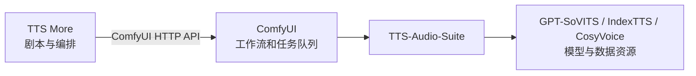

# TTS 运行架构

TTS More 不再在 GPT-SoVITS、IndexTTS、CosyVoice 仓库中部署或管理独立 worker。运行与排队职责统一交给 ComfyUI，具体 TTS 能力由 `XucroYuri/TTS-Audio-Suite` custom node 提供。

上游 TTS 仓库仍可保留在本机，作为插件需要的模型、词典、参考音频或其他运行资源来源；它们不是 TTS More 的服务进程，也不要求改造成统一 HTTP worker。

服务登记、端点契约、工作流要求和从零部署步骤见 [ComfyUI TTS 后端接入指南](comfyui-integration.md)。

## 已停止的 worker 路线

`tts-more-v1` worker、Gradio 兼容兜底、Windows 便携服务包及其启动/停止/修复脚本，不再是受支持的运行路径。历史代码可仅用于迁移审计，默认 CI 不再执行其便携包测试，也不会生成 ZIP 发布物。
