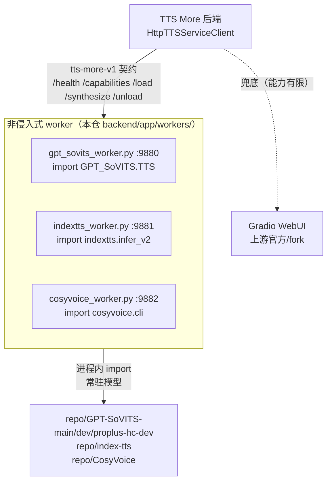
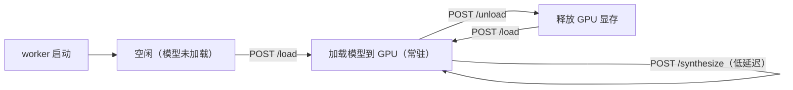

# TTS Worker 架构

TTS More 通过**非侵入式嵌入式 worker** 接入三个开源 TTS 服务（GPT-SoVITS、IndexTTS、CosyVoice）。每个 worker 是一个 FastAPI 脚本，在上游 repo 的 Python 环境里运行，**直接 import 上游模型类**，暴露统一的 REST 契约——不改上游任何文件，不依赖 Gradio WebUI 的能力披露。

## 架构



**为什么不用 Gradio：** Gradio API 不是为 TTS More 设计的。上游官方 GPT-SoVITS 的 Gradio 不暴露模型列表、参考音频自动绑定等能力；fork 版本有但兼容性窄。worker 直接 import 模型，暴露完整 API，对上游官方版本也能用。Gradio 作为兜底保留（用户已有上游 Gradio 仍可接入，但无自动发现）。

## 契约

所有 worker 暴露统一的 **tts-more-v1** 标准契约，由 `HttpTTSServiceClient`（`services.py`）消费，无需新 client 代码：

| 端点 | 作用 |
|---|---|
| `GET /health` | 就绪状态、repo 是否找到、模型是否已加载 |
| `GET /capabilities` | 能力声明（tts / trained-weights / reference-audio / ...） |
| `POST /load` | 加载/切换模型配置（权重、参考音频）；常驻模式首次加载模型 |
| `POST /synthesize` | 合成音频，写 wav 到 output_path |
| `POST /unload` | 释放常驻模型（释放 GPU 显存）；下次 /load 重建 |

GPT-SoVITS worker 额外暴露**发现端点**（替代 Gradio scrape + fork api_v2 改造）：

| 端点 | 作用 |
|---|---|
| `GET /models` | 列出训练角色 + GPT/SoVITS 权重 + 样本数（按 logs 名前缀配对，按 epoch/step 排序） |
| `GET /models/{name}/samples` | 训练音频 + 参考文本（解析 `2-name2text.txt` + 扫 `5-wav32k/`） |
| `GET /status` | 当前权重/版本/设备 |
| `POST /upload_ref` | 跨机上传参考音频 |

## 模型加载策略：常驻 + 可 unload



模型在首次 `/load` 时在进程内构造一次并常驻，`/synthesize` 直接调用（低延迟）。`/unload` 释放显存，下次 `/load` 重建。IndexTTS 的每行子进程模式作为 fallback（`TTS_MORE_INDEXTTS_RESIDENT=0`）。

## 启动

```bash
# macOS / Linux
make workers
# 或：scripts/start-service-workers.sh --services local-gpt-sovits-main,local-indextts

# Windows
.\scripts\start-service-workers.ps1 -Services local-gpt-sovits-main,local-indextts
```

worker 启动信息来自 `repo.lock.json`，由 `scripts/tts_more_deploy.py` 渲染。每个 worker 在其 repo 的 venv 里运行（torch/CUDA 解析）。如需生成本机服务配置：

```bash
python scripts/tts_more_deploy.py render-services --profile local-all --output data/local/services.json
```

普通验证建议一次启动一个 GPT-SoVITS 分支，避免同时加载多个大模型占满显存。

## 端口约定

| 服务 | 端口 | worker 模块 |
|---|---|---|
| GPT-SoVITS main | 9880 | `app.workers.gpt_sovits_worker:app` |
| GPT-SoVITS dev | 9883 | `app.workers.gpt_sovits_worker:app` |
| GPT-SoVITS proplus-hc-dev | 9884 | `app.workers.gpt_sovits_worker:app` |
| IndexTTS | 9881 | `app.workers.indextts_worker:app` |
| CosyVoice | 9882 | `app.workers.cosyvoice_worker:app` |

## 服务注册

`data/services.json` 的提交模板声明五个本地 worker（GPT-SoVITS 三分支、IndexTTS、CosyVoice），默认 `enabled:false`、`setup_state:not_configured`。部署脚本生成的 `data/local/services.json` 会启用目标服务，并写入 `start_command`/`start_cwd`/`env`/`repo_path`。`ServiceSupervisor` 可启停。`HttpTTSServiceClient` 自动消费。

## 分布式部署

worker 可部署在 LAN/公网 GPU 机器上，本机 TTS More 通过 `services.json` 的 `base_url` 远程调用（设为 `mode: external`、`managed: false`）。远端机器只需：

1. 克隆上游 repo + 装 torch + 模型权重；
2. 运行 `start-service-workers.sh`（或单独启动某个 worker）；
3. 本机 `data/local/services.json` 指向远端 worker 端口。

参考音频跨机上传走 `POST /upload_ref`（GPT-SoVITS worker）或本地路径直传（同机）。

## 参考音频时长限制解除（GPT-SoVITS）

上游 GPT-SoVITS 在 `_set_prompt_semantic` 中硬限制参考音频 3–10 秒（16kHz 下 48000–160000 采样点），超限直接 `raise OSError`。TTS More 不认为这是需要硬限制的设计——更长/更短的参考音频是合法输入。

worker 在 import `TTS` 类后、构造实例前，**进程内 monkey-patch** `_set_prompt_semantic`，仅去掉长度检查，保留全部语义提取逻辑（librosa 加载、hubert 特征、codes、prompt_semantic）。这是进程内补丁，**不改上游任何文件**，对上游官方和 fork 都生效。

设 `TTS_MORE_ENFORCE_REF_DURATION=1` 可恢复上游原始硬限制（操作员可选）。

## 文件清单

| 文件 | 作用 |
|---|---|
| `backend/app/workers/gpt_sovits_worker.py` | GPT-SoVITS worker（标准契约 + 发现） |
| `backend/app/workers/cosyvoice_worker.py` | CosyVoice worker（标准契约，4 模式） |
| `backend/app/workers/indextts_worker.py` | IndexTTS worker（标准契约） |
| `backend/app/workers/indextts_subprocess.py` | IndexTTS 适配器（常驻 + 子进程 fallback） |
| `backend/app/workers/indextts_line_launcher.py` | IndexTTS 每行 CLI（子进程模式用） |
| `backend/app/workers/discovery.py` | 共享发现助手（logs 名提取、权重扫描、name2text 解析） |
| `backend/app/workers/contracts.py` | 标准请求 schema |
| `backend/app/workers/gpt_sovits_launcher.py` | **LEGACY** runpy 重执行上游 api_v2（被 worker 取代） |

## 待 GPU 环境验证

- GPT-SoVITS worker 真实合成（`TTS.run` → wav）；
- CosyVoice 上游 import 路径 + 推理方法签名（`cosyvoice.cli.cosyvoice.CosyVoice`）；
- IndexTTS 常驻模式推理。

这些在 macOS 上无法验证（无 GPU/torch）。契约与发现层已测试通过。
