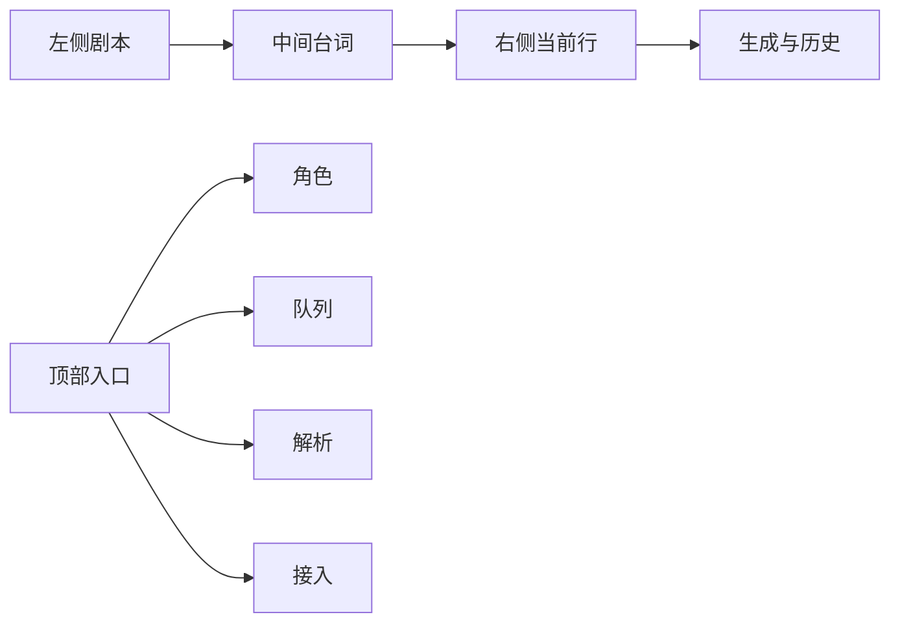

# TTS More 前端设计基线

TTS More 是剧本配音生产工作台，不是模型配置控制台，也不是营销型页面。界面应当密集、安静、可扫描，让用户尽快完成“导入剧本 -> 提取台词 -> 选音色 -> 生成 -> 试听历史”。

这份文件是 UI 改动前的首读文档。若它和代码不一致，以当前代码和浏览器验证为准，再更新本文档。

## 一句话原则

只把当前任务需要的实体放到当前屏幕。高级配置、兼容旧路径、加载签名和诊断只在异常、展开或明确配置任务中出现。

## 信息架构



### 左侧：剧本

左侧只回答：

- 当前是哪个剧本。
- 原文大概是什么。
- 是否需要编辑或提取台词。

左侧不要承担完整项目管理器。新建、删除、重命名、版本保存等维护动作可以进入管理器，但普通状态只突出当前剧本和主操作。

### 中间：台词

中间是生产主工作区，只回答：

- 当前显示哪些台词。
- 哪些台词被选中。
- 每行现在能不能生成，生成后能不能试听。

顶部工具条默认只保留搜索、行数、筛选入口和生成按钮。服务商与状态筛选放进 `筛选`，不要常驻暴露多个 select。

台词行卡常态只保留角色、括注、台词、状态和必要操作。历史数量、加载签名、预检、cluster、错误详情只在展开、运行中、失败或需要用户处理时出现。

### 右侧：当前行

右侧只服务当前选中的台词行。默认应该先回答：

- 这行会用哪个音色。
- 当前服务是否可用。
- 还缺什么参考资源。
- 生成前文本能不能微调。
- 现在能不能生成本行。

不要把 GPT / Index / Cosy / API 四种方式当作默认学习任务。切换 provider、profile、binding、service、权重、诊断等内容属于“更多设置”或异常状态。

### 顶部入口

顶部入口使用任务名：

- `角色`：给当前剧本角色选择或保存常用音色。
- `队列`：查看正在分发的生成任务。空队列时不要放大它。
- `解析`：配置剧本解析用 LLM。
- `接入`：粘贴并检测 TTS Gradio endpoint。

不要使用 `服务与资源`、`配置管理`、`角色库管理`、`LLM API 配置` 作为主路径名称。这些词可以存在于兼容代码或内部说明，但不应成为普通用户的第一层入口。

## 文案规则

- 正常状态少说话，直接给动作。
- 异常状态写“发生了什么 + 下一步做什么”。
- 操作用动词加对象：`检测并保存`、`生成本行`、`保存为常用音色`。
- 不使用只有工程师懂的词作为按钮：`cluster key`、`binding_id`、`profile override`。
- 说明文字不要引导 Agent 进入深层推理。能用一句话说明的，不写多段背景。
- 对人和 Agent 都重要的约束要具体：例如“密钥只写入 `.env.local`”，不要写“安全保存”。

## 组件使用规则

- 按钮使用现有 `primary-button`、`secondary-button`、`icon-button`、`compact-button`。
- 图标优先使用 `lucide-react`，不要手写 SVG。
- 卡片只用于重复项、工具区和弹窗内部。页面区域不要再套页面级卡片。
- 状态优先使用现有 `StatusPill` / chip 风格，颜色只表达状态，不做装饰。
- 折叠区用于高级配置和诊断；正常状态不展开。
- 空状态只保留一个清晰动作或状态，不堆 0% 进度、空列表和空统计。

## 响应式规则

- 390px 宽度不能出现横向页面滚动。
- 固定格式控件要有稳定尺寸，hover、标签和动态状态不能推动布局跳动。
- 移动端优先单列堆叠：搜索、筛选、生成、台词行卡、当前行操作都要可触达。
- 不用 viewport width 缩放字体；字号跟随组件语义。

## 颜色与密度

TTS More 使用 Geist Light 的克制视觉语言，但不是 Vercel 官网页面。这里的色彩和间距只服务生产效率。

常用 token 约定：

| 用途 | 值 |
| --- | --- |
| 主文字 | `#171717` |
| 次级文字 | `#4d4d4d` |
| 页面背景 | `#ffffff` |
| 次级表面 | `#fafafa` |
| 分割线 | `#00000015` 或 `#ebebeb` |
| 主蓝色 | `#006bff` |
| 弱蓝底 | `#f0f7ff` |
| 警告 | `#ffae00` |
| 错误 | `#fc0035` |
| 成功 | `#28a948` |
| 常规圆角 | `6px` |
| 弹窗圆角 | `12px` |
| 紧凑控件高度 | `32px` |
| 普通控件高度 | `40px` |

间距使用 4px 系列：`4 / 8 / 12 / 16 / 24 / 32`。工作台内部优先 8px 和 12px，避免营销页式大留白。

## 修改前检查

改 UI 前先问这 5 个问题：

1. 这个控件是否服务当前任务？
2. 这个信息是否只有异常时才需要？
3. 能否合并成一个主动作？
4. 文案是否是用户语言，而不是内部实体？
5. 390px 宽度是否仍然能完成核心动作？

如果答案不清楚，先改文案或折叠层级，不急着新增组件。

## 验证

轻 UI 改动至少运行：

```bash
(cd frontend && pnpm test)
(cd frontend && pnpm exec tsc --noEmit)
git diff --check
```

涉及 `App.tsx`、筛选、生成按钮、服务接入、角色/台词选择时，再运行：

```bash
(cd frontend && pnpm build)
```

视觉改动要用浏览器验证桌面和 390px 移动宽度，检查：

- 页面无横向滚动。
- 没有框架错误覆盖层。
- 控制台没有相关 warning/error。
- 目标控件默认态、展开态和异常态都能解释得通。
